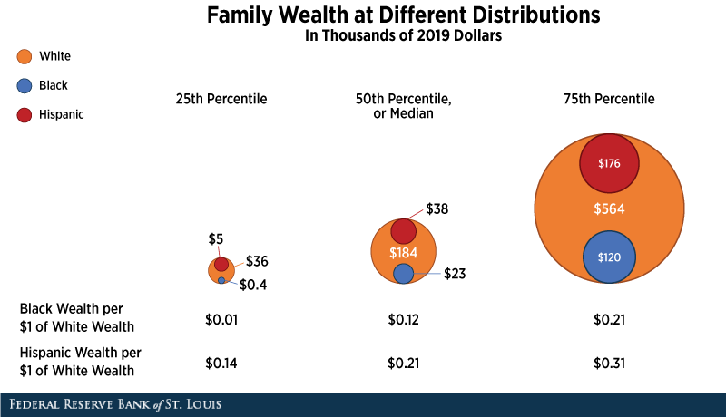
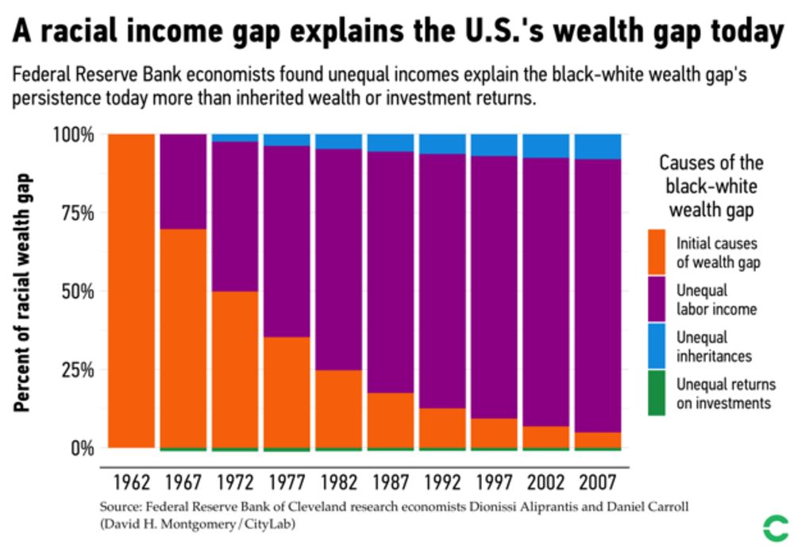

```{r setup, include = FALSE}
knitr::opts_chunk$set(echo = TRUE, warning = FALSE, message = FALSE)
```

```{r libs}
library(tidyverse)
library(sf)
library(leaflet)
# devtools::install_github("johannesbjork/LaCroixColoR")
library(LaCroixColoR)
library(flextable)
library(officer)
library(scales)
library(waffle)
library(patchwork)

# ACS data
tractdat <- read_csv("data/acs_tract_orangedot.csv")
tractdat$GEOID <- as.character(tractdat$GEOID)
countydat <- read_csv("data/acs_county_orangedot.csv")

# sort by locality (alphabetically, for table order)
countydat <- countydat %>% arrange(countyName)

# Spatial data
geo <- readRDS("data/cvilleODreport_tracts.RDS")
geo$GEOID <- as.character(geo$GEOID)

geofull <- geo %>%
  left_join(tractdat, by = "GEOID")

geofull <- st_transform(geofull, crs = 4326) 

expenses <- read_csv("data/Expenses-SH-2kids.csv")

highlightcolor <- "#EE6100"
lowlightcolor <- "#FFAD0A"
```


> "[W]henever you are engaged in work that serves humanity and is for the building of humanity, it has dignity, and it has worth [...] All labor has dignity." -- Martin Luther King Jr.^[Martin Luther King, Jr. (March 18, 1968). Retrieved from https://www.beaconbroadside.com/broadside/2018/03/the-50th-anniversary-of-martin-luther-king-jrs-all-labor-has-dignity.html]

~~2020 was a difficult year. The pandemic. Economic collapse. Racial tensions. A divided nation.~~

__Over the last several years, our country has had to reckon in new ways with issues that are, sadly, not new at all: low-income individuals, especially individuals of color, are suffering disproportionately, both physically and financially. Despite working hard, many families struggle to make ends meet, in part because they're work is not treated with dignity. Or at least, many hard-working families are not compensated as though their work has dignity. With rising prices and inflation, these struggles become even more apparent.__

The upheavals of the last several years have us all yearning for security and stability. We want to provide for ourselves and for our families. We want our children to have a better life. In America, the coin of the realm is coin. And without enough coin, every day is a struggle. To maintain a roof over your family's head, to put food on the table, to fix the car that is your family's lifeblood because it carries you to work.

When you are faced daily with those struggles, it is difficult to be the parent you want to be, the worker you know you could be, or the person you were meant to be.

~~We want the life of this world to be made more gentle. For too many families in our community, life is not gentle.~~

We should focus our recovery efforts not on restoring the old economy but on rebuilding an equitable economy, intentionally constructed on a foundation of racial justice.

In the work that follows, we provide an update to the Orange Dot Project report first issued in September 2011.^[To find previous versions of the Orange Dot report, go to https://www.pvcc.edu/history-network2workpvcc- program]. 

~~COVID-19 delayed the publication of this report, as it has disrupted so much over the past year. We intend to resume releasing updated Orange Dot Reports in the Fall of even years, beginning again in 2022.~~ 

Knowing that we can only solve issues we can understand, we start with a snapshot of the families in our community who are struggling, and we conclude with some solutions that address those struggles.

What we have learned since our work began in 2011 is that there are too many struggling families in our community, but not too many to help.

## Struggling Families

There are 66,633 families living in the Charlottesville region __(which includes Charlottesville, Albemarle, Louisa, Nelson, Buckingham, Greene, and Fluvanna)__.^[Family is defined as two or more related people living in the same household. U.S. Census Bureau (2020). Selected Economic Characteristics. American Community Survey 5-Year Estimates, 2014-2018. Retrieved from https://data.census.gov/cedsci/table?text=dp03&tid=ACSDP5Y2018.DP03&hidePreview=true.]

Of these, 9,413 families (14 percent) do not make enough money to afford the essentials of life-—food, shelter, clothing and utilities-—and the added costs associated with working (childcare and transportation).^[This report reflects the U.S. Census Bureau's American Community Survey 5-year averages, 2015-2020.]

While this is still too many families, it is heartening to note that the situation improved since the previous report was published in January 2021. In the Orange Dot Report 4.0, we found that there were 10,940 families (17 percent) who did not earn enough to meet their basic needs. Thus, over the following two years our community reduced the number of struggling families by nearly 14 percent. ~~At this rate, our community is on track to help lift 4,000 families to self-sufficiency by 2026~~.^[This is a community success, brought about primarily by the hard work of the job-seekers themselves, made possible by the quality employers who hire them, and propelled by the social and material support supplied by family, friends and a network of community-based organizations and agencies.]

As detailed in the sections that follow, families in our community generally need to earn at least $35,000 annually to meet their basic needs.

#### Number of families struggling in the region

```{r}
# flextable
strfam_tot <- countydat %>%
  dplyr::select(countyName, AllFamUnder35kE, perc_AllFamUnder35kE) %>%
  rename(Locality = countyName,
         Number = AllFamUnder35kE,
         Percent = perc_AllFamUnder35kE) %>% 
  mutate(Percent = round(Percent,1))

flextable(strfam_tot) %>% 
  width(width = 5) %>%
  align(align = "center", part = "all") %>% 
  bg(i = ~Number > 9000, bg = lowlightcolor) %>%
  color(i = ~Number > 9000, color = "black") %>% 
  colformat_num(j = "Percent", suffix = "%") %>% 
  set_header_labels(values = list(Number = "Number of Families Struggling", Percent = "Percent of Families Struggling"))

```

As you can see from the table below, while some of these 9,413 families struggling in our community appear to have limited or no earning capacity (those with incomes from $0-$14,999), most appear to be working and earning income ($15,000-$34,999) but not enough to support their families:

#### Breakdown of families making under $35,000

```{r}
income_break <- countydat %>% 
  filter(countyName != "Whole Region") %>% 
  select(AllFamUnder10kE, AllFamBtw10_14kE,
         AllFamBtw15_24kE, AllFamBtw25_34kE, AllFamUnder35kE) %>% 
  pivot_longer(cols = everything(), names_to = "Income", values_to = "Number") %>% 
  group_by(Income) %>% 
  summarize(Number = sum(Number)) %>% 
  mutate(Income = factor(Income, 
                         levels = c("AllFamUnder10kE", "AllFamBtw10_14kE",
                                    "AllFamBtw15_24kE", "AllFamBtw25_34kE",
                                    "AllFamUnder35kE"),
                         labels = c("$0 - $9,999", "$10,000 - $14,999",
                                    "$15,000 - $24,999", "$25,000 - $34,999",
                                    "Total"))) %>% 
  arrange(Income) %>% mutate(group = c(1,1,2,2,3))

totfam <- as_vector(income_break[5,2])

income_break <- income_break %>% 
  mutate(Percent = round((Number/totfam)*100, 0)) %>% 
  group_by(group) %>% 
  mutate(Cumulative = sum(Percent)) %>% 
  ungroup() %>% 
  select(-group)

flextable(income_break) %>% 
  merge_v() %>% 
  merge_h() %>% 
  width(width = 5) %>% 
  align(align = "center", part = "all") %>% 
  bg(j = "Cumulative", bg = lowlightcolor) %>%
  bg(j = "Cumulative", i = ~ Cumulative > 70, bg = highlightcolor) %>% 
  colformat_num(j = c("Percent", "Cumulative"), suffix = "%") %>% 
  border_inner_h(border = fp_border(color="gray", width=1))
```

This data points to an important distinction when developing a strategy for improving the lives of these families. There are two categories of families: Those who can earn their way to self- sufficiency, and those whose earning potential is more limited. And we need a method for distinguishing between the two.

Unfortunately, we often lump them together. But for most families, low-incomeness is not a constant that must be worked around, but a variable that must be changed.

When we are working with someone who is low-income, our very first question should be: Do they need to be low-income?

Certainly, there are those who have exhausted their earning potential and are on fixed incomes that are unlikely to increase by very much. These families require sustained subsidy to meet their basic needs of food, shelter, clothing and utilities. These families have run out of other options. Based on the income data above, which shows 3,057 families make less than $15,000 annually (28%), as well data from Charlottesville’s housing affordability study^[Partners for Economic Solutions. (2018). Housing Needs Assessment: Socioeconomic and Housing Market Analysis. Washington, D.C.: Form-Based Code Institute/Smart Growth America, 58.], it is estimated that roughly one-third of the families who are struggling cannot earn their way to self-sufficiency. Their very survival depends on the strength of the social safety net—a blend of government assistance and private philanthropy.

The vast majority of families, however, have the potential to provide for themselves. They are working, but their labor is simply not valued.

Not being valued—literally—has devastating consequences. One consequence is the stigma of being poor in America. We Americans hold tightly to the belief that "if you work hard and play by the rules," you will get ahead. The corollary to that belief, sadly, is that if you haven't gotten ahead, it must be because you don't work hard and don't play by the rules. As demonstrated by the following mathematical formula, however, working hard and playing by the rules doesn't guarantee that you'll get ahead:

<style>
  .shadowbox {
    background-color: gray;
    border-radius: 25px;
    color: white;
    font-weight: bold;
    width: 400px;
    padding: 20px;
    margin: auto;
  }
</style>

<div class="shadowbox">

\begin{align*}
Hard \: Work \; x \; High \: Wages = High \: Income \\

Hard \: Work \; x \; Low \: Wages = Low \: Income \\
\end{align*}

</div>

</p>

The variable is not the hard work, but the wages. People generally don’t choose to be poor. It is important to note that a full-time worker making Virginia's minimum wage will have a gross income of 22,000 per year.^[Based on wage of $11/hour.]. To reduce the number of struggling families, therefore, requires that we increase their wages. We need a system that identifies the 72 percent of low-income families who are working for a living but who are not valued, and help them increase their value in the eyes of their employers:

```{r, fig.align = "center", out.width = "70%"}
knitr::include_graphics("PictureChart.png")
```

MPC NOTE: I would love to experiment with conveying this visually in a form other than a pie chart -- here's one possible start, though I'd need to figure out how to control elements better (by switching to geom_waffle() or else see if we could fix it up in other software...). Another thought was a small sankey? If we stick with pie chart, I'd like to revise the labels a bit...

```{r}
wafdf1 <- c(86, 14)
names(wafdf1) <- c("Earn Family\nSufficient Wages", "Do Not Earn Family\n-Sufficient Wages")
w1 <- waffle(wafdf1, rows = 5, size = 0.5,
       colors = c("gray", lowlightcolor),
       legend_pos = "left", flip = TRUE, reverse = TRUE)

wafdf2 <- c(73, 27)
names(wafdf2) <- c("Family-Sufficient Wages\n within Reach", "Family-Sufficient Wages\n not in Reach")
w2 <- waffle(wafdf2, rows = 5, size = 0.5,
       colors = c(lowlightcolor, highlightcolor),
       legend_pos = "right", flip = TRUE, reverse = TRUE)

w1 + w2
```

To get ahead, those workers will need jobs and careers that pay enough to support their families.

The sections that follow detail what it costs to be self-sufficient in each of the localities that comprise the region, including the costs of food^[U.S. Department of Agriculture, Center for Nutrition Policy and Promotion (2022). Official USDA Food Plans: Cost of Food at Home at Four Levels, U.S. Average, May 2022, Weekly Cost of the Low-Cost Plan. Retrieved from https://www.fns.usda.gov/sites/default/files/media/file/CostofFoodMay2022Thrifty.pdf], shelter^[Virginia Housing. (2022). 2022 Fair Market Rents. retrieved from https://www.huduser.gov/portal/datasets/fmr/fmrs/FY2022_code/2022summary.odn], clothing^[U.S. Department of Agriculture, Center for Nutrition Policy and Promotion. (2017). Expenditures on Children by Families, Estimated annual expenditures on a child by single-parent families. Retrieved from https://www.fns.usda.gov/sites/default/files/resource-files/crc2015-march2017.pdf and U.S. Bureau of Labor Statistics. (2020). Consumer Expenditures Survey, CE Tables, Age of Reference Person, Apparel and Services by Women, 16 and over. Retrieved from https://www.bls.gov/cex/tables/calendar-year/mean-item-share-average-standard-error/reference-person-age-ranges-2020.pdf], utilities^[Virginia Housing Development Authority. (2022). Allowances for Tenant-Furnished Utilities and Other Services, Two Exposed UA Schedule. Retrieved from https://mc-0e9acafd-48f4-4c49-b478-6257-cdn-endpoint.azureedge.net/-/media/docs/partners/housing-choice-vouchers/utility-allowance/2exposed-walls.pdf?rev=91c81573c2e94b8cb314f871bbad5e65&hash=666946C107D54311AC4222AC1E81F850 and the U.S. Bureau of Labor Statistics. (2020), Consumer Expenditure Survey, Telephone Services. Retrieved from https://www.bls.gov/cex/tables/calendar-year/mean-item-share-average-standard-error/reference-person-age-ranges-2020.pdf], childcare^[Virginia Department of Social Services, Division of Child Care and Early Childhood Development. (2021). Child Care Subsidy Program Guidance Manual. Richmond, Virginia. Retrieved from https://doe.virginia.gov/cc/files/child-care-subsidy-guidance-manual.pdf.], transportation^[U.S. Bureau of Labor Statistics. (2020). Consumer Expenditures Survey, CE Tables, Age of Reference Person, Apparel and Services by Women, 16 and over. Retrieved from https://www.bls.gov/cex/tables/calendar-year/mean-item-share-average-standard-error/reference-person-age-ranges-2020.pdf], and necessary costs^[Garner, T. (2010). Supplemental Poverty Measure Thresholds: Laying the Foundation. Washington DC: Bureau of Labor Statistics.].

While there is variation across the communities in our region, there is one constant: In every corner of every county and the city, there are hundreds of families who struggle every day to put a roof over their heads, food in their bellies, clothes on their backs and heat in their homes.

The reason that boosting incomes is so important are among the truths that are self-evident:

**Kids do better.** Graduating from college continues to be the fastest way to climb the economic ladder. But as noted author Robert Putnam reports, “[a]s the twenty-first century opened, a family’s socioeconomic status had become even more important than test scores in predicting which eighth graders would graduate from college. High-scoring poor kids are now slightly less likely (29 percent) to get a college degree than low-scoring rich kids (30 percent).”^[Putnam, R. (2015). Our Kids: The American Dream in Crisis. New York, NY: Simon & Schuster, 189-190.]

**Local businesses benefit.** In a consumer-based economy, the more money that consumers (read: workers) have, the better for the economy, especially the local economy.^[In a classic example of the tragedy of the commons, while all businesses benefit when consumers have more money to spend on their goods and services, each particular business feels pressure to keep wages low.]

**Taxpayers benefit.** Most families want to provide for themselves, and when they do, they require less support from others.

**The community thrives.** A community thrives when its residents thrive. Residents thrive when their capacity as human beings is unleashed. And their capacity as human beings can only be unleashed when their basic needs are met. As illustrated in the pages that follow, there are too many families in our community who do not earn enough to meet their basic needs. When you worry every month about paying the landlord, every week about buying groceries, every day about whether your car will start, it is difficult to realize your full potential as a parent, as a friend, as a worker, or as a human being.

**People live longer.** According to the Centers for Disease Control, the biggest factor in poor health is socio-economic status, as shown in the graphic below.18 In fact, according to the Health Inequality Project, a man in the Charlottesville area in the lowest income bracket dies nearly a decade sooner than a man in the highest.^[Thomas Jefferson Health District (Fall/Winter 2019), MAPP2Health. Retrieved from: https://www.vdh.virginia.gov/content/uploads/sites/91/2019/08/2019-MAPP2Health-Report.pdf]


## Family-Sufficiency and the Intersection with Race

While there are too many families struggling in our region, that struggle is not equally shared.

As the graphs below demonstrate, in many of our communities the labor of our black neighbors is systematically valued less than the labor of our white neighbors. There are many reasons for this. Overt and subconscious racial discrimination. Disinvestment in black communities. Blocking wealth creation through red-lining, unfair lending practices, predatory lending and predatory training. Massive Resistance. Disfranchisement. Jim Crow. Black codes. Disproportionate treatment by the criminal justice system. Sadly, the list goes on. And on.

So while we need to be intentional about helping all families in our community who struggle in our economy, we need to be especially attentive to black families who are struggling, as they may understandably be distrustful or disconnected from the very institutions that may be able to help.

Of course, this struggle is not new. When Dr. Martin Luther King, Jr. stood on the steps of the Lincoln Memorial on August 28, 1963 and delivered his iconic I Have A Dream speech, he was addressing a "March for Jobs and Freedom." And when he was assassinated at the Lorraine Motel on April 4, 1968, he was in Memphis to stand shoulder to shoulder with black sanitation works fighting for higher wages.

This struggle is not new, and it's not unique to the Charlottesville region. Across the nation, there is a significant racial wealth gap. The Federal Reserve Bank of St. Louis, for example, calculated that the average net worth of a white family in America was ten times greater than the net worth of a black family, as shown on the following graphic.^[Emmons, W., Kent, A., & Ricketts, L. (2019, October 9). Just How Severe is America's Racial Wealth Gap?. Federal Reserve Bank of St. Louis. Retrieved from: https://www.stlouisfed.org/open-vault/2019/october/how-severe- americas-racial-wealth-gap]

```{r, fig.align = "center", out.width = "70%"}

```

That racial wealth gap is best explained by unequal labor income, according to research from the Federal Reserve Bank of Cleveland.^[Mock, B. (2019, March 21). Why Can't We Close the Racial Wealth Gap? Bloomberg City Lab. Retrieved from https://www.bloomberg.com/news/articles/2019-03-21/how-income-inequality-feeds-the-racial-wealth-gap. Data on unequal labor income in our region comes from U.S. Census Bureau (2020). Family Income in the Past 12 Months. American Community Survey 5-Year Estimates, 2014-2018, Tables B19101, 19101A, 19101B]

```{r, fig.align = "center", out.width = "70%"}

```

This is the same unequal labor income we see in our own communities, as shown below.

#### Families Making under $35,000 by Race

```{r, fig.width = 10, fig.height = 8}
cnty_race_long <- countydat %>% 
  filter(countyName != "Whole Region") %>% 
  select(countyName, count_AllFamUnder35kE = AllFamUnder35kE, 
         count_BlackFamUnder35kE = BlackFamUnder35kE, count_WhiteFamUnder35kE = WhiteFamUnder35kE,
         perc_AllFamUnder35kE, perc_WhiteFamUnder35kE, perc_BlackFamUnder35kE) %>% 
  pivot_longer(-countyName, names_to = c(".value", "fam"), names_sep = "_") %>% 
  mutate(fam = factor(fam, levels = c("AllFamUnder35kE", "BlackFamUnder35kE", "WhiteFamUnder35kE"),
                        labels = c("All families", "Black families", "White families")))

numplot <- ggplot(cnty_race_long, aes(y = count, 
                           x = fct_reorder(countyName, count), 
                           fill = fct_rev(fam))) + 
  geom_bar(position="dodge", stat="identity") +
  geom_text(aes(label = comma(count)),
            position = position_dodge(width=0.9), hjust = -0.2, 
            size = 4) + 
  labs(title = "Number of Families", x = "", y = "") + 
  scale_fill_manual(values=c("#7473A6", "#1BB6AF", "#FFAD0A"), 
                    name = element_blank()) + 
  scale_y_continuous(labels = label_comma(),
                     limits = c(0,2800)) +
  annotate("text", x = "Greene", y = 2000, color = "gray50",
           label = "9,413 families\n in region", size = 5) +
  theme_minimal() +
  coord_flip() +
  guides(fill = guide_legend(reverse = TRUE)) +
  theme(legend.position = "bottom",
        axis.text=element_text(size=10),
        legend.text = element_text(size=10))

allperc <- as_vector(countydat %>% filter(countyName == "Whole Region") %>% 
                       select(perc_AllFamUnder35kE))

percplot <- ggplot(cnty_race_long, aes(y = perc,
                           x = fct_reorder(countyName, perc), 
                           fill = fct_rev(fam))) + 
  geom_bar(position="dodge", stat="identity") +
  geom_text(aes(label = percent(perc, scale = 1, accuracy = 0.1)),
            position = position_dodge(width=0.9), hjust = -0.25, 
            size = 4) + 
  labs(title = "Percent of Families", x = "", y = "") + 
  scale_fill_manual(values=c("#7473A6", "#1BB6AF", "#FFAD0A"), 
                    name = element_blank()) + 
  scale_y_continuous(labels = label_percent(scale = 1),
                     limits = c(0,53)) +
  geom_hline(yintercept = allperc, color = "gray50", linetype = "dashed") +
  annotate("curve", y = 30, x = 1, yend = 14.5, xend = 1.7, 
           curvature = -0.1, arrow = arrow(length = unit(2, "mm")),  color = "gray50") +
  annotate("text", x = 1, y = 30.5, size = 5, color = "gray50",
           label = "14% of families\n in region", hjust = "left") +
  theme_minimal() +
  coord_flip() +
  guides(fill = guide_legend(reverse = TRUE)) +
  theme(legend.position = "bottom",
        axis.text=element_text(size=10),
        legend.text = element_text(size=10))

numplot + percplot + 
  plot_layout(guides = 'collect') &
  theme(legend.position='bottom')
```


## Locality Profiles {.tabset}
The following sections explore each locality separately. You will see in the following maps geographical variation across the regions. Charlottesville for example, is a city of roughly 10 square miles. Albemarle surrounds Charlottesville, dwarfs it physically at 726 square miles and has both dense urban neighborhoods and sprawling rural ones. In fact, the United States Census Bureau recognizes these various neighborhoods, known as census tracts. These tracts are roughly equal in population and are bounded by major roads, rivers and railroad tracks.

Variations occur not just geographically but economically as well. Housing is less expensive in Buckingham and Louisa. ~~Childcare is more expensive in Albemarle and Charlottesville.~~

The tables and maps that follow use these census tracts to describe what is happening in our communities beyond the superficial. For example, on its surface Albemarle County is a wealthy county whose residents earned $4.7 Billion in income. That overview, however, does not capture the variations that occur across the county in its neighborhoods, both urban and rural.

### Albemarle County
```{r}
albemarle <- countydat %>% filter(countyName == "Albemarle")
```

There are `r comma(albemarle$AllFamE)` families living in `r albemarle$countyName` county.

Of these, `r comma(albemarle$AllFamUnder35kE)` (`r percent(albemarle$perc_AllFamUnder35kE, scale = 1, accuracy = 0.1)`) do not earn enough to provide for their basic needs and the costs associated with working. As you can see from the expenses table below and those that follow for the other localities, the single biggest factor that dictates how much a family needs to earn in order to survive without assistance is housing, followed closely by the cost of childcare.

#### Expenses: Single Householder + 2 Children (1 Toddler)
```{r}
exAC <- expenses %>%
  filter(Locality == "Albemarle",
         Unit == "Total") %>%
  select(Expense, Annual, Monthly, Weekly)

flextable(exAC) %>% 
  width(width = 5) %>%
  align(align = "center", part = "all") %>% 
  bg(i = ~Annual > 30000, bg = lowlightcolor) %>% 
  bg(i = ~Annual > 49390, bg = highlightcolor) %>%
  color(i = ~Annual > 49390, color = "white") 
```


#### Breakdown of families making under $35,000 in Albemarle County
```{r}
income_break_ac <- albemarle %>% 
  select(AllFamUnder10kE, AllFamBtw10_14kE,
         AllFamBtw15_24kE, AllFamBtw25_34kE, AllFamUnder35kE) %>% 
  pivot_longer(cols = everything(), names_to = "Income", values_to = "Number") %>% 
  group_by(Income) %>% 
  summarize(Number = sum(Number)) %>% 
  mutate(Income = factor(Income, 
                         levels = c("AllFamUnder10kE", "AllFamBtw10_14kE",
                                    "AllFamBtw15_24kE", "AllFamBtw25_34kE",
                                    "AllFamUnder35kE"),
                         labels = c("$0 - $9,999", "$10,000 - $14,999",
                                    "$15,000 - $24,999", "$25,000 - $34,999",
                                    "Total"))) %>% 
  arrange(Income) %>% mutate(group = c(1,1,2,2,3))

totfam <- as_vector(income_break_ac[5,2])

income_break_ac <- income_break_ac %>% 
  mutate(Percent = round((Number/totfam)*100, 0)) %>% 
  group_by(group) %>% 
  mutate(Cumulative = sum(Percent)) %>% 
  ungroup() %>% 
  select(-group)

flextable(income_break_ac) %>% 
  merge_v() %>% 
  merge_h() %>% 
  width(width = 5) %>% 
  align(align = "center", part = "all") %>% 
  bg(j = "Cumulative", bg = lowlightcolor) %>%
  bg(j = "Cumulative", i = ~ Cumulative > 70, bg = highlightcolor) %>% 
  colformat_num(j = c("Percent", "Cumulative"), suffix = "%") %>% 
  border_inner_h(border = fp_border(color="gray", width=1))

```

As this table shows, `r paste0(income_break_ac$Cumulative[4], "%")`  of the families who cannot meet their basic needs earn between $15,000-$35,000 annually. This strongly suggests they are working, but not earning the wages, or getting the hours, they need to support their families.

#### Income distribution of Black and White families in Albemarle County
```{r}
alb_race_long <- albemarle %>% 
  select(perc_AllFamUnder35kE, perc_WhiteFamUnder35kE, perc_BlackFamUnder35kE,
         perc_AllFamBtw35_59kE, perc_WhiteFamBtw35_59kE, perc_BlackFamBtw35_59kE,
         perc_AllFamBtw60_100kE, perc_WhiteFamBtw60_100kE, perc_BlackFamBtw60_100kE,
         perc_AllFamOver100kE, perc_WhiteFamOver100kE, perc_BlackFamOver100kE) %>% 
  pivot_longer(cols = everything(), names_to = c("fam", "inc"), 
               names_pattern = "perc_(AllFam|BlackFam|WhiteFam)(.+)", 
               values_to = "Percent") %>% 
  mutate(inc = factor(inc, levels = c("Under35kE", "Btw35_59kE", "Btw60_100kE", "Over100kE"),
                      labels = c("Earning Under $35K", "Earning $35K-$59,999K", "Earning $60-100k","Earning Over $100K")),
         fam = factor(fam, levels = c("AllFam", "BlackFam", "WhiteFam"),
                      labels = c("All families", "Black families", "White families")))

ggplot(alb_race_long, aes(y = Percent,
                           x = inc, 
                           fill = fam)) + 
  geom_col(position="dodge") +
  labs(title = "Percent of Ablemarle Families", x = "", y = "") + 
  geom_text(aes(label = percent(Percent, scale = 1, accuracy = 1)),
            position = position_dodge(width=0.9), vjust = -0.25, 
            size = 4) + 
  scale_fill_manual(values=c("#FFAD0A", "#1BB6AF", "#7473A6"), 
                    name = element_blank()) + 
  scale_y_continuous(labels = label_percent(scale = 1)) +
  # annotate("text", x = 1.1, y = 30.5, size = 3, color = "gray50",
  #          label = "Percent in region (14%)", hjust = "left") +
  theme_minimal() +
  #coord_flip() +
  #guides(fill = guide_legend(reverse = TRUE)) +
  theme(legend.position = "bottom")
```

#### Median family income in Albemarle County
```{r}
ACmap <- geofull %>%
  filter(countyName == "Albemarle")

# pal <- colorBin(palette = c("#D72000", "#FFAD0A", "#1BB6AF", "#EE6100", "#9093A2", "#132157"), domain = ACmap$medianFamIncomeE)

# show_col(lacroix_palette("Apricot", type = "continuous", n = 20))
pal_vector <- lacroix_palette("Apricot", type = "continuous", n = 20)[5:14]
# pal_vector <- c("#EE6400","#F37903","#F78C05","#FCA108","#E7AD1B","#ABB046","#6FB272","#33B59D","#2DB0AC","#4CA7A9")

pal <- colorBin(pal_vector, 
                domain = geofull$medianFamIncomeE)

# pal <- colorQuantile(pal_vector,
#                      domain = ACmap$medianFamIncomeE, n = 5)

leaflet() %>% 
  addProviderTiles("CartoDB.Positron") %>% 
  addPolygons(data = ACmap,
              fillColor = ~pal(medianFamIncomeE),
              # fillColor = ~lacroix_palette("Apricot", type = "continuous"),
              weight = 1,
              opacity = 1,
              color = "white", 
              fillOpacity = 0.6,
              smoothFactor = 0.3,
              highlight = highlightOptions(
                weight = 1, fillOpacity = 0.8, bringToFront = T),
              popup = paste0("Median family income: ", "$", comma(ACmap$medianFamIncomeE))) %>% 
  addLegend("bottomright", pal = pal, values = ACmap$medianFamIncomeE, 
            title = "Median family income", opacity = 0.7)
```

#### Percent of families making under $35,000 in Albemarle County
```{r}
# pal <- colorBin(palette = c("#D72000", "#FFAD0A", "#1BB6AF", "#EE6100", "#9093A2", "#132157"), domain = ACmap$perc_AllFamUnder35kE)

# show_col(lacroix_palette("Apricot", type = "continuous", n = 10))
pal2_vector <- lacroix_palette("Apricot", type = "continuous", n = 10)[2:7]
# pal_vector <- c("#E34400","#EF6901","#F99306","#CCAF2E","#4DB48A","#41AAAA")

pal2 <- colorBin(pal2_vector, 
                domain = geofull$perc_AllFamUnder35kE,
                reverse = TRUE)

leaflet() %>% 
  addProviderTiles("CartoDB.Positron") %>% 
  addPolygons(data = ACmap,
              fillColor = ~pal2(perc_AllFamUnder35kE),
              weight = 1,
              opacity = 1,
              color = "white", 
              fillOpacity = 0.6,
              smoothFactor = 0.3,
              highlight = highlightOptions(
                weight = 1, fillOpacity = 0.8, bringToFront = T
              ),
              popup = paste0("Percent of families: ", round(ACmap$perc_AllFamUnder35kE,1), "%")) %>% 
  addLegend("bottomright", pal = pal2, values = ACmap$perc_AllFamUnder35kE, 
            title = "Percent of families <br> making < $35,000", opacity = 0.7)
```

### Buckingham County
```{r}
buckingham <- countydat %>% filter(countyName == "Buckingham")
```

There are `r comma(buckingham$AllFamE)` families living in `r buckingham$countyName` county. This is the fewest number of families in a locality in the region.

Of these, `r comma(buckingham$AllFamUnder35kE)` (`r percent(buckingham$perc_AllFamUnder35kE, scale = 1, accuracy = 0.1)`) do not earn enough to provide for their basic needs and the costs associated with working. This is the highest percent of families struggling in localities across the region.

#### Expenses: Single Householder + 2 Children (1 Toddler)
```{r}
exBC <- expenses %>%
  filter(Locality == "Buckingham",
         Unit == "Total") %>%
  select(Expense, Annual, Monthly, Weekly)

flextable(exBC) %>% 
  width(width = 5) %>%
  align(align = "center", part = "all") %>% 
  bg(i = ~Annual > 20000, bg = lowlightcolor) %>% 
  bg(i = ~Annual > 40000, bg = highlightcolor) %>%
  color(i = ~Annual > 40000, color = "white") 
```


#### Breakdown of families making under $35,000 in Buckingham County
```{r}
income_break_bc <- buckingham %>% 
  select(AllFamUnder10kE, AllFamBtw10_14kE,
         AllFamBtw15_24kE, AllFamBtw25_34kE, AllFamUnder35kE) %>% 
  pivot_longer(cols = everything(), names_to = "Income", values_to = "Number") %>% 
  group_by(Income) %>% 
  summarize(Number = sum(Number)) %>% 
  mutate(Income = factor(Income, 
                         levels = c("AllFamUnder10kE", "AllFamBtw10_14kE",
                                    "AllFamBtw15_24kE", "AllFamBtw25_34kE",
                                    "AllFamUnder35kE"),
                         labels = c("$0 - $9,999", "$10,000 - $14,999",
                                    "$15,000 - $24,999", "$25,000 - $34,999",
                                    "Total"))) %>% 
  arrange(Income) %>% mutate(group = c(1,1,2,2,3))

totfam <- as_vector(income_break_bc[5,2])

income_break_bc <- income_break_bc %>% 
  mutate(Percent = round((Number/totfam)*100, 0)) %>% 
  group_by(group) %>% 
  mutate(Cumulative = sum(Percent)) %>% 
  ungroup() %>% 
  select(-group)

flextable(income_break_bc) %>% 
  merge_v() %>% 
  merge_h() %>% 
  width(width = 5) %>% 
  align(align = "center", part = "all") %>% 
  bg(j = "Cumulative", bg = lowlightcolor) %>%
  bg(j = "Cumulative", i = ~ Cumulative > 70, bg = highlightcolor) %>% 
  colformat_num(j = c("Percent", "Cumulative"), suffix = "%") %>% 
  border_inner_h(border = fp_border(color="gray", width=1))
```

As this table shows, `r paste0(income_break_bc$Cumulative[4], "%")` of the families who cannot meet their basic needs earn between $15,000-$35,000 annually. This strongly suggests they are working, but not earning the wages, or getting the hours, they need to support their families.

#### Income distribution of Black and White families in Buckingham County
```{r}
buc_race_long <- buckingham %>% 
  select(perc_AllFamUnder35kE, perc_WhiteFamUnder35kE, perc_BlackFamUnder35kE,
         perc_AllFamBtw35_59kE, perc_WhiteFamBtw35_59kE, perc_BlackFamBtw35_59kE,
         perc_AllFamBtw60_100kE, perc_WhiteFamBtw60_100kE, perc_BlackFamBtw60_100kE,
         perc_AllFamOver100kE, perc_WhiteFamOver100kE, perc_BlackFamOver100kE) %>% 
  pivot_longer(cols = everything(), names_to = c("fam", "inc"), 
               names_pattern = "perc_(AllFam|BlackFam|WhiteFam)(.+)", 
               values_to = "Percent") %>% 
  mutate(inc = factor(inc, levels = c("Under35kE", "Btw35_59kE", "Btw60_100kE", "Over100kE"),
                      labels = c("Earning Under $35K", "Earning $35K-$59,999K", "Earning $60-100k","Earning Over $100K")),
         fam = factor(fam, levels = c("AllFam", "BlackFam", "WhiteFam"),
                      labels = c("All families", "Black families", "White families")))

ggplot(buc_race_long, aes(y = Percent,
                           x = inc, 
                           fill = fam)) + 
  geom_col(position="dodge") +
  labs(title = "Percent of Buckingham Families", x = "", y = "") + 
  geom_text(aes(label = percent(Percent, scale = 1, accuracy = 1)),
            position = position_dodge(width=0.9), vjust = -0.25, 
            size = 4) + 
  scale_fill_manual(values=c("#FFAD0A", "#1BB6AF", "#7473A6"), 
                    name = element_blank()) + 
  scale_y_continuous(labels = label_percent(scale = 1)) +
  # annotate("text", x = 1.1, y = 30.5, size = 3, color = "gray50",
  #          label = "Percent in region (14%)", hjust = "left") +
  theme_minimal() +
  #coord_flip() +
  #guides(fill = guide_legend(reverse = TRUE)) +
  theme(legend.position = "bottom")
```

#### Median family income in Buckingham County
```{r}
BCmap <- geofull %>%
  filter(countyName == "Buckingham")

leaflet() %>% 
  addProviderTiles("CartoDB.Positron") %>% 
  addPolygons(data = BCmap,
              fillColor = ~pal(medianFamIncomeE),
              # fillColor = ~lacroix_palette("Apricot", type = "continuous"),
              weight = 1,
              opacity = 1,
              color = "white", 
              fillOpacity = 0.6,
              smoothFactor = 0.3,
              highlight = highlightOptions(
                weight = 1, fillOpacity = 0.8, bringToFront = T),
              popup = paste0("Median family income: ", "$", comma(BCmap$medianFamIncomeE))) %>% 
  addLegend("bottomright", pal = pal, values = BCmap$medianFamIncomeE, 
            title = "Median family income", opacity = 0.7)
```

#### Percent of families making under $35,000 in Buckingham County
```{r}
leaflet() %>% 
  addProviderTiles("CartoDB.Positron") %>% 
  addPolygons(data = BCmap,
              fillColor = ~pal2(perc_AllFamUnder35kE),
              weight = 1,
              opacity = 1,
              color = "white", 
              fillOpacity = 0.6,
              smoothFactor = 0.3,
              highlight = highlightOptions(
                weight = 1, fillOpacity = 0.8, bringToFront = T
              ),
              popup = paste0("Percent of families: ", round(BCmap$perc_AllFamUnder35kE,1), "%")) %>% 
  addLegend("bottomright", pal = pal2, values = BCmap$perc_AllFamUnder35kE, 
            title = "Percent of families <br> making < $35,000", opacity = 0.7)
```

### Charlottesville City
```{r}
charlottesville <- countydat %>% filter(countyName == "Charlottesville")
```

There are `r comma(charlottesville$AllFamE)` families living in `r charlottesville$countyName` county. 

Of these, `r comma(charlottesville$AllFamUnder35kE)` (`r percent(charlottesville$perc_AllFamUnder35kE, scale = 1, accuracy = 0.1)`) do not earn enough to provide for their basic needs and the costs associated with working. 

#### Expenses: Single Householder + 2 Children (1 Toddler)
```{r}
exCC <- expenses %>%
  filter(Locality == "Charlottesville",
         Unit == "Total") %>%
  select(Expense, Annual, Monthly, Weekly)

flextable(exCC) %>% 
  width(width = 5) %>%
  align(align = "center", part = "all") %>% 
  bg(i = ~Annual > 30000, bg = lowlightcolor) %>% 
  bg(i = ~Annual > 49390, bg = highlightcolor) %>%
  color(i = ~Annual > 49390, color = "white") 
```

#### Breakdown of families making under $35,000 in Charlottesville City
```{r}
income_break_cc <- charlottesville %>% 
  select(AllFamUnder10kE, AllFamBtw10_14kE,
         AllFamBtw15_24kE, AllFamBtw25_34kE, AllFamUnder35kE) %>% 
  pivot_longer(cols = everything(), names_to = "Income", values_to = "Number") %>% 
  group_by(Income) %>% 
  summarize(Number = sum(Number)) %>% 
  mutate(Income = factor(Income, 
                         levels = c("AllFamUnder10kE", "AllFamBtw10_14kE",
                                    "AllFamBtw15_24kE", "AllFamBtw25_34kE",
                                    "AllFamUnder35kE"),
                         labels = c("$0 - $9,999", "$10,000 - $14,999",
                                    "$15,000 - $24,999", "$25,000 - $34,999",
                                    "Total"))) %>% 
  arrange(Income) %>% mutate(group = c(1,1,2,2,3))

totfam <- as_vector(income_break_cc[5,2])

income_break_cc <- income_break_cc %>% 
  mutate(Percent = round((Number/totfam)*100, 0)) %>% 
  group_by(group) %>% 
  mutate(Cumulative = sum(Percent)) %>% 
  ungroup() %>% 
  select(-group)

flextable(income_break_cc) %>% 
  merge_v() %>% 
  merge_h() %>% 
  width(width = 5) %>% 
  align(align = "center", part = "all") %>% 
  bg(j = "Cumulative", bg = lowlightcolor) %>%
  bg(j = "Cumulative", i = ~ Cumulative > 70, bg = highlightcolor) %>% 
  colformat_num(j = c("Percent", "Cumulative"), suffix = "%") %>% 
  border_inner_h(border = fp_border(color="gray", width=1))
```

As this table shows, `r paste0(income_break_cc$Cumulative[4], "%")` of the families who cannot meet their basic needs earn between $15,000-$35,000 annually. This strongly suggests they are working, but not earning the wages, or getting the hours, they need to support their families.

#### Income distribution of Black and White families in Charlottesville City
```{r}
cvl_race_long <- charlottesville %>% 
  select(perc_AllFamUnder35kE, perc_WhiteFamUnder35kE, perc_BlackFamUnder35kE,
         perc_AllFamBtw35_59kE, perc_WhiteFamBtw35_59kE, perc_BlackFamBtw35_59kE,
         perc_AllFamBtw60_100kE, perc_WhiteFamBtw60_100kE, perc_BlackFamBtw60_100kE,
         perc_AllFamOver100kE, perc_WhiteFamOver100kE, perc_BlackFamOver100kE) %>% 
  pivot_longer(cols = everything(), names_to = c("fam", "inc"), 
               names_pattern = "perc_(AllFam|BlackFam|WhiteFam)(.+)", 
               values_to = "Percent") %>% 
  mutate(inc = factor(inc, levels = c("Under35kE", "Btw35_59kE", "Btw60_100kE", "Over100kE"),
                      labels = c("Earning Under $35K", "Earning $35K-$59,999K", "Earning $60-100k","Earning Over $100K")),
         fam = factor(fam, levels = c("AllFam", "BlackFam", "WhiteFam"),
                      labels = c("All families", "Black families", "White families")))

ggplot(cvl_race_long, aes(y = Percent,
                           x = inc, 
                           fill = fam)) + 
  geom_col(position="dodge") +
  labs(title = "Percent of Charlottesville Families", x = "", y = "") + 
  geom_text(aes(label = percent(Percent, scale = 1, accuracy = 1)),
            position = position_dodge(width=0.9), vjust = -0.25, 
            size = 4) + 
  scale_fill_manual(values=c("#FFAD0A", "#1BB6AF", "#7473A6"), 
                    name = element_blank()) + 
  scale_y_continuous(labels = label_percent(scale = 1)) +
  # annotate("text", x = 1.1, y = 30.5, size = 3, color = "gray50",
  #          label = "Percent in region (14%)", hjust = "left") +
  theme_minimal() +
  #coord_flip() +
  #guides(fill = guide_legend(reverse = TRUE)) +
  theme(legend.position = "bottom")
```

#### Median family income in Charlottesville City
```{r}
CCmap <- geofull %>%
  filter(countyName == "Charlottesville")

leaflet() %>% 
  addProviderTiles("CartoDB.Positron") %>% 
  addPolygons(data = CCmap,
              fillColor = ~pal(medianFamIncomeE),
              # fillColor = ~lacroix_palette("Apricot", type = "continuous"),
              weight = 1,
              opacity = 1,
              color = "white", 
              fillOpacity = 0.6,
              smoothFactor = 0.3,
              highlight = highlightOptions(
                weight = 1, fillOpacity = 0.8, bringToFront = T),
              popup = paste0("Median family income: ", "$", comma(CCmap$medianFamIncomeE))) %>% 
  addLegend("bottomright", pal = pal, values = CCmap$medianFamIncomeE, 
            title = "Median family income", opacity = 0.7)
```

#### Percent of families making under $35,000 in Charlottesville City
```{r}
leaflet() %>% 
  addProviderTiles("CartoDB.Positron") %>% 
  addPolygons(data = CCmap,
              fillColor = ~pal2(perc_AllFamUnder35kE),
              weight = 1,
              opacity = 1,
              color = "white", 
              fillOpacity = 0.6,
              smoothFactor = 0.3,
              highlight = highlightOptions(
                weight = 1, fillOpacity = 0.8, bringToFront = T
              ),
              popup = paste0("Percent of families: ", round(CCmap$perc_AllFamUnder35kE,1), "%")) %>% 
  addLegend("bottomright", pal = pal2, values = CCmap$perc_AllFamUnder35kE, 
            title = "Percent of families <br> making < $35,000", opacity = 0.7)
```

### Fluvanna County
```{r}
fluvanna <- countydat %>% filter(countyName == "Fluvanna")
```

There are `r comma(fluvanna$AllFamE)` families living in `r fluvanna$countyName` county. 

Of these, `r comma(fluvanna$AllFamUnder35kE)` (`r percent(fluvanna$perc_AllFamUnder35kE, scale = 1, accuracy = 0.1)`) do not earn enough to provide for their basic needs and the costs associated with working. 

#### Expenses: Single Householder + 2 Children (1 Toddler)
```{r}
exFC <- expenses %>%
  filter(Locality == "Fluvanna",
         Unit == "Total") %>%
  select(Expense, Annual, Monthly, Weekly)

flextable(exFC) %>% 
  width(width = 5) %>%
  align(align = "center", part = "all") %>% 
  bg(i = ~Annual > 30000, bg = lowlightcolor) %>% 
  bg(i = ~Annual > 40000, bg = highlightcolor) %>%
  color(i = ~Annual > 40000, color = "white") 
```

#### Breakdown of families making under $35,000 in Fluvanna County
```{r}
income_break_fc <- fluvanna %>% 
  select(AllFamUnder10kE, AllFamBtw10_14kE,
         AllFamBtw15_24kE, AllFamBtw25_34kE, AllFamUnder35kE) %>% 
  pivot_longer(cols = everything(), names_to = "Income", values_to = "Number") %>% 
  group_by(Income) %>% 
  summarize(Number = sum(Number)) %>% 
  mutate(Income = factor(Income, 
                         levels = c("AllFamUnder10kE", "AllFamBtw10_14kE",
                                    "AllFamBtw15_24kE", "AllFamBtw25_34kE",
                                    "AllFamUnder35kE"),
                         labels = c("$0 - $9,999", "$10,000 - $14,999",
                                    "$15,000 - $24,999", "$25,000 - $34,999",
                                    "Total"))) %>% 
  arrange(Income) %>% mutate(group = c(1,1,2,2,3))

totfam <- as_vector(income_break_fc[5,2])

income_break_fc <- income_break_fc %>% 
  mutate(Percent = round((Number/totfam)*100, 0)) %>% 
  group_by(group) %>% 
  mutate(Cumulative = sum(Percent)) %>% 
  ungroup() %>% 
  select(-group)

flextable(income_break_fc) %>% 
  merge_v() %>% 
  merge_h() %>% 
  width(width = 5) %>% 
  align(align = "center", part = "all") %>% 
  bg(j = "Cumulative", bg = lowlightcolor) %>%
  bg(j = "Cumulative", i = ~ Cumulative > 70, bg = highlightcolor) %>% 
  colformat_num(j = c("Percent", "Cumulative"), suffix = "%") %>% 
  border_inner_h(border = fp_border(color="gray", width=1))
```

As this table shows, `r paste0(income_break_fc$Cumulative[4], "%")` of the families who cannot meet their basic needs earn between $15,000-$35,000 annually. This strongly suggests they are working, but not earning the wages, or getting the hours, they need to support their families.

#### Income distribution of Black and White families in Fluvanna County
```{r}
flv_race_long <- fluvanna %>% 
  select(perc_AllFamUnder35kE, perc_WhiteFamUnder35kE, perc_BlackFamUnder35kE,
         perc_AllFamBtw35_59kE, perc_WhiteFamBtw35_59kE, perc_BlackFamBtw35_59kE,
         perc_AllFamBtw60_100kE, perc_WhiteFamBtw60_100kE, perc_BlackFamBtw60_100kE,
         perc_AllFamOver100kE, perc_WhiteFamOver100kE, perc_BlackFamOver100kE) %>% 
  pivot_longer(cols = everything(), names_to = c("fam", "inc"), 
               names_pattern = "perc_(AllFam|BlackFam|WhiteFam)(.+)", 
               values_to = "Percent") %>% 
  mutate(inc = factor(inc, levels = c("Under35kE", "Btw35_59kE", "Btw60_100kE", "Over100kE"),
                      labels = c("Earning Under $35K", "Earning $35K-$59,999K", "Earning $60-100k","Earning Over $100K")),
         fam = factor(fam, levels = c("AllFam", "BlackFam", "WhiteFam"),
                      labels = c("All families", "Black families", "White families")))

ggplot(flv_race_long, aes(y = Percent,
                           x = inc, 
                           fill = fam)) + 
  geom_col(position="dodge") +
  labs(title = "Percent of Fluvanna Families", x = "", y = "") + 
  geom_text(aes(label = percent(Percent, scale = 1, accuracy = 1)),
            position = position_dodge(width=0.9), vjust = -0.25, 
            size = 4) + 
  scale_fill_manual(values=c("#FFAD0A", "#1BB6AF", "#7473A6"), 
                    name = element_blank()) + 
  scale_y_continuous(labels = label_percent(scale = 1)) +
  # annotate("text", x = 1.1, y = 30.5, size = 3, color = "gray50",
  #          label = "Percent in region (14%)", hjust = "left") +
  theme_minimal() +
  #coord_flip() +
  #guides(fill = guide_legend(reverse = TRUE)) +
  theme(legend.position = "bottom")
```

#### Median family income in Fluvanna County
```{r}
FCmap <- geofull %>%
  filter(countyName == "Fluvanna")

leaflet() %>% 
  addProviderTiles("CartoDB.Positron") %>% 
  addPolygons(data = FCmap,
              fillColor = ~pal(medianFamIncomeE),
              # fillColor = ~lacroix_palette("Apricot", type = "continuous"),
              weight = 1,
              opacity = 1,
              color = "white", 
              fillOpacity = 0.6,
              smoothFactor = 0.3,
              highlight = highlightOptions(
                weight = 1, fillOpacity = 0.8, bringToFront = T),
              popup = paste0("Median family income: ", "$", comma(FCmap$medianFamIncomeE))) %>% 
  addLegend("bottomright", pal = pal, values = FCmap$medianFamIncomeE, 
            title = "Median family income", opacity = 0.7)
```

#### Percent of families making < $35,000 in Fluvanna County
```{r}
leaflet() %>% 
  addProviderTiles("CartoDB.Positron") %>% 
  addPolygons(data = FCmap,
              fillColor = ~pal2(perc_AllFamUnder35kE),
              weight = 1,
              opacity = 1,
              color = "white", 
              fillOpacity = 0.6,
              smoothFactor = 0.3,
              highlight = highlightOptions(
                weight = 1, fillOpacity = 0.8, bringToFront = T
              ),
              popup = paste0("Percent of families: ", round(FCmap$perc_AllFamUnder35kE,1), "%")) %>% 
  addLegend("bottomright", pal = pal2, values = FCmap$perc_AllFamUnder35kE, 
            title = "Percent of families <br> making < $35,000", opacity = 0.7)
```

### Greene County
```{r}
greene <- countydat %>% filter(countyName == "Greene")
```

There are `r comma(greene$AllFamE)` families living in `r greene$countyName` county. 

Of these, `r comma(greene$AllFamUnder35kE)` (`r percent(greene$perc_AllFamUnder35kE, scale = 1, accuracy = 0.1)`) do not earn enough to provide for their basic needs and the costs associated with working. 

#### Expenses: Single Householder + 2 Children (1 Toddler)
```{r}
exGC <- expenses %>%
  filter(Locality == "Greene",
         Unit == "Total") %>%
  select(Expense, Annual, Monthly, Weekly)

flextable(exGC) %>% 
  width(width = 5) %>%
  align(align = "center", part = "all") %>% 
  bg(i = ~Annual > 30000, bg = lowlightcolor) %>% 
  bg(i = ~Annual > 40000, bg = highlightcolor) %>%
  color(i = ~Annual > 40000, color = "white") 
```

#### Breakdown of families making under $35,000 in Greene County
```{r}
income_break_gc <- greene %>% 
  select(AllFamUnder10kE, AllFamBtw10_14kE,
         AllFamBtw15_24kE, AllFamBtw25_34kE, AllFamUnder35kE) %>% 
  pivot_longer(cols = everything(), names_to = "Income", values_to = "Number") %>% 
  group_by(Income) %>% 
  summarize(Number = sum(Number)) %>% 
  mutate(Income = factor(Income, 
                         levels = c("AllFamUnder10kE", "AllFamBtw10_14kE",
                                    "AllFamBtw15_24kE", "AllFamBtw25_34kE",
                                    "AllFamUnder35kE"),
                         labels = c("$0 - $9,999", "$10,000 - $14,999",
                                    "$15,000 - $24,999", "$25,000 - $34,999",
                                    "Total"))) %>% 
  arrange(Income) %>% mutate(group = c(1,1,2,2,3))

totfam <- as_vector(income_break_gc[5,2])

income_break_gc <- income_break_gc %>% 
  mutate(Percent = round((Number/totfam)*100, 0)) %>% 
  group_by(group) %>% 
  mutate(Cumulative = sum(Percent)) %>% 
  ungroup() %>% 
  select(-group)

flextable(income_break_gc) %>% 
  merge_v() %>% 
  merge_h() %>% 
  width(width = 5) %>% 
  align(align = "center", part = "all") %>% 
  bg(j = "Cumulative", bg = lowlightcolor) %>%
  bg(j = "Cumulative", i = ~ Cumulative > 70, bg = highlightcolor) %>% 
  colformat_num(j = c("Percent", "Cumulative"), suffix = "%") %>% 
  border_inner_h(border = fp_border(color="gray", width=1))
```

As this table shows, `r paste0(income_break_gc$Cumulative[4], "%")` of the families who cannot meet their basic needs earn between $15,000-$35,000 annually. This strongly suggests they are working, but not earning the wages, or getting the hours, they need to support their families.

#### Income distribution of Black and White families in Greene County
```{r}
grn_race_long <- greene %>% 
  select(perc_AllFamUnder35kE, perc_WhiteFamUnder35kE, perc_BlackFamUnder35kE,
         perc_AllFamBtw35_59kE, perc_WhiteFamBtw35_59kE, perc_BlackFamBtw35_59kE,
         perc_AllFamBtw60_100kE, perc_WhiteFamBtw60_100kE, perc_BlackFamBtw60_100kE,
         perc_AllFamOver100kE, perc_WhiteFamOver100kE, perc_BlackFamOver100kE) %>% 
  pivot_longer(cols = everything(), names_to = c("fam", "inc"), 
               names_pattern = "perc_(AllFam|BlackFam|WhiteFam)(.+)", 
               values_to = "Percent") %>% 
  mutate(inc = factor(inc, levels = c("Under35kE", "Btw35_59kE", "Btw60_100kE", "Over100kE"),
                      labels = c("Earning Under $35K", "Earning $35K-$59,999K", "Earning $60-100k","Earning Over $100K")),
         fam = factor(fam, levels = c("AllFam", "BlackFam", "WhiteFam"),
                      labels = c("All families", "Black families", "White families")))

ggplot(grn_race_long, aes(y = Percent,
                           x = inc, 
                           fill = fam)) + 
  geom_col(position="dodge") +
  labs(title = "Percent of Greene Families", x = "", y = "") + 
  geom_text(aes(label = percent(Percent, scale = 1, accuracy = 1)),
            position = position_dodge(width=0.9), vjust = -0.25, 
            size = 4) + 
  scale_fill_manual(values=c("#FFAD0A", "#1BB6AF", "#7473A6"), 
                    name = element_blank()) + 
  scale_y_continuous(labels = label_percent(scale = 1)) +
  # annotate("text", x = 1.1, y = 30.5, size = 3, color = "gray50",
  #          label = "Percent in region (14%)", hjust = "left") +
  theme_minimal() +
  #coord_flip() +
  #guides(fill = guide_legend(reverse = TRUE)) +
  theme(legend.position = "bottom")
```

#### Median family income in Greene County
```{r}
GCmap <- geofull %>%
  filter(countyName == "Greene")

leaflet() %>% 
  addProviderTiles("CartoDB.Positron") %>% 
  addPolygons(data = GCmap,
              fillColor = ~pal(medianFamIncomeE),
              # fillColor = ~lacroix_palette("Apricot", type = "continuous"),
              weight = 1,
              opacity = 1,
              color = "white", 
              fillOpacity = 0.6,
              smoothFactor = 0.3,
              highlight = highlightOptions(
                weight = 1, fillOpacity = 0.8, bringToFront = T),
              popup = paste0("Median family income: ", "$", comma(GCmap$medianFamIncomeE))) %>% 
  addLegend("bottomright", pal = pal, values = GCmap$medianFamIncomeE, 
            title = "Median family income", opacity = 0.7)
```

#### Percent of families making under $35,000 in Greene County
```{r}
leaflet() %>% 
  addProviderTiles("CartoDB.Positron") %>% 
  addPolygons(data = GCmap,
              fillColor = ~pal2(perc_AllFamUnder35kE),
              weight = 1,
              opacity = 1,
              color = "white", 
              fillOpacity = 0.6,
              smoothFactor = 0.3,
              highlight = highlightOptions(
                weight = 1, fillOpacity = 0.8, bringToFront = T
              ),
              popup = paste0("Percent of families: ", round(GCmap$perc_AllFamUnder35kE,1), "%")) %>% 
  addLegend("bottomright", pal = pal2, values = GCmap$perc_AllFamUnder35kE, 
            title = "Percent of families <br> making < $35,000", opacity = 0.7)
```

### Louisa County
```{r}
louisa <- countydat %>% filter(countyName == "Louisa")
```

There are `r comma(louisa$AllFamE)` families living in `r louisa$countyName` county. 

Of these, `r comma(louisa$AllFamUnder35kE)` (`r percent(louisa$perc_AllFamUnder35kE, scale = 1, accuracy = 0.1)`) do not earn enough to provide for their basic needs and the costs associated with working. Louisa has second highest number of families left behind. 19 percent of the families struggling in our region live in Louisa, where the median income is $79,821 annually. Louisa has the second lowest cost for housing.

#### Expenses: Single Householder + 2 Children (1 Toddler)
```{r}
exLC <- expenses %>%
  filter(Locality == "Louisa",
         Unit == "Total") %>%
  select(Expense, Annual, Monthly, Weekly)

flextable(exLC) %>% 
  width(width = 5) %>%
  align(align = "center", part = "all") %>% 
  bg(i = ~Annual > 27000, bg = lowlightcolor) %>% 
  bg(i = ~Annual > 40000, bg = highlightcolor) %>%
  color(i = ~Annual > 40000, color = "white") 
```

#### Breakdown of families making under $35,000 in Louisa County
```{r}
income_break_lc <- louisa %>% 
  select(AllFamUnder10kE, AllFamBtw10_14kE,
         AllFamBtw15_24kE, AllFamBtw25_34kE, AllFamUnder35kE) %>% 
  pivot_longer(cols = everything(), names_to = "Income", values_to = "Number") %>% 
  group_by(Income) %>% 
  summarize(Number = sum(Number)) %>% 
  mutate(Income = factor(Income, 
                         levels = c("AllFamUnder10kE", "AllFamBtw10_14kE",
                                    "AllFamBtw15_24kE", "AllFamBtw25_34kE",
                                    "AllFamUnder35kE"),
                         labels = c("$0 - $9,999", "$10,000 - $14,999",
                                    "$15,000 - $24,999", "$25,000 - $34,999",
                                    "Total"))) %>% 
  arrange(Income) %>% mutate(group = c(1,1,2,2,3))

totfam <- as_vector(income_break_lc[5,2])

income_break_lc <- income_break_lc %>% 
  mutate(Percent = round((Number/totfam)*100, 0)) %>% 
  group_by(group) %>% 
  mutate(Cumulative = sum(Percent)) %>% 
  ungroup() %>% 
  select(-group)

flextable(income_break_lc) %>% 
  merge_v() %>% 
  merge_h() %>% 
  width(width = 5) %>% 
  align(align = "center", part = "all") %>% 
  bg(j = "Cumulative", bg = lowlightcolor) %>%
  bg(j = "Cumulative", i = ~ Cumulative > 70, bg = highlightcolor) %>% 
  colformat_num(j = c("Percent", "Cumulative"), suffix = "%") %>% 
  border_inner_h(border = fp_border(color="gray", width=1))
```

As this table shows, `r paste0(income_break_lc$Cumulative[4], "%")` of the families who cannot meet their basic needs earn between $15,000-$35,000 annually. This strongly suggests they are working, but not earning the wages, or getting the hours, they need to support their families.

#### Income distribution of Black and White families in Louisa County
```{r}
lsa_race_long <- louisa %>% 
  select(perc_AllFamUnder35kE, perc_WhiteFamUnder35kE, perc_BlackFamUnder35kE,
         perc_AllFamBtw35_59kE, perc_WhiteFamBtw35_59kE, perc_BlackFamBtw35_59kE,
         perc_AllFamBtw60_100kE, perc_WhiteFamBtw60_100kE, perc_BlackFamBtw60_100kE,
         perc_AllFamOver100kE, perc_WhiteFamOver100kE, perc_BlackFamOver100kE) %>% 
  pivot_longer(cols = everything(), names_to = c("fam", "inc"), 
               names_pattern = "perc_(AllFam|BlackFam|WhiteFam)(.+)", 
               values_to = "Percent") %>% 
  mutate(inc = factor(inc, levels = c("Under35kE", "Btw35_59kE", "Btw60_100kE", "Over100kE"),
                      labels = c("Earning Under $35K", "Earning $35K-$59,999K", "Earning $60-100k","Earning Over $100K")),
         fam = factor(fam, levels = c("AllFam", "BlackFam", "WhiteFam"),
                      labels = c("All families", "Black families", "White families")))

ggplot(lsa_race_long, aes(y = Percent,
                           x = inc, 
                           fill = fam)) + 
  geom_col(position="dodge") +
  labs(title = "Percent of Louisa Families", x = "", y = "") + 
  geom_text(aes(label = percent(Percent, scale = 1, accuracy = 1)),
            position = position_dodge(width=0.9), vjust = -0.25, 
            size = 4) + 
  scale_fill_manual(values=c("#FFAD0A", "#1BB6AF", "#7473A6"), 
                    name = element_blank()) + 
  scale_y_continuous(labels = label_percent(scale = 1)) +
  # annotate("text", x = 1.1, y = 30.5, size = 3, color = "gray50",
  #          label = "Percent in region (14%)", hjust = "left") +
  theme_minimal() +
  #coord_flip() +
  #guides(fill = guide_legend(reverse = TRUE)) +
  theme(legend.position = "bottom")
```

#### Median family income in Louisa County
```{r}
LCmap <- geofull %>%
  filter(countyName == "Louisa")

leaflet() %>% 
  addProviderTiles("CartoDB.Positron") %>% 
  addPolygons(data = LCmap,
              fillColor = ~pal(medianFamIncomeE),
              # fillColor = ~lacroix_palette("Apricot", type = "continuous"),
              weight = 1,
              opacity = 1,
              color = "white", 
              fillOpacity = 0.6,
              smoothFactor = 0.3,
              highlight = highlightOptions(
                weight = 1, fillOpacity = 0.8, bringToFront = T),
              popup = paste0("Median family income: ", "$", comma(LCmap$medianFamIncomeE))) %>% 
  addLegend("bottomright", pal = pal, values = LCmap$medianFamIncomeE, 
            title = "Median family income", opacity = 0.7)
```

#### Percent of families making under $35,000 in Louisa County
```{r}
leaflet() %>% 
  addProviderTiles("CartoDB.Positron") %>% 
  addPolygons(data = LCmap,
              fillColor = ~pal2(perc_AllFamUnder35kE),
              weight = 1,
              opacity = 1,
              color = "white", 
              fillOpacity = 0.6,
              smoothFactor = 0.3,
              highlight = highlightOptions(
                weight = 1, fillOpacity = 0.8, bringToFront = T
              ),
              popup = paste0("Percent of families: ", round(LCmap$perc_AllFamUnder35kE,1), "%")) %>% 
  addLegend("bottomright", pal = pal2, values = LCmap$perc_AllFamUnder35kE, 
            title = "Percent of families <br> making < $35,000", opacity = 0.7)
```

### Nelson County
```{r}
nelson <- countydat %>% filter(countyName == "Nelson")
```

There are `r comma(nelson$AllFamE)` families living in `r nelson$countyName` county. 

Of these, `r comma(nelson$AllFamUnder35kE)` (`r percent(nelson$perc_AllFamUnder35kE, scale = 1, accuracy = 0.1)`) do not earn enough to provide for their basic needs and the costs associated with working. 

#### Expenses: Single Householder + 2 Children (1 Toddler)
```{r}
exNC <- expenses %>%
  filter(Locality == "Nelson",
         Unit == "Total") %>%
  select(Expense, Annual, Monthly, Weekly)

flextable(exNC) %>% 
  width(width = 5) %>%
  align(align = "center", part = "all") %>% 
  bg(i = ~Annual > 30000, bg = lowlightcolor) %>% 
  bg(i = ~Annual > 40000, bg = highlightcolor) %>%
  color(i = ~Annual > 40000, color = "white") 
```

#### Breakdown of families making under $35,000 in Nelson County
```{r}
income_break_nc <- nelson %>% 
  select(AllFamUnder10kE, AllFamBtw10_14kE,
         AllFamBtw15_24kE, AllFamBtw25_34kE, AllFamUnder35kE) %>% 
  pivot_longer(cols = everything(), names_to = "Income", values_to = "Number") %>% 
  group_by(Income) %>% 
  summarize(Number = sum(Number)) %>% 
  mutate(Income = factor(Income, 
                         levels = c("AllFamUnder10kE", "AllFamBtw10_14kE",
                                    "AllFamBtw15_24kE", "AllFamBtw25_34kE",
                                    "AllFamUnder35kE"),
                         labels = c("$0 - $9,999", "$10,000 - $14,999",
                                    "$15,000 - $24,999", "$25,000 - $34,999",
                                    "Total"))) %>% 
  arrange(Income) %>% mutate(group = c(1,1,2,2,3))

totfam <- as_vector(income_break_nc[5,2])

income_break_nc <- income_break_nc %>% 
  mutate(Percent = round((Number/totfam)*100, 0)) %>% 
  group_by(group) %>% 
  mutate(Cumulative = sum(Percent)) %>% 
  ungroup() %>% 
  select(-group)

flextable(income_break_nc) %>% 
  merge_v() %>% 
  merge_h() %>% 
  width(width = 5) %>% 
  align(align = "center", part = "all") %>% 
  bg(j = "Cumulative", bg = lowlightcolor) %>%
  bg(j = "Cumulative", i = ~ Cumulative > 70, bg = highlightcolor) %>% 
  colformat_num(j = c("Percent", "Cumulative"), suffix = "%") %>% 
  border_inner_h(border = fp_border(color="gray", width=1))
```

As this table shows, `r paste0(income_break_nc$Cumulative[4], "%")` of the families who cannot meet their basic needs earn between $15,000-$35,000 annually. This strongly suggests they are working, but not earning the wages, or getting the hours, they need to support their families.

#### Income distribution of Black and White families in Nelson County
```{r}
nel_race_long <- nelson %>% 
  select(perc_AllFamUnder35kE, perc_WhiteFamUnder35kE, perc_BlackFamUnder35kE,
         perc_AllFamBtw35_59kE, perc_WhiteFamBtw35_59kE, perc_BlackFamBtw35_59kE,
         perc_AllFamBtw60_100kE, perc_WhiteFamBtw60_100kE, perc_BlackFamBtw60_100kE,
         perc_AllFamOver100kE, perc_WhiteFamOver100kE, perc_BlackFamOver100kE) %>% 
  pivot_longer(cols = everything(), names_to = c("fam", "inc"), 
               names_pattern = "perc_(AllFam|BlackFam|WhiteFam)(.+)", 
               values_to = "Percent") %>% 
  mutate(inc = factor(inc, levels = c("Under35kE", "Btw35_59kE", "Btw60_100kE", "Over100kE"),
                      labels = c("Earning Under $35K", "Earning $35K-$59,999K", "Earning $60-100k","Earning Over $100K")),
         fam = factor(fam, levels = c("AllFam", "BlackFam", "WhiteFam"),
                      labels = c("All families", "Black families", "White families")))

ggplot(nel_race_long, aes(y = Percent,
                           x = inc, 
                           fill = fam)) + 
  geom_col(position="dodge") +
  labs(title = "Percent of Nelson Families", x = "", y = "") + 
  geom_text(aes(label = percent(Percent, scale = 1, accuracy = 1)),
            position = position_dodge(width=0.9), vjust = -0.25, 
            size = 4) + 
  scale_fill_manual(values=c("#FFAD0A", "#1BB6AF", "#7473A6"), 
                    name = element_blank()) + 
  scale_y_continuous(labels = label_percent(scale = 1)) +
  # annotate("text", x = 1.1, y = 30.5, size = 3, color = "gray50",
  #          label = "Percent in region (14%)", hjust = "left") +
  theme_minimal() +
  #coord_flip() +
  #guides(fill = guide_legend(reverse = TRUE)) +
  theme(legend.position = "bottom")
```

#### Median family income in Nelson County
```{r}
NCmap <- geofull %>%
  filter(countyName == "Nelson")

leaflet() %>% 
  addProviderTiles("CartoDB.Positron") %>% 
  addPolygons(data = NCmap,
              fillColor = ~pal(medianFamIncomeE),
              # fillColor = ~lacroix_palette("Apricot", type = "continuous"),
              weight = 1,
              opacity = 1,
              color = "white", 
              fillOpacity = 0.6,
              smoothFactor = 0.3,
              highlight = highlightOptions(
                weight = 1, fillOpacity = 0.8, bringToFront = T),
              popup = paste0("Median family income: ", "$", comma(NCmap$medianFamIncomeE))) %>% 
  addLegend("bottomright", pal = pal, values = NCmap$medianFamIncomeE, 
            title = "Median family income", opacity = 0.7)
```

#### Percent of families making under $35,000 in Nelson County
```{r}
leaflet() %>% 
  addProviderTiles("CartoDB.Positron") %>% 
  addPolygons(data = NCmap,
              fillColor = ~pal2(perc_AllFamUnder35kE),
              weight = 1,
              opacity = 1,
              color = "white", 
              fillOpacity = 0.6,
              smoothFactor = 0.3,
              highlight = highlightOptions(
                weight = 1, fillOpacity = 0.8, bringToFront = T
              ),
              popup = paste0("Percent of families: ", round(NCmap$perc_AllFamUnder35kE,1), "%")) %>% 
  addLegend("bottomright", pal = pal2, values = NCmap$perc_AllFamUnder35kE, 
            title = "Percent of families <br> making < $35,000", opacity = 0.7)
```


## The Importance of Core Skills

In order to advance economically, individuals often need to advance educationally—they need skills that provide them more "employer-recognized value." Acquiring those valuable skills, however, can be difficult for adults who left high school before developing core skills and receiving a high school credential.
Over 18,000 adults in our region do not have a high school diploma. Especially in a community teeming with college graduates, the lack of a high school credential can prevent job-seekers who have enormous potential from grasping even the first rung on a career ladder.

#### Number and Percent of adults over age 25 without a high school diploma 
```{r, fig.width = 10}
hs_long <- countydat %>% 
  filter(countyName != "Whole Region") %>% 
  select(countyName, noHSE, perc_noHSE) %>% 
  pivot_longer(-countyName, names_to = "status", values_to = "value") %>% 
  mutate(status = factor(status, levels = c("perc_noHSE", "noHSE")),
         countyName = factor(countyName))

hsnum_pop <- hs_long %>% filter(status == "noHSE") %>% 
  mutate(countyName = fct_rev(countyName)) %>% 
  ggplot(aes(x = value, y = countyName)) +
  geom_segment(aes(x=0, xend=value, y=countyName, yend=countyName), 
               color = "grey") + 
  geom_point(size = 10, color = "deepskyblue4") +
  labs(title = "Number", x = "", y = "") +
  geom_text(aes(label=comma(value)), 
            position=position_dodge(width=0.9), 
            vjust=0.25, size=3, color = "white") +
  scale_x_continuous(labels = label_comma()) +
  theme_minimal()

hsperc_pop <- hs_long %>% filter(status == "perc_noHSE") %>% 
  mutate(countyName = fct_rev(countyName)) %>% 
  ggplot(aes(x = value, y = countyName)) +
  geom_segment(aes(x=0, xend=value, y=countyName, yend=countyName), 
               color = "grey") + 
  geom_point(size = 10, color = "deepskyblue4") +
  labs(title = "Percent", x = "", y = "") +
  geom_text(aes(label=percent(value, scale = 1)), 
            position=position_dodge(width=0.9), 
            vjust=0.25, size=3, color = "white") +
  scale_x_continuous(labels = label_percent()) +
  theme_minimal() +
  theme(axis.text.y = element_blank())

hsnum_pop + hsperc_pop 
```

----


