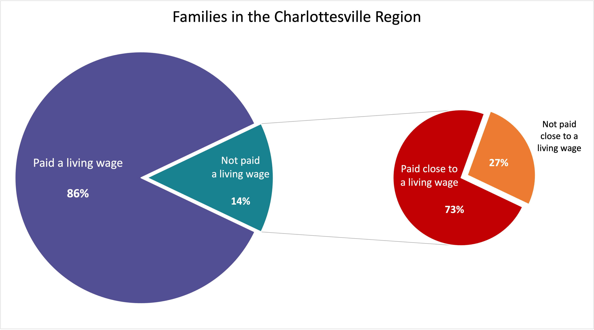

```{r setup, include = FALSE}
knitr::opts_chunk$set(echo = FALSE, warning = FALSE, message = FALSE)
```

```{r libs}
library(tidyverse)
library(sf)
library(leaflet)
# devtools::install_github("johannesbjork/LaCroixColoR")
# library(LaCroixColoR)
library(flextable)
library(officer)
library(scales)
library(patchwork)

# ACS data
tractdat <- read_csv("data/acs_tract_orangedot.csv")
tractdat$GEOID <- as.character(tractdat$GEOID)
countydat <- read_csv("data/acs_county_orangedot.csv")

# tract names 
tnames <- read_csv("data/tractnames.csv")
tnames$GEOID <- as.character(tnames$GEOID)

tractdat <- tractdat %>%
  left_join(tnames[,c('tractnames', 'GEOID')], by = "GEOID")

# sort by locality (alphabetically, for table order)
countydat <- countydat %>% arrange(countyName)

# Spatial data
geo <- readRDS("data/cvilleODreport_tracts.RDS")
geo$GEOID <- as.character(geo$GEOID)

geofull <- geo %>%
  left_join(tractdat, by = "GEOID")

geofull <- st_transform(geofull, crs = 4326) 

expenses <- read_csv("data/Expenses-SH-2kids.csv")

highlightcolor <- "#EE6100"
lowlightcolor <- "#FFAD0A"

set_flextable_defaults(
  background.color = "#FFFFFF"
)
```

# Preface

The first Orange Dot Report was released in 2011 and served both to describe the local income deficit – the gap between what families receive as income and what they need to earn to be self-sufficient – in Charlottesville and to develop strategies for creating pathways to self-sufficiency for families in the region. This initial effort launched the innovative Network2Work framework pioneered at Piedmont Virginia Community College, a process that brings together a Job-Seeker Network, an Employer Network, and a Provider Network to match match job-seekers to family-sustaining jobs and careers and to connect them to community resources using neighborhood-based volunteers.

As Network2Work has grown, the Orange Dot Report has also expanded, encompassing Charlottesville and Albemarle County in Orange Dot 2.0 (2015) and the entire region (Albemarle, Buckingham, Charlottesville, Flufanna, Greene, Louisa, and Nelson) in Orange Dot 3.0 (2018) and Orange Dot 4.0 (2021). Along the way, the report has come to serve as a central resource for the community and an important update on the progress of our community.

This report, Orange Dot 5.0, represents the continuation of our community’s progress toward a more fully and equitable thriving region. Orange Dot 5.0, incorporating an updated description of the condition of families in our larger region, marks the beginning of an annual update completed in partnership between Network2Work\@PVCC and The Equity Center at the University of Virginia. We will be providing an update of the report in early spring incorporating the most recent information from the U.S. Census’ American Community Survey along with the progress of Network2Work\@PVCC in creating pathways to self-sufficiency. [It feels like this would be a good place for an invitation to other providers/resources, but not entirely sure what the invitation should/could be.]


# Summary

In the larger Charlottesville community, 9,413 families (14 percent) do not make enough money to afford the essentials of life—food, shelter, clothing and utilities—and the added costs associated with working—childcare and transportation. This number represents the families making less than $35,000 in our region. 

This represents an improvement since the first Orange Dot Report in 2011. For the Charlottesville region, defined as the city of Charlottesville and the surrounding counties of Albemarle, Buckingham, Fluvanna, Greene, Louisa and Nelson, the comparable number of families struggling in the region was 12,552, 21 percent of families. One out of five families. 

However, the cost of essentials has gone up over time. Currently in our region, these basic needs require over $45,000 a year for a single parent with a toddler in childcare. Twenty percent of families in our community are still below this higher threshold. In this report, we continue to use the $35,000 income threshold as the break point for defining struggling families to remain consistent with the four prior reports, so these numbers should be understood as a minimum – at least 9,413 families are struggling.^[As we begin updating these estimates annually, we hope to work with community partners and providers to consider together what metric we should use.]

While families facing economic insecurity live throughout our region, the likelihood that a family is struggling varies by race and by place. The struggle is not equally shared. 

* Thirty-two percent of black families make less than $35,000/year, compared to 11 percent of white families, a persistent gap resulting from past and ongoing policies that suppress investment, opportunity, and wealth creation in black communities. 
* The percent of families struggling is highest in Buckingham County, at 28 percent, and lowest in Louisa County, at 8 percent. 
* Within every locality except Fluvanna, there are neighborhoods where a quarter or more of families have less than family-sufficient incomes. The four neighborhoods with the highest percent of struggling families are in the city of Charlottesville.

Our community has seen progress since this work began in 2011, but there are still too many struggling families in our community. In a region as prosperous as ours, however, ten thousand families is not too many to help.


# Introduction

> "[W]henever you are engaged in work that serves humanity and is for the building of humanity, it has dignity, and it has worth [...] All labor has dignity." 
>
> --- Martin Luther King Jr.^[Martin Luther King, Jr. (March 18, 1968). Retrieved from https://www.beaconbroadside.com/broadside/2018/03/the-50th-anniversary-of-martin-luther-king-jrs-all-labor-has-dignity.html]

The last few years have brought our country’s and our community’s ongoing struggles and inequities into stark relief. The continued pandemic, the growing housing affordability crisis, the increasing volatility of man-made climate change have created challenges for all of us. But low-income individuals, especially individuals of color, are suffering disproportionately, both physically and financially. 

Despite working hard, many families struggle to make ends meet, in part because they’re work is not treated with dignity. Or at least, many hard-working families are not compensated as though their work has dignity. While the enormous value, the essentialness, of the labor performed by “front-line” workers became clear to all during the pandemic, many people laboring in these positions do not earn enough to provide for their families. Rising prices and inflation will only worsen the strain.

We all seek security and stability, to feed our families, to see our children thrive, to create community with others, to promote our wellbeing. For families experiencing economic security, all of this is jeopardized. When faced daily with financial struggles – to pay for housing, to repair the car that carries you to work, to put food on the table, to find and afford a safe environment for your children – it is difficult to be the parent you want to be, the worker you know you could be, or the person you were meant to be.
We all deserve a chance to thrive, but we are all not yet given that chance. Towards that end, we must seek to build an equitable economy, one intentionally constructed on a foundation of racial justice.

Knowing that we can only solve issues we can understand, we provide a snapshot of the families in our community who are struggling, an update to the Orange Dot Project report first issued in September 2011.^[To find previous versions of the Orange Dot report, go to https://www.pvcc.edu/history-network2workpvcc- program] 

What we have learned since this work began in 2011 is that there are too many struggling families in our community, but not too many to help.


# Struggling Families

There are 66,633 families living in the Charlottesville region, defined as the city of Charlottesville and the surrounding counties of Albemarle, Louisa, Nelson, Buckingham, Greene, and Fluvanna.^[Family is defined as two or more people related by birth, marriage, or adoption and living in the same household. U.S. Census Bureau (2020). Household Type, 2016-2020. Retrieved from https://data.census.gov/cedsci/table?q=B11001&g=0500000US51003,51029,51065,51079,51109,51125,51540&tid=ACSDT5Y2020.B11001.]

Of these, 9,413 families (14 percent) do not make enough money to afford the essentials of life-—food, shelter, clothing and utilities-—and the added costs associated with working (childcare and transportation).^[This report reflects the U.S. Census Bureau's American Community Survey 5-year averages, 2016-2020.]

While this is still too many families, this is a decrease compared to the numbers provided in the prior report. In the Orange Dot Report 4.0, there were 10,940 families (17 percent) who did not earn enough to meet their basic needs. Since then our community has seen that number reduced by nearly 14 percent.^[This is a community success, brought about primarily by the hard work of the job-seekers themselves, made possible by the quality employers who hire them, and propelled by the social and material support supplied by family, friends and a network of community-based organizations and agencies.]

## Number of families struggling in the region {.figure-title}

```{r}
# flextable
strfam_tot <- countydat %>%
  dplyr::select(countyName, AllFamUnder35kE, perc_AllFamUnder35kE) %>%
  rename(Locality = countyName,
         Number = AllFamUnder35kE,
         Percent = perc_AllFamUnder35kE) %>% 
  mutate(Percent = round(Percent,1))

flextable(strfam_tot) %>% 
  width(width = 5) %>%
  align(align = "center", part = "all") %>% 
  bg(i = ~Number > 9000, bg = lowlightcolor) %>%
  color(i = ~Number > 9000, color = "black") %>% 
  colformat_num(j = "Percent", suffix = "%") %>% 
  border_inner_h(border = fp_border(color="gray", width=1)) %>%
  set_header_labels(values = list(Number = "Number of Families Struggling", Percent = "Percent of Families Struggling"))

```
<br/>

Families in our community generally need to earn at least $35,000 annually to meet their basic needs, as detailed in the locality profiles below. While some of the 9,413 families struggling in our community appear to have limited earning capacity (those with incomes from $0-$14,999), most are working and earning income ($15,000-$34,999), just not enough to support their families.

## Breakdown of families making under $35,000 {.figure-title}

```{r}
income_break <- countydat %>% 
  filter(countyName != "Whole Region") %>% 
  select(AllFamUnder10kE, AllFamBtw10_14kE,
         AllFamBtw15_24kE, AllFamBtw25_34kE, AllFamUnder35kE) %>% 
  pivot_longer(cols = everything(), names_to = "Income", values_to = "Number") %>% 
  group_by(Income) %>% 
  summarize(Number = sum(Number)) %>% 
  mutate(Income = factor(Income, 
                         levels = c("AllFamUnder10kE", "AllFamBtw10_14kE",
                                    "AllFamBtw15_24kE", "AllFamBtw25_34kE",
                                    "AllFamUnder35kE"),
                         labels = c("$0 - $9,999", "$10,000 - $14,999",
                                    "$15,000 - $24,999", "$25,000 - $34,999",
                                    "Total"))) %>% 
  arrange(Income) %>% mutate(group = c(1,1,2,2,3))

totfam <- as_vector(income_break[5,2])

income_break <- income_break %>% 
  mutate(Percent = round((Number/totfam)*100, 0)) %>% 
  group_by(group) %>% 
  mutate(Cumulative = sum(Percent)) %>% 
  ungroup() %>% 
  select(-group)

flextable(income_break) %>% 
  merge_v() %>% 
  merge_h() %>% 
  width(width = 5) %>% 
  align(align = "center", part = "all") %>% 
  bg(j = "Cumulative", bg = lowlightcolor) %>%
  bg(j = "Cumulative", i = ~ Cumulative > 70, bg = highlightcolor) %>% 
  colformat_num(j = c("Percent", "Cumulative"), suffix = "%") %>% 
  border_inner_h(border = fp_border(color="gray", width=1))%>%
  color(j = "Cumulative", i = ~ Cumulative > 70, color = "white") 
```
<br/>

This highlights an important distinction. There are at least two categories of families – those who are closer to self-sufficiency and who can more readily earn more with the right opportunities, and those whose earning potential is more limited – and different strategies are required to improve the lives of families within each.

For most families, low-incomeness is not a constant, not a condition or internal characteristic that must be managed, but a variable that must be changed. For a family experiencing economic struggle, the first question should be: What do they need to improve their economic circumstances?

Some families are on fixed incomes or have otherwise reached a more constrained earning potential due to illness, caregiving responsibilities, and other circumstances. These families are unlikely to see their incomes increase appreciably and require sustained subsidy to meet their basic needs of food, shelter, clothing and utilities. Based on the income data above, which shows 3,057 families make less than $15,000 annually (28%), as well data from Charlottesville’s housing affordability study,^[Partners for Economic Solutions. (2018). Housing Needs Assessment: Socioeconomic and Housing Market Analysis. Washington, D.C.: Form-Based Code Institute/Smart Growth America, 58.] for roughly one-third of the families who are struggling, a self-sufficient family income will be out of reach. Their survival depends on the strength of the social safety net.

The vast majority of families, however, have the capacity to earn a family-sufficient income. They are working, but their labor is not sufficiently valued.

The undervaluing of labor has far-reaching consequences. The myth of American meritocracy promotes the idea that those who work hard and play by the rules will get ahead. The flipside of that myth – if you haven’t gotten ahead, it must be because you don’t work hard enough or play by the rules – leads to negative beliefs about the poor in our society and, subsequently, to reduced support for resources and programs meant to reduce the burdens of poverty. Working hard, however, does not guarantee that individuals will get ahead. Take the formula below:

<div class="shadowbox">
Hard Work x High Wages = High Income
<br/>
Hard Work x Low Wages = Low Income
</div>

The difference between these outcomes is not the hard work individuals put in, but the wages paid out. A full-time worker making Virginia’s minimum wage will have a gross income of 22,000 per year.^[Based on wage of $11/hour.] To reduce the number of struggling families, therefore, requires an increase in their wages. We need a system that identifies the 72 percent of low-income families who are working for a living but who are not valued, and help them increase their value in the eyes of their employers.

<br/>
```{r, fig.alt= "Two pie charts showing percents of families in the Charlottesville Region paid a living wage. The first shows 86% of families are paid a living wage and 14% are not paid a living wage. The second shows that of that 14% not paid a living wage, 73% are paid close to a living wage and 27% are not paid close to a living wage.", fig.align = "center", out.width = "100%"}

```
<br/>

To get ahead, those workers will need jobs and careers that pay enough to support their families.

We all benefit when the families in our community have access to jobs that pay sufficient incomes. Among the many advantages include:

The reason that boosting incomes is so important are among the truths that are self-evident:

**Children do better.** Graduating from college continues to be the fastest route to economic security, yet economic insecurity limits access to higher education. As Robert Putnam’s work shows, “a family’s socioeconomic status [has] become even more important than test scores in predicting which eighth graders would graduate from college. High-scoring poor kids are now slightly less likely (29 percent) to get a college degree than low-scoring rich kids (30 percent).”^[Putnam, R. (2015). Our Kids: The American Dream in Crisis. New York, NY: Simon & Schuster, 189-190.]

**Local businesses benefit.** Employees are also consumers, and increased income among a region’s workers means more spending power, which lower-wage workers are more likely to spend locally on basic needs..

**Taxpayers benefit.** Given the chance, families want to provide for themselves. When they are able to do so, they require less support from others.

**People live longer.** According to the Centers for Disease Control, the biggest contributor to poor health is low socio-economic status. The Health Inequality Project estimates that a woman in the Charlottesville area in the lowest income quartile has a life expectancy of seven years less than a woman from the highest income quartile; among men in our region, the life expectancy gap is nearly ten years.^[Chetty R, Stepner M, Abraham S, et al. (2016). The Association Between Income and Life Expectancy in the United States, 2001-2014. JAMA 315:1750–1766. doi:10.1001/jama.2016.4226. Data: https://healthinequality.org/data/]

**The community thrives.** A community thrives when its residents thrive. Residents thrive when their capacity as human beings is unleashed. And their capacity as human beings can only be unleashed when their basic needs are met. 


# The Intersection with Race

Too many families are struggling in our region, but these burdens are not equally shared.
Throughout our country and our history, the labor of our black neighbors has been systematically valued less than the labor of our white neighbors. The undervaluing of Black labor has been reinforced through many policies from those we’ve recognized as racially discriminatory – enslavement, Black codes, Jim Crow, Massive Resistance – to ongoing and often unacknowledged choices - a legacy of disinvestment in and displacement of black communities, the blocking wealth creation through red-lining and predatory lending, disenfranchisement and political demobilization, disproportionately punitive treatment by the carceral system, overt and subconscious negative stereotypes. And the list could go on.

These policies and choices have generated a significant racial wealth gap. The Federal Reserve Bank of St. Louis, for example, calculated that the average net worth of a white family in America was ten times greater than the net worth of a black family, as shown below.^[Mock, B. (2019, March 21). Why Can’t We Close the Racial Wealth Gap? Bloomberg City Lab. Retrieved from https://www.bloomberg.com/news/articles/2019-03-21/how-income-inequality-feeds-the-racial-wealth-gap. Data on unequal labor income in our region comes from U.S. Census Bureau (2020). Family Income in the Past 12 Months. American Community Survey 5-Year Estimates, 2014-2018, Tables B19101, 19101A, 19101B.]

<br/>
```{r, fig.alt="Distribution of family wealth by race and ethinicity. Wealth gaps in terms of Black and Hispanic families' cents per every dollar of white family wealth shown for percentile groups. Source: Federal Reserve Bank of St. Louis.", fig.align = "center", out.width = "80%"}
knitr::include_graphics("WealthGap.png")
```
<br/>

That racial wealth gap is best explained by unequal labor income, according to research from the Federal Reserve Bank of Cleveland.^[Mock, B. (2019, March 21). Why Can't We Close the Racial Wealth Gap? Bloomberg City Lab. Retrieved from https://www.bloomberg.com/news/articles/2019-03-21/how-income-inequality-feeds-the-racial-wealth-gap.]

<br/>
```{r, fig.alt="Figure showing percent of racial wealth gap from 1962 to 2007. Title: A racial income gap explains the US's wealth gap today. Subtitle: Federal Reserve Bank economists found unequal incomes explain the black-white wealth gap's persistence today more than inherited wealth or investment returns. Source: Federal Reserve Bank of Cleveland research economists Dionissi Aliprantic and Daniel Carroll.", fig.align = "center", out.width = "80%"}
knitr::include_graphics("IncomeGap.jpg")
```
<br/>

This struggle is not new. When Dr. Martin Luther King, Jr. stood on the steps of the Lincoln Memorial on August 28, 1963 to deliver his iconic I Have A Dream speech, he was addressing a “March for Jobs and Freedom.” When he was assassinated at the Lorraine Motel on April 4, 1968, he was in Memphis to stand shoulder to shoulder with black sanitation workers fighting for higher wages.

This struggle is also local, as was made stark in the violence and terror of August 11 and 12, 2017. And the unequal labor income within the nation is reflected in our community as well. As shown below, the percent of black families making less than family-sustaining income is consistently higher across our region than the percent of white families struggling, and is especially high in Albemarle and Charlottesville.^[Data on unequal labor income in our region comes from U.S. Census Bureau (2020). Family Income in the Past 12 Months. American Community Survey 5-Year Estimates, 2014-2018, Tables B19101, 19101A, 19101B.]

## Families Making under $35,000 by Race {.figure-title}

```{r, fig.width = 10, fig.height = 8}
cnty_race_long <- countydat %>% 
  filter(countyName != "Whole Region") %>% 
  select(countyName, count_AllFamUnder35kE = AllFamUnder35kE, 
         count_BlackFamUnder35kE = BlackFamUnder35kE, count_WhiteFamUnder35kE = WhiteFamUnder35kE,
         perc_AllFamUnder35kE, perc_WhiteFamUnder35kE, perc_BlackFamUnder35kE) %>% 
  pivot_longer(-countyName, names_to = c(".value", "fam"), names_sep = "_") %>% 
  mutate(fam = factor(fam, levels = c("AllFamUnder35kE", "BlackFamUnder35kE", "WhiteFamUnder35kE"),
                        labels = c("All families", "Black families", "White families")))

numplot <- ggplot(cnty_race_long, aes(y = count, 
                           x = fct_reorder(countyName, count), 
                           fill = fct_rev(fam))) + 
  geom_bar(position="dodge", stat="identity") +
  geom_text(aes(label = comma(count)),
            position = position_dodge(width=0.9), hjust = -0.2, 
            size = 4) + 
  labs(title = "Number of Families", x = "", y = "") + 
  scale_fill_manual(values=c("#7473A6", "#1BB6AF", "#FFAD0A"), 
                    name = element_blank()) + 
  scale_y_continuous(labels = label_comma(),
                     limits = c(0,3200)) +
  annotate("text", x = "Greene", y = 2200, color = "black",
           label = "9,413 families\n in region", size = 5) +
  theme_minimal() +
  coord_flip() +
  guides(fill = guide_legend(reverse = TRUE)) +
  theme(legend.position = "bottom",
        axis.text=element_text(size=10),
        legend.text = element_text(size=14),
        plot.title = element_text(size=16, hjust = 0.5))

allperc <- as_vector(countydat %>% filter(countyName == "Whole Region") %>% 
                       select(perc_AllFamUnder35kE))

percplot <- ggplot(cnty_race_long, aes(y = perc,
                           x = fct_reorder(countyName, count), 
                           fill = fct_rev(fam))) + 
  geom_bar(position="dodge", stat="identity") +
  geom_text(aes(label = percent(perc, scale = 1, accuracy = 0.1)),
            position = position_dodge(width=0.9), hjust = -0.25, 
            size = 4) + 
  labs(title = "Percent of Families", x = "", y = "") + 
  scale_fill_manual(values=c("#7473A6", "#1BB6AF", "#FFAD0A"), 
                    name = element_blank()) + 
  scale_y_continuous(labels = label_percent(scale = 1),
                     limits = c(0,55)) +
  geom_hline(yintercept = allperc, color = "gray50", linetype = "dashed") +
  annotate("curve", y = 30, x = 1, yend = 14.5, xend = 1.7, 
           curvature = -0.1, arrow = arrow(length = unit(2, "mm")),  color = "gray50") +
  annotate("text", x = 1, y = 30.5, size = 5, color = "black",
           label = "14% of families\n in region", hjust = "left") +
  theme_minimal() +
  coord_flip() +
  guides(fill = guide_legend(reverse = TRUE)) +
  theme(legend.position = "bottom",
        axis.text=element_text(size=10),
        legend.text = element_text(size=14),
        plot.title = element_text(size=16, hjust = 0.5))

numplot + percplot + 
  plot_layout(guides = 'collect') &
  theme(legend.position='bottom')
```
<br/>

We need to be intentional about helping all families in our community who are struggling to achieve self-sufficient income, but must be especially attentive to black families who are struggling in our economy as they may understandably be distrustful or disconnected from the very institutions positioned to help.


# Locality Profiles

The following sections explore each locality separately, detailing what it costs to be self-sufficient in each of the localities that comprise the region - including the costs of food^[U.S. Department of Agriculture, Center for Nutrition Policy and Promotion (2022). Official USDA Food Plans: Cost of Food at Home at Four Levels, U.S. Average, May 2022, Weekly Cost of the Low-Cost Plan. Retrieved from https://www.fns.usda.gov/sites/default/files/media/file/CostofFoodMay2022Thrifty.pdf], shelter^[Virginia Housing. (2022). 2022 Fair Market Rents. retrieved from https://www.huduser.gov/portal/datasets/fmr/fmrs/FY2022_code/2022summary.odn], clothing^[U.S. Department of Agriculture, Center for Nutrition Policy and Promotion. (2017). Expenditures on Children by Families, Estimated annual expenditures on a child by single-parent families. Retrieved from https://www.fns.usda.gov/sites/default/files/resource-files/crc2015-march2017.pdf and U.S. Bureau of Labor Statistics. (2020). Consumer Expenditures Survey, CE Tables, Age of Reference Person, Apparel and Services by Women, 16 and over. Retrieved from https://www.bls.gov/cex/tables/calendar-year/mean-item-share-average-standard-error/reference-person-age-ranges-2020.pdf], utilities^[Virginia Housing Development Authority. (2022). Allowances for Tenant-Furnished Utilities and Other Services, Two Exposed UA Schedule. Retrieved from https://mc-0e9acafd-48f4-4c49-b478-6257-cdn-endpoint.azureedge.net/-/media/docs/partners/housing-choice-vouchers/utility-allowance/2exposed-walls.pdf?rev=91c81573c2e94b8cb314f871bbad5e65&hash=666946C107D54311AC4222AC1E81F850 and the U.S. Bureau of Labor Statistics. (2020), Consumer Expenditure Survey, Telephone Services. Retrieved from https://www.bls.gov/cex/tables/calendar-year/mean-item-share-average-standard-error/reference-person-age-ranges-2020.pdf], childcare^[Virginia Department of Social Services, Division of Child Care and Early Childhood Development. (2021). Child Care Subsidy Program Guidance Manual. Richmond, Virginia. Retrieved from https://doe.virginia.gov/cc/files/child-care-subsidy-guidance-manual.pdf.], transportation^[U.S. Bureau of Labor Statistics. (2020). Consumer Expenditures Survey, CE Tables, Age of Reference Person, Apparel and Services by Women, 16 and over. Retrieved from https://www.bls.gov/cex/tables/calendar-year/mean-item-share-average-standard-error/reference-person-age-ranges-2020.pdf], and necessary costs^[Garner, T. (2010). Supplemental Poverty Measure Thresholds: Laying the Foundation. Washington DC: Bureau of Labor Statistics.] - and describing how many families in each locality are struggling.

We show, too, how families are faring by race, as above, and by place. Places, or the neighborhoods within localities, are captured with census tracts, areas used by the United States Census Bureau to approximate neighborhoods. Census tracts are roughly equal in population and are bounded by major roads, rivers and railroad tracks. The geographic variation in our region is evident across these census tracts. Charlottesville for example, is a city of roughly 10 square miles that are more densely populated. Albemarle surrounds Charlottesville and dwarfs it physically at 726 square miles, but has both dense neighborhoods and sprawling rural ones. 

While there is variation across the communities that define the greater Charlottesville region, there is one constant: throughout the region there are hundreds of families who struggle every day to put a roof over their heads, food in their bellies, clothes on their backs and heat in their homes.

## Localities {.tabset .tabset-pills}

### Albemarle County
```{r}
albemarle <- countydat %>% filter(countyName == "Albemarle")
```

#### Albemarle County

There are `r comma(albemarle$AllFamE)` families living in `r albemarle$countyName` county.

Of these, `r comma(albemarle$AllFamUnder35kE)` (`r percent(albemarle$perc_AllFamUnder35kE, scale = 1, accuracy = 0.1)`) do not earn enough to provide for their basic needs and the costs associated with working.

Albemarle County at a glance:

* Albemarle and Charlottesville are the most expensive localities in terms of housing and childcare.

* Albemarle and Charlottesville have the largest disparities in the percent of Black and White families making <$35k/year (the percent of Black families making <$35/year is `r round(albemarle$perc_BlackFamUnder35kE - albemarle$perc_WhiteFamUnder35kE, 0)`% higher than the percent of White families in Albemarle). 

* Albemarle, relative to the other localities, has the highest number of families making $25,000-34,999/year. 

* Families making less than <$35k/year tend to be more highly concentrated near the University of Virginia and the Oak Hill neighborhood. 

##### Expenses: Single Householder + 2 Children (1 Toddler)
```{r}
exAC <- expenses %>%
  filter(Locality == "Albemarle",
         Unit == "Total") %>%
  select(Expense, Annual, Monthly, Weekly)

flextable(exAC) %>% 
  width(width = 5) %>%
  align(align = "center", part = "all") %>% 
  bg(i = ~Annual > 30000, bg = lowlightcolor) %>% 
  bg(i = ~Annual > 49390, bg = highlightcolor) %>%
  border_inner_h(border = fp_border(color="gray", width=1)) %>%
  color(i = ~Annual > 49390, color = "white") 
```
<br/>

##### Breakdown of families making under $35,000 in Albemarle County
```{r}
income_break_ac <- albemarle %>% 
  select(AllFamUnder10kE, AllFamBtw10_14kE,
         AllFamBtw15_24kE, AllFamBtw25_34kE, AllFamUnder35kE) %>% 
  pivot_longer(cols = everything(), names_to = "Income", values_to = "Number") %>% 
  group_by(Income) %>% 
  summarize(Number = sum(Number)) %>% 
  mutate(Income = factor(Income, 
                         levels = c("AllFamUnder10kE", "AllFamBtw10_14kE",
                                    "AllFamBtw15_24kE", "AllFamBtw25_34kE",
                                    "AllFamUnder35kE"),
                         labels = c("$0 - $9,999", "$10,000 - $14,999",
                                    "$15,000 - $24,999", "$25,000 - $34,999",
                                    "Total"))) %>% 
  arrange(Income) %>% mutate(group = c(1,1,2,2,3))

totfam <- as_vector(income_break_ac[5,2])

income_break_ac <- income_break_ac %>% 
  mutate(Percent = round((Number/totfam)*100, 0)) %>% 
  group_by(group) %>% 
  mutate(Cumulative = sum(Percent)) %>% 
  ungroup() %>% 
  select(-group)

flextable(income_break_ac) %>% 
  merge_v() %>% 
  merge_h() %>% 
  width(width = 5) %>% 
  align(align = "center", part = "all") %>% 
  bg(j = "Cumulative", bg = lowlightcolor) %>%
  bg(j = "Cumulative", i = ~ Cumulative > 70, bg = highlightcolor) %>% 
  colformat_num(j = c("Percent", "Cumulative"), suffix = "%") %>% 
  border_inner_h(border = fp_border(color="gray", width=1))%>%
  color(j = "Cumulative", i = ~ Cumulative > 70, color = "white") 

```
<br/>
As this table shows, `r paste0(income_break_ac$Cumulative[4], "%")`  of the families who cannot meet their basic needs earn between $15,000-$35,000 annually. This strongly suggests they are working, but not earning the wages or not getting the hours they need to support their families.

The bar graph below shows the distribution of families in various pay ranges, broken up by race. In a world with racial equity in income, the bars for all families, Black families, and White families would be equal in height. As you can see, Black families are over-represented at the low end of the pay ranges (<$35k/year), and Black families are under-represented at the high end of the pay ranges (>$100k/year). In other words, relative to White families, Black families are more likely to be paid insufficient wages and less likely to be high-earning. 

Relative to the other localities, in Albemarle County, a higher share of families fall into the high-earning pay ranges---this distribution is likely related to the high cost of housing within the county. 

##### Income distribution of Black and White families in Albemarle County
```{r fig.align = 'center'}
alb_race_long <- albemarle %>% 
  select(perc_AllFamUnder35kE, perc_WhiteFamUnder35kE, perc_BlackFamUnder35kE,
         perc_AllFamBtw35_59kE, perc_WhiteFamBtw35_59kE, perc_BlackFamBtw35_59kE,
         perc_AllFamBtw60_100kE, perc_WhiteFamBtw60_100kE, perc_BlackFamBtw60_100kE,
         perc_AllFamOver100kE, perc_WhiteFamOver100kE, perc_BlackFamOver100kE) %>% 
  pivot_longer(cols = everything(), names_to = c("fam", "inc"), 
               names_pattern = "perc_(AllFam|BlackFam|WhiteFam)(.+)", 
               values_to = "Percent") %>% 
  mutate(inc = factor(inc, levels = c("Under35kE", "Btw35_59kE", "Btw60_100kE", "Over100kE"),
                      labels = c("Earning Under $35K", "Earning $35K-$59,999K", "Earning $60-100k","Earning Over $100K")),
         fam = factor(fam, levels = c("AllFam", "BlackFam", "WhiteFam"),
                      labels = c("All families", "Black families", "White families")))

ggplot(alb_race_long, aes(y = Percent,
                           x = inc, 
                           fill = fam)) + 
  geom_col(position="dodge") +
  labs(title = "Percent of Albemarle Families", x = "", y = "") + 
  geom_text(aes(label = percent(Percent, scale = 1, accuracy = 1)),
            position = position_dodge(width=0.9), vjust = -0.25, 
            size = 4) + 
  scale_fill_manual(values=c("#FFAD0A", "#1BB6AF", "#7473A6"), 
                    name = element_blank()) + 
  scale_y_continuous(labels = label_percent(scale = 1)) +
  # annotate("text", x = 1.1, y = 30.5, size = 3, color = "gray50",
  #          label = "Percent in region (14%)", hjust = "left") +
  theme_minimal() +
  #coord_flip() +
  #guides(fill = guide_legend(reverse = TRUE)) +
  theme(legend.position = "bottom",
        legend.text = element_text(size=12),
        plot.title = element_text(size=16, hjust = 0.5))
```
<br/>
The maps below show the geo-spatial relationships between income and neighborhood. The color of each census tract in the county is based on the median family income or the percent of families within the tract who make less than $35k/year. The maps show how neighborhoods are often concentrated with either high-earning or low-earning families, which has implications for the resources and opportunities available to the families living within each tract. 

Which neighborhoods or census tracts in Albemarle County have the highest median family incomes? Which have the lowest? Click on each tract to see its median income and a nickname for the tract based on which neighborhood the tract contains. 

##### Median family income in Albemarle County
```{r}
ACmap <- geofull %>%
  filter(countyName == "Albemarle")

# pal <- colorBin(palette = c("#D72000", "#FFAD0A", "#1BB6AF", "#EE6100", "#9093A2", "#132157"), domain = ACmap$medianFamIncomeE)

# show_col(lacroix_palette("Apricot", type = "continuous", n = 20))
# pal_vector <- lacroix_palette("Apricot", type = "continuous", n = 20)[5:14]
pal_vector <- c("#EE6400","#F37903","#F78C05","#FCA108","#E7AD1B","#ABB046","#6FB272","#33B59D","#2DB0AC","#4CA7A9")

pal <- colorBin(pal_vector, 
                domain = geofull$medianFamIncomeE)

# pal <- colorQuantile(pal_vector,
#                      domain = ACmap$medianFamIncomeE, n = 5)

leaflet() %>% 
  leaflet(width = "100%") %>%
  addProviderTiles("CartoDB.Positron") %>% 
  addPolygons(data = ACmap,
              fillColor = ~pal(medianFamIncomeE),
              # fillColor = ~lacroix_palette("Apricot", type = "continuous"),
              weight = 1,
              opacity = 1,
              color = "white", 
              fillOpacity = 0.6,
              smoothFactor = 0.3,
              highlight = highlightOptions(
                weight = 1, fillOpacity = 0.8, bringToFront = T),
              popup = paste0("Median family income: ", "$", comma(ACmap$medianFamIncomeE), "<br>",
                             "Census Tract: ", ACmap$NAME.x, "<br>",
                             "Area Name: ", ACmap$tractname)) %>% 
  addLegend("bottomright", pal = pal, values = ACmap$medianFamIncomeE, 
            title = "Median family income", opacity = 0.7)
```

The `r paste0(ACmap$tractnames[which.min(ACmap$medianFamIncomeE)])` tract has the lowest median family incomes at $`r paste0(comma(ACmap$medianFamIncomeE[which.min(ACmap$medianFamIncomeE)]))`. Due to its proximity to the University, this tract likely includes graduate students and other low-paid families employed by the University. By contrast, the `r paste0(ACmap$tractnames[which.max(ACmap$medianFamIncomeE)])` tract has the highest median family income  at $`r paste0(comma(ACmap$medianFamIncomeE[which.max(ACmap$medianFamIncomeE)]))`, and it likely includes many University professors and high-paid administrators. 

The following map shows the concentration of low-paid families by showing the percent of families in each tract who earn less than $35k/year. For Albemarle County, it shows a similar pattern as the previous map--the highest percentage of low-paid families are concentrated in the Carr's Hill-McCormick Road (UVA), Oak Hill, and Southwood tracts. Most of the other tracts in the county have no more than 20% of families making less than $35k/year. 

##### Percent of families making under $35,000 in Albemarle County
```{r}
# pal <- colorBin(palette = c("#D72000", "#FFAD0A", "#1BB6AF", "#EE6100", "#9093A2", "#132157"), domain = ACmap$perc_AllFamUnder35kE)

# show_col(lacroix_palette("Apricot", type = "continuous", n = 10))
# pal2_vector <- lacroix_palette("Apricot", type = "continuous", n = 10)[2:7]
pal2_vector <- c("#E34400","#EF6901","#F99306","#CCAF2E","#4DB48A","#41AAAA")

pal2 <- colorBin(pal2_vector, 
                domain = geofull$perc_AllFamUnder35kE,
                reverse = TRUE)

leaflet() %>% 
  leaflet(width = "100%") %>%
  addProviderTiles("CartoDB.Positron") %>% 
  addPolygons(data = ACmap,
              fillColor = ~pal2(perc_AllFamUnder35kE),
              weight = 1,
              opacity = 1,
              color = "white", 
              fillOpacity = 0.6,
              smoothFactor = 0.3,
              highlight = highlightOptions(
                weight = 1, fillOpacity = 0.8, bringToFront = T
              ),
              popup = paste0("Percent of families: ", round(ACmap$perc_AllFamUnder35kE,1), "%", "<br>",
                             "Census Tract: ", ACmap$NAME.x, "<br>",
                             "Area Name: ", ACmap$tractname)) %>% 
  addLegend("bottomright", pal = pal2, values = ACmap$perc_AllFamUnder35kE, 
            title = "Percent of families <br> making < $35,000", opacity = 0.7)
```

### Buckingham County
```{r}
buckingham <- countydat %>% filter(countyName == "Buckingham")
```

#### Buckingham County

There are `r comma(buckingham$AllFamE)` families living in `r buckingham$countyName` county. This is the fewest number of families in a locality in the region.

Of these, `r comma(buckingham$AllFamUnder35kE)` (`r percent(buckingham$perc_AllFamUnder35kE, scale = 1, accuracy = 0.1)`) do not earn enough to provide for their basic needs and the costs associated with working. This is the highest percent of families struggling in localities across the region.

Buckingham County at a glance:

* Buckingham has the least expensive housing and childcare relative to the other localities in the region, and yet it still has the largest percentage of families earning less than they need to afford basic needs.

* In Buckingham, the percent of Black families making <$35k/year is `r paste0(round(buckingham$perc_BlackFamUnder35kE - buckingham$perc_WhiteFamUnder35kE, 0), "%")` higher than the percent of White families making <$35k/year. 

* Buckingham, relative to the other localities, has the lowest percent of families making over $100k/year--a higher share of Buckingham's families are concentrated in the lower pay ranges. 

* Because so many families are paid <$35k/year in Buckingham, the share of low-paid families is more evenly distributed throughout the locality; the concentration of low-paid families is less obvious in Buckingham relative to the other localities. 

##### Expenses: Single Householder + 2 Children (1 Toddler)
```{r}
exBC <- expenses %>%
  filter(Locality == "Buckingham",
         Unit == "Total") %>%
  select(Expense, Annual, Monthly, Weekly)

flextable(exBC) %>% 
  width(width = 5) %>%
  align(align = "center", part = "all") %>% 
  bg(i = ~Annual > 20000, bg = lowlightcolor) %>% 
  bg(i = ~Annual > 40000, bg = highlightcolor) %>%
  border_inner_h(border = fp_border(color="gray", width=1)) %>%
  color(i = ~Annual > 40000, color = "white") 
```
<br/>

##### Breakdown of families making under $35,000 in Buckingham County
```{r}
income_break_bc <- buckingham %>% 
  select(AllFamUnder10kE, AllFamBtw10_14kE,
         AllFamBtw15_24kE, AllFamBtw25_34kE, AllFamUnder35kE) %>% 
  pivot_longer(cols = everything(), names_to = "Income", values_to = "Number") %>% 
  group_by(Income) %>% 
  summarize(Number = sum(Number)) %>% 
  mutate(Income = factor(Income, 
                         levels = c("AllFamUnder10kE", "AllFamBtw10_14kE",
                                    "AllFamBtw15_24kE", "AllFamBtw25_34kE",
                                    "AllFamUnder35kE"),
                         labels = c("$0 - $9,999", "$10,000 - $14,999",
                                    "$15,000 - $24,999", "$25,000 - $34,999",
                                    "Total"))) %>% 
  arrange(Income) %>% mutate(group = c(1,1,2,2,3))

totfam <- as_vector(income_break_bc[5,2])

income_break_bc <- income_break_bc %>% 
  mutate(Percent = round((Number/totfam)*100, 0)) %>% 
  group_by(group) %>% 
  mutate(Cumulative = sum(Percent)) %>% 
  ungroup() %>% 
  select(-group)

flextable(income_break_bc) %>% 
  merge_v() %>% 
  merge_h() %>% 
  width(width = 5) %>% 
  align(align = "center", part = "all") %>% 
  bg(j = "Cumulative", bg = lowlightcolor) %>%
  bg(j = "Cumulative", i = ~ Cumulative > 70, bg = highlightcolor) %>% 
  colformat_num(j = c("Percent", "Cumulative"), suffix = "%") %>% 
  border_inner_h(border = fp_border(color="gray", width=1)) %>%
  color(j = "Cumulative", i = ~Cumulative > 70, color = "white") 
```
<br/>
As this table shows, `r paste0(income_break_bc$Cumulative[4], "%")`  of the families who cannot meet their basic needs earn between $15,000-$35,000 annually. This strongly suggests they are working, but not earning the wages or not getting the hours they need to support their families.

The bar graph below shows the distribution of families in various pay ranges, broken up by race. In a world with racial equity in income, the bars for all families, Black families, and White families would be equal in height. As you can see, Black families are over-represented at the low end of the pay ranges (<$35k/year), and Black families are under-represented at the high end of the pay ranges (>$100k/year). In other words, relative to White families, Black families are more likely to be paid insufficient wages and less likely to be high-earning. 

Relative to the other localities, in Buckingham County, a higher share of families overall fall into the low-earning pay ranges. 

##### Income distribution of Black and White families in Buckingham County
```{r fig.align = 'center'}
buc_race_long <- buckingham %>% 
  select(perc_AllFamUnder35kE, perc_WhiteFamUnder35kE, perc_BlackFamUnder35kE,
         perc_AllFamBtw35_59kE, perc_WhiteFamBtw35_59kE, perc_BlackFamBtw35_59kE,
         perc_AllFamBtw60_100kE, perc_WhiteFamBtw60_100kE, perc_BlackFamBtw60_100kE,
         perc_AllFamOver100kE, perc_WhiteFamOver100kE, perc_BlackFamOver100kE) %>% 
  pivot_longer(cols = everything(), names_to = c("fam", "inc"), 
               names_pattern = "perc_(AllFam|BlackFam|WhiteFam)(.+)", 
               values_to = "Percent") %>% 
  mutate(inc = factor(inc, levels = c("Under35kE", "Btw35_59kE", "Btw60_100kE", "Over100kE"),
                      labels = c("Earning Under $35K", "Earning $35K-$59,999K", "Earning $60-100k","Earning Over $100K")),
         fam = factor(fam, levels = c("AllFam", "BlackFam", "WhiteFam"),
                      labels = c("All families", "Black families", "White families")))

ggplot(buc_race_long, aes(y = Percent,
                           x = inc, 
                           fill = fam)) + 
  geom_col(position="dodge") +
  labs(title = "Percent of Buckingham Families", x = "", y = "") + 
  geom_text(aes(label = percent(Percent, scale = 1, accuracy = 1)),
            position = position_dodge(width=0.9), vjust = -0.25, 
            size = 4) + 
  scale_fill_manual(values=c("#FFAD0A", "#1BB6AF", "#7473A6"), 
                    name = element_blank()) + 
  scale_y_continuous(labels = label_percent(scale = 1)) +
  # annotate("text", x = 1.1, y = 30.5, size = 3, color = "gray50",
  #          label = "Percent in region (14%)", hjust = "left") +
  theme_minimal() +
  #coord_flip() +
  #guides(fill = guide_legend(reverse = TRUE)) +
  theme(legend.position = "bottom",
        legend.text = element_text(size=12),
        plot.title = element_text(size=16, hjust = 0.5))
```
<br/>
The maps below show the geo-spatial relationships between income and neighborhood. The color of each census tract in the county is based on the median family income or the percent of families within the tract who make less than $35k/year. In Buckingham county, the median family income is low (relative to the other counties) in each tract, which has implications for the resources and opportunities available to the families living there. 

Which neighborhoods or census tracts in Buckingham County have the highest median family incomes? Which have the lowest? Click on each tract to see its median income and a nickname for the tract based on which neighborhood the tract contains. 

##### Median family income in Buckingham County
```{r}
BCmap <- geofull %>%
  filter(countyName == "Buckingham")

leaflet() %>% 
  leaflet(width = "100%") %>%
  addProviderTiles("CartoDB.Positron") %>% 
  addPolygons(data = BCmap,
              fillColor = ~pal(medianFamIncomeE),
              # fillColor = ~lacroix_palette("Apricot", type = "continuous"),
              weight = 1,
              opacity = 1,
              color = "white", 
              fillOpacity = 0.6,
              smoothFactor = 0.3,
              highlight = highlightOptions(
                weight = 1, fillOpacity = 0.8, bringToFront = T),
              popup = paste0("Median family income: ", "$", comma(BCmap$medianFamIncomeE), "<br>",
                             "Census Tract: ", BCmap$NAME.x, "<br>",
                             "Area Name: ", BCmap$tractname)) %>% 
  addLegend("bottomright", pal = pal, values = BCmap$medianFamIncomeE, 
            title = "Median family income", opacity = 0.7)
```

The `r paste0(BCmap$tractnames[which.min(BCmap$medianFamIncomeE)])` tract has the lowest median family incomes at $`r paste0(comma(BCmap$medianFamIncomeE[which.min(BCmap$medianFamIncomeE)]))`. However, relative to the other localities, the difference between the lowest median family income and the highest median family income in Buckingham is small---the `r paste0(BCmap$tractnames[which.max(BCmap$medianFamIncomeE)])` tract has the highest median family income ($`r paste0(comma(BCmap$medianFamIncomeE[which.max(BCmap$medianFamIncomeE)]))`) 

The following map shows the concentration of low-paid families by showing the percent of families in each tract who earn <$35k/year. Similar to the other counties, in Buckingham County, the tract with the lowest median family income also has the highest percentage of families making <$35k/year. 

##### Percent of families making under $35,000 in Buckingham County
```{r}
leaflet() %>% 
  leaflet(width = "100%") %>%
  addProviderTiles("CartoDB.Positron") %>% 
  addPolygons(data = BCmap,
              fillColor = ~pal2(perc_AllFamUnder35kE),
              weight = 1,
              opacity = 1,
              color = "white", 
              fillOpacity = 0.6,
              smoothFactor = 0.3,
              highlight = highlightOptions(
                weight = 1, fillOpacity = 0.8, bringToFront = T
              ),
              popup = paste0("Percent of families: ", round(BCmap$perc_AllFamUnder35kE,1), "%", "<br>",
                             "Census Tract: ", BCmap$NAME.x, "<br>",
                             "Area Name: ", BCmap$tractname)) %>% 
  addLegend("bottomright", pal = pal2, values = BCmap$perc_AllFamUnder35kE, 
            title = "Percent of families <br> making < $35,000", opacity = 0.7)
```

### Charlottesville City
```{r}
charlottesville <- countydat %>% filter(countyName == "Charlottesville")
```

#### Charlottesville City

There are `r comma(charlottesville$AllFamE)` families living in `r charlottesville$countyName` county. 

Of these, `r comma(charlottesville$AllFamUnder35kE)` (`r percent(charlottesville$perc_AllFamUnder35kE, scale = 1, accuracy = 0.1)`) do not earn enough to provide for their basic needs and the costs associated with working. 

Charlottesville City at a glance:

* Charlottesville and Albemarle County are the most expensive localities in terms of housing and childcare.

* Charlottesville has the largest disparities in the percent of Black and White families making <$35k/year (the percent of Black families making <$35/year is `r round(charlottesville$perc_BlackFamUnder35kE - charlottesville$perc_WhiteFamUnder35kE, 0)`% higher than the percent of White families in Charlottesville). 

* Charlottesville, relative to the other localities, has the largest percent of families making <$35k/year. 

* Families making less than <$35k/year tend to be more highly concentrated near the University of Virginia and the Oak Hill neighborhood. 

##### Expenses: Single Householder + 2 Children (1 Toddler)
```{r}
exCC <- expenses %>%
  filter(Locality == "Charlottesville",
         Unit == "Total") %>%
  select(Expense, Annual, Monthly, Weekly)

flextable(exCC) %>% 
  width(width = 5) %>%
  align(align = "center", part = "all") %>% 
  bg(i = ~Annual > 30000, bg = lowlightcolor) %>% 
  bg(i = ~Annual > 49390, bg = highlightcolor) %>%
  border_inner_h(border = fp_border(color="gray", width=1)) %>%
  color(i = ~Annual > 49390, color = "white") 
```
<br/>

##### Breakdown of families making under $35,000 in Charlottesville City
```{r}
income_break_cc <- charlottesville %>% 
  select(AllFamUnder10kE, AllFamBtw10_14kE,
         AllFamBtw15_24kE, AllFamBtw25_34kE, AllFamUnder35kE) %>% 
  pivot_longer(cols = everything(), names_to = "Income", values_to = "Number") %>% 
  group_by(Income) %>% 
  summarize(Number = sum(Number)) %>% 
  mutate(Income = factor(Income, 
                         levels = c("AllFamUnder10kE", "AllFamBtw10_14kE",
                                    "AllFamBtw15_24kE", "AllFamBtw25_34kE",
                                    "AllFamUnder35kE"),
                         labels = c("$0 - $9,999", "$10,000 - $14,999",
                                    "$15,000 - $24,999", "$25,000 - $34,999",
                                    "Total"))) %>% 
  arrange(Income) %>% mutate(group = c(1,1,2,2,3))

totfam <- as_vector(income_break_cc[5,2])

income_break_cc <- income_break_cc %>% 
  mutate(Percent = round((Number/totfam)*100, 0)) %>% 
  group_by(group) %>% 
  mutate(Cumulative = sum(Percent)) %>% 
  ungroup() %>% 
  select(-group)

flextable(income_break_cc) %>% 
  merge_v() %>% 
  merge_h() %>% 
  width(width = 5) %>% 
  align(align = "center", part = "all") %>% 
  bg(j = "Cumulative", bg = lowlightcolor) %>%
  bg(j = "Cumulative", i = ~ Cumulative > 50, bg = highlightcolor) %>% 
  colformat_num(j = c("Percent", "Cumulative"), suffix = "%") %>% 
  border_inner_h(border = fp_border(color="gray", width=1))%>%
  color(j = "Cumulative", i = ~Cumulative > 50, color = "white") 
```
<br/>
As this table shows, `r paste0(income_break_cc$Cumulative[4], "%")` of the families who cannot meet their basic needs earn between $15,000-$35,000 annually. This strongly suggests they are working, but not earning the wages or not getting the hours they need to support their families. In Charlottesville, however, the percent of families making <$35k/year are more equally distributed between 0-14,999 and 15-34,999. This distribution means that more families, relative to the other localities, are in the lowest income range.

The bar graph below shows the distribution of families in various pay ranges, broken up by race. In a world with racial equity in income, the bars for all families, Black families, and White families would be equal in height. As you can see, Black families are over-represented at the low end of the pay ranges (<$35k/year), and Black families are under-represented at the high end of the pay ranges (>$100k/year). In other words, relative to White families, Black families are more likely to be paid insufficient wages and less likely to be high-earning. 

##### Income distribution of Black and White families in Charlottesville City
```{r fig.align = 'center'}
cvl_race_long <- charlottesville %>% 
  select(perc_AllFamUnder35kE, perc_WhiteFamUnder35kE, perc_BlackFamUnder35kE,
         perc_AllFamBtw35_59kE, perc_WhiteFamBtw35_59kE, perc_BlackFamBtw35_59kE,
         perc_AllFamBtw60_100kE, perc_WhiteFamBtw60_100kE, perc_BlackFamBtw60_100kE,
         perc_AllFamOver100kE, perc_WhiteFamOver100kE, perc_BlackFamOver100kE) %>% 
  pivot_longer(cols = everything(), names_to = c("fam", "inc"), 
               names_pattern = "perc_(AllFam|BlackFam|WhiteFam)(.+)", 
               values_to = "Percent") %>% 
  mutate(inc = factor(inc, levels = c("Under35kE", "Btw35_59kE", "Btw60_100kE", "Over100kE"),
                      labels = c("Earning Under $35K", "Earning $35K-$59,999K", "Earning $60-100k","Earning Over $100K")),
         fam = factor(fam, levels = c("AllFam", "BlackFam", "WhiteFam"),
                      labels = c("All families", "Black families", "White families")))

ggplot(cvl_race_long, aes(y = Percent,
                           x = inc, 
                           fill = fam)) + 
  geom_col(position="dodge") +
  labs(title = "Percent of Charlottesville Families", x = "", y = "") + 
  geom_text(aes(label = percent(Percent, scale = 1, accuracy = 1)),
            position = position_dodge(width=0.9), vjust = -0.25, 
            size = 4) + 
  scale_fill_manual(values=c("#FFAD0A", "#1BB6AF", "#7473A6"), 
                    name = element_blank()) + 
  scale_y_continuous(labels = label_percent(scale = 1)) +
  # annotate("text", x = 1.1, y = 30.5, size = 3, color = "gray50",
  #          label = "Percent in region (14%)", hjust = "left") +
  theme_minimal() +
  #coord_flip() +
  #guides(fill = guide_legend(reverse = TRUE)) +
  theme(legend.position = "bottom",
        legend.text = element_text(size=12),
        plot.title = element_text(size=16, hjust = 0.5))
```
<br/>
The maps below show the geo-spatial relationships between income and neighborhood. The color of each census tract in the county is based on the median family income or the percent of families within the tract who make less than $35k/year. The maps show how neighborhoods are often concentrated with either high-earning or low-earning families, which has implications for the resources and opportunities available to the families living within each tract. 

Which neighborhoods or census tracts in Charlottesville have the highest median family incomes? Which have the lowest? Click on each tract to see its median income and a nickname for the tract based on which neighborhood the tract contains. 

##### Median family income in Charlottesville City
```{r}
CCmap <- geofull %>%
  filter(countyName == "Charlottesville")

leaflet() %>% 
  leaflet(width = "100%") %>%
  addProviderTiles("CartoDB.Positron") %>% 
  addPolygons(data = CCmap,
              fillColor = ~pal(medianFamIncomeE),
              # fillColor = ~lacroix_palette("Apricot", type = "continuous"),
              weight = 1,
              opacity = 1,
              color = "white", 
              fillOpacity = 0.6,
              smoothFactor = 0.3,
              highlight = highlightOptions(
                weight = 1, fillOpacity = 0.8, bringToFront = T),
              popup = paste0("Median family income: ", "$", comma(CCmap$medianFamIncomeE), "<br>",
                             "Census Tract: ", CCmap$NAME.x, "<br>",
                             "Area Name: ", CCmap$tractname)) %>% 
  addLegend("bottomright", pal = pal, values = CCmap$medianFamIncomeE, 
            title = "Median family income", opacity = 0.7)
```

The `r paste0(CCmap$tractnames[which.min(CCmap$medianFamIncomeE)])` tract has the lowest median family incomes at $`r paste0(comma(CCmap$medianFamIncomeE[which.min(CCmap$medianFamIncomeE)]))`. By contrast, the `r paste0(CCmap$tractnames[which.max(CCmap$medianFamIncomeE)])` tract has the highest median family income at $`r paste0(comma(CCmap$medianFamIncomeE[which.max(CCmap$medianFamIncomeE)]))`, making the disparity between the lowest and highest median family incomes well-over $100k. 

The following map shows the concentration of low-paid families by showing the percent of families in each tract who earn less than $35k/year. For Charlottesville, it shows a similar pattern as the previous map--the highest percentage of low-paid families are concentrated in the 10th & Page-Venable and JPA-Fontaine tracts. On the other hand, in addition to having the highest median family income, the Barracks-Rugby tract also has the lowest percent of families making <$35k/year `r comma(CCmap$perc_AllFamUnder35kE[CCmap$tract == "010904"])`

##### Percent of families making under $35,000 in Charlottesville City
```{r}
leaflet() %>% 
  leaflet(width = "100%") %>%
  addProviderTiles("CartoDB.Positron") %>% 
  addPolygons(data = CCmap,
              fillColor = ~pal2(perc_AllFamUnder35kE),
              weight = 1,
              opacity = 1,
              color = "white", 
              fillOpacity = 0.6,
              smoothFactor = 0.3,
              highlight = highlightOptions(
                weight = 1, fillOpacity = 0.8, bringToFront = T
              ),
              popup = paste0("Percent of families: ", round(CCmap$perc_AllFamUnder35kE,1), "%", "<br>",
                             "Census Tract: ", CCmap$NAME.x, "<br>",
                             "Area Name: ", CCmap$tractname)) %>% 
  addLegend("bottomright", pal = pal2, values = CCmap$perc_AllFamUnder35kE, 
            title = "Percent of families <br> making < $35,000", opacity = 0.7)
```

### Fluvanna County
```{r}
fluvanna <- countydat %>% filter(countyName == "Fluvanna")
```

#### Fluvanna County

There are `r comma(fluvanna$AllFamE)` families living in `r fluvanna$countyName` county. 

Of these, `r comma(fluvanna$AllFamUnder35kE)` (`r percent(fluvanna$perc_AllFamUnder35kE, scale = 1, accuracy = 0.1)`) do not earn enough to provide for their basic needs and the costs associated with working. 

Fluvanna County at a glance:

* Fluvanna has the second least expensive childcare relative to the other localities in the region, but it is tied with Albemarle, Charlottesville, Greene, and Nelson for most expensive housing.

* Fluvanna has the lowest percent of all families making <$35k/year, and it has the smallest disparitiees between the percent of White and the percent of Black families making <$35k/year: In Fluvanna, the percent of Black families making <$35k/year is `r paste0(round(fluvanna$perc_BlackFamUnder35kE - fluvanna$perc_WhiteFamUnder35kE, 0), "%")` higher than the percent of White families making <$35k/year. 

* Fluvanna, relative to the other localities, has the largest percent of families making over $60-100k/year. 

* Relative to the other counties, the disparities between the highest tract median family income and the lowest tract median family income are smaller in Fluvanna. In other words, the median family income is more consistent across the different tracts in Fluvanna than it is in other counties. 

##### Expenses: Single Householder + 2 Children (1 Toddler)
```{r}
exFC <- expenses %>%
  filter(Locality == "Fluvanna",
         Unit == "Total") %>%
  select(Expense, Annual, Monthly, Weekly)

flextable(exFC) %>% 
  width(width = 5) %>%
  align(align = "center", part = "all") %>% 
  bg(i = ~Annual > 30000, bg = lowlightcolor) %>% 
  bg(i = ~Annual > 40000, bg = highlightcolor) %>%
  border_inner_h(border = fp_border(color="gray", width=1)) %>%
  color(i = ~Annual > 40000, color = "white") 
```
<br/>

##### Breakdown of families making under $35,000 in Fluvanna County
```{r}
income_break_fc <- fluvanna %>% 
  select(AllFamUnder10kE, AllFamBtw10_14kE,
         AllFamBtw15_24kE, AllFamBtw25_34kE, AllFamUnder35kE) %>% 
  pivot_longer(cols = everything(), names_to = "Income", values_to = "Number") %>% 
  group_by(Income) %>% 
  summarize(Number = sum(Number)) %>% 
  mutate(Income = factor(Income, 
                         levels = c("AllFamUnder10kE", "AllFamBtw10_14kE",
                                    "AllFamBtw15_24kE", "AllFamBtw25_34kE",
                                    "AllFamUnder35kE"),
                         labels = c("$0 - $9,999", "$10,000 - $14,999",
                                    "$15,000 - $24,999", "$25,000 - $34,999",
                                    "Total"))) %>% 
  arrange(Income) %>% mutate(group = c(1,1,2,2,3))

totfam <- as_vector(income_break_fc[5,2])

income_break_fc <- income_break_fc %>% 
  mutate(Percent = round((Number/totfam)*100, 0)) %>% 
  group_by(group) %>% 
  mutate(Cumulative = sum(Percent)) %>% 
  ungroup() %>% 
  select(-group)

flextable(income_break_fc) %>% 
  merge_v() %>% 
  merge_h() %>% 
  width(width = 5) %>% 
  align(align = "center", part = "all") %>% 
  bg(j = "Cumulative", bg = lowlightcolor) %>%
  bg(j = "Cumulative", i = ~ Cumulative > 70, bg = highlightcolor) %>% 
  colformat_num(j = c("Percent", "Cumulative"), suffix = "%") %>% 
  border_inner_h(border = fp_border(color="gray", width=1)) %>%
  color(j = "Cumulative", i = ~Cumulative > 70, color = "white") 
```
<br/>
As this table shows, `r paste0(income_break_fc$Cumulative[4], "%")` of the families who cannot meet their basic needs earn between $15,000-$35,000 annually. This strongly suggests they are working, but not earning the wages or not getting the hours they need to support their families.

The bar graph below shows the distribution of families in various pay ranges, broken up by race. In a world with racial equity in income, the bars for all families, Black families, and White families would be equal in height. As you can see, Black families are over-represented at the low end of the pay ranges (<$35k/year), and Black families are under-represented at the high end of the pay ranges (>$100k/year). In other words, relative to White families, Black families are more likely to be paid insufficient wages and less likely to be high-earning. 

##### Income distribution of Black and White families in Fluvanna County
```{r fig.align = 'center'}
flv_race_long <- fluvanna %>% 
  select(perc_AllFamUnder35kE, perc_WhiteFamUnder35kE, perc_BlackFamUnder35kE,
         perc_AllFamBtw35_59kE, perc_WhiteFamBtw35_59kE, perc_BlackFamBtw35_59kE,
         perc_AllFamBtw60_100kE, perc_WhiteFamBtw60_100kE, perc_BlackFamBtw60_100kE,
         perc_AllFamOver100kE, perc_WhiteFamOver100kE, perc_BlackFamOver100kE) %>% 
  pivot_longer(cols = everything(), names_to = c("fam", "inc"), 
               names_pattern = "perc_(AllFam|BlackFam|WhiteFam)(.+)", 
               values_to = "Percent") %>% 
  mutate(inc = factor(inc, levels = c("Under35kE", "Btw35_59kE", "Btw60_100kE", "Over100kE"),
                      labels = c("Earning Under $35K", "Earning $35K-$59,999K", "Earning $60-100k","Earning Over $100K")),
         fam = factor(fam, levels = c("AllFam", "BlackFam", "WhiteFam"),
                      labels = c("All families", "Black families", "White families")))

ggplot(flv_race_long, aes(y = Percent,
                           x = inc, 
                           fill = fam)) + 
  geom_col(position="dodge") +
  labs(title = "Percent of Fluvanna Families", x = "", y = "") + 
  geom_text(aes(label = percent(Percent, scale = 1, accuracy = 1)),
            position = position_dodge(width=0.9), vjust = -0.25, 
            size = 4) + 
  scale_fill_manual(values=c("#FFAD0A", "#1BB6AF", "#7473A6"), 
                    name = element_blank()) + 
  scale_y_continuous(labels = label_percent(scale = 1)) +
  # annotate("text", x = 1.1, y = 30.5, size = 3, color = "gray50",
  #          label = "Percent in region (14%)", hjust = "left") +
  theme_minimal() +
  #coord_flip() +
  #guides(fill = guide_legend(reverse = TRUE)) +
  theme(legend.position = "bottom",
        legend.text = element_text(size=12),
        plot.title = element_text(size=16, hjust = 0.5))
```
<br/>
The maps below show the geo-spatial relationships between income and neighborhood. The color of each census tract in the county is based on the median family income or the percent of families within the tract who make less than $35k/year. Having a higher percentage of families making <$35/year in a tracthas implications for the resources and opportunities available to the families living there. 

Which neighborhoods or census tracts in Fluvanna County have the highest median family incomes? Which have the lowest? Click on each tract to see its median income and a nickname for the tract based on which neighborhood the tract contains.

##### Median family income in Fluvanna County
```{r}
FCmap <- geofull %>%
  filter(countyName == "Fluvanna")

leaflet() %>% 
  leaflet(width = "100%") %>%
  addProviderTiles("CartoDB.Positron") %>% 
  addPolygons(data = FCmap,
              fillColor = ~pal(medianFamIncomeE),
              # fillColor = ~lacroix_palette("Apricot", type = "continuous"),
              weight = 1,
              opacity = 1,
              color = "white", 
              fillOpacity = 0.6,
              smoothFactor = 0.3,
              highlight = highlightOptions(
                weight = 1, fillOpacity = 0.8, bringToFront = T),
              popup = paste0("Median family income: ", "$", comma(FCmap$medianFamIncomeE), "<br>",
                             "Census Tract: ", FCmap$NAME.x, "<br>",
                             "Area Name: ", FCmap$tractname)) %>% 
  addLegend("bottomright", pal = pal, values = FCmap$medianFamIncomeE, 
            title = "Median family income", opacity = 0.7)
```

The `r paste0(FCmap$tractnames[which.min(FCmap$medianFamIncomeE)])` tract has the lowest median family incomes at $`r paste0(comma(FCmap$medianFamIncomeE[which.min(FCmap$medianFamIncomeE)]))`. By contrast, the `r paste0(FCmap$tractnames[which.max(FCmap$medianFamIncomeE)])` tract has the highest median family income at $`r paste0(comma(FCmap$medianFamIncomeE[which.max(FCmap$medianFamIncomeE)]))`. However, relative to the other localities, the difference between the lowest median family income and the highest median family income in Fluvanna is small. Additionally, the highest median family income in Fluvanna is much lower than the highest median family income in Albemarle or Charlottesville. 

The following map shows the concentration of low-paid families by showing the percent of families in each tract who earn <$35k/year. Similar to the other counties, in Fluvanna County, the tract with the lowest median family income also has the highest percentage of families making <$35k/year. 

##### Percent of families making < $35,000 in Fluvanna County
```{r}
leaflet() %>% 
  leaflet(width = "100%") %>%
  addProviderTiles("CartoDB.Positron") %>% 
  addPolygons(data = FCmap,
              fillColor = ~pal2(perc_AllFamUnder35kE),
              weight = 1,
              opacity = 1,
              color = "white", 
              fillOpacity = 0.6,
              smoothFactor = 0.3,
              highlight = highlightOptions(
                weight = 1, fillOpacity = 0.8, bringToFront = T
              ),
              popup = paste0("Percent of families: ", round(FCmap$perc_AllFamUnder35kE,1), "%", "<br>",
                             "Census Tract: ", FCmap$NAME.x, "<br>",
                             "Area Name: ", FCmap$tractname)) %>% 
  addLegend("bottomright", pal = pal2, values = FCmap$perc_AllFamUnder35kE, 
            title = "Percent of families <br> making < $35,000", opacity = 0.7)
```

### Greene County
```{r}
greene <- countydat %>% filter(countyName == "Greene")
```

#### Greene County

There are `r comma(greene$AllFamE)` families living in `r greene$countyName` county. 

Of these, `r comma(greene$AllFamUnder35kE)` (`r percent(greene$perc_AllFamUnder35kE, scale = 1, accuracy = 0.1)`) do not earn enough to provide for their basic needs and the costs associated with working. 

Greene County at a glance:

* Greene has the second least expensive childcare relative to the other localities in the region, but it is tied with Albemarle, Charlottesville, Fluvanna and Nelson for most expensive housing.

* In Greene, the percent of Black families making <$35k/year is `r paste0(round(greene$perc_BlackFamUnder35kE - greene$perc_WhiteFamUnder35kE, 0), "%")` higher than the percent of White families making <$35k/year. 

##### Expenses: Single Householder + 2 Children (1 Toddler)
```{r}
exGC <- expenses %>%
  filter(Locality == "Greene",
         Unit == "Total") %>%
  select(Expense, Annual, Monthly, Weekly)

flextable(exGC) %>% 
  width(width = 5) %>%
  align(align = "center", part = "all") %>% 
  bg(i = ~Annual > 30000, bg = lowlightcolor) %>% 
  bg(i = ~Annual > 40000, bg = highlightcolor) %>%
  border_inner_h(border = fp_border(color="gray", width=1)) %>%
  color(i = ~Annual > 40000, color = "white") 
```
<br/>

##### Breakdown of families making under $35,000 in Greene County
```{r}
income_break_gc <- greene %>% 
  select(AllFamUnder10kE, AllFamBtw10_14kE,
         AllFamBtw15_24kE, AllFamBtw25_34kE, AllFamUnder35kE) %>% 
  pivot_longer(cols = everything(), names_to = "Income", values_to = "Number") %>% 
  group_by(Income) %>% 
  summarize(Number = sum(Number)) %>% 
  mutate(Income = factor(Income, 
                         levels = c("AllFamUnder10kE", "AllFamBtw10_14kE",
                                    "AllFamBtw15_24kE", "AllFamBtw25_34kE",
                                    "AllFamUnder35kE"),
                         labels = c("$0 - $9,999", "$10,000 - $14,999",
                                    "$15,000 - $24,999", "$25,000 - $34,999",
                                    "Total"))) %>% 
  arrange(Income) %>% mutate(group = c(1,1,2,2,3))

totfam <- as_vector(income_break_gc[5,2])

income_break_gc <- income_break_gc %>% 
  mutate(Percent = round((Number/totfam)*100, 0)) %>% 
  group_by(group) %>% 
  mutate(Cumulative = sum(Percent)) %>% 
  ungroup() %>% 
  select(-group)

flextable(income_break_gc) %>% 
  merge_v() %>% 
  merge_h() %>% 
  width(width = 5) %>% 
  align(align = "center", part = "all") %>% 
  bg(j = "Cumulative", bg = lowlightcolor) %>%
  bg(j = "Cumulative", i = ~ Cumulative > 70, bg = highlightcolor) %>% 
  colformat_num(j = c("Percent", "Cumulative"), suffix = "%") %>% 
  border_inner_h(border = fp_border(color="gray", width=1)) %>%
  color(j = "Cumulative", i = ~Cumulative > 70, color = "white") 
```
<br/>
As this table shows, `r paste0(income_break_gc$Cumulative[4], "%")` of the families who cannot meet their basic needs earn between $15,000-$35,000 annually. This strongly suggests they are working, but not earning the wages or not getting the hours they need to support their families.

The bar graph below shows the distribution of families in various pay ranges, broken up by race. In a world with racial equity in income, the bars for all families, Black families, and White families would be equal in height. As you can see, Black families are over-represented at the low end of the pay ranges (<$35k/year), and Black families are under-represented at the high end of the pay ranges (>$100k/year). In other words, relative to White families, Black families are more likely to be paid insufficient wages and less likely to be high-earning. 

##### Income distribution of Black and White families in Greene County
```{r fig.align = 'center'}
grn_race_long <- greene %>% 
  select(perc_AllFamUnder35kE, perc_WhiteFamUnder35kE, perc_BlackFamUnder35kE,
         perc_AllFamBtw35_59kE, perc_WhiteFamBtw35_59kE, perc_BlackFamBtw35_59kE,
         perc_AllFamBtw60_100kE, perc_WhiteFamBtw60_100kE, perc_BlackFamBtw60_100kE,
         perc_AllFamOver100kE, perc_WhiteFamOver100kE, perc_BlackFamOver100kE) %>% 
  pivot_longer(cols = everything(), names_to = c("fam", "inc"), 
               names_pattern = "perc_(AllFam|BlackFam|WhiteFam)(.+)", 
               values_to = "Percent") %>% 
  mutate(inc = factor(inc, levels = c("Under35kE", "Btw35_59kE", "Btw60_100kE", "Over100kE"),
                      labels = c("Earning Under $35K", "Earning $35K-$59,999K", "Earning $60-100k","Earning Over $100K")),
         fam = factor(fam, levels = c("AllFam", "BlackFam", "WhiteFam"),
                      labels = c("All families", "Black families", "White families")))

ggplot(grn_race_long, aes(y = Percent,
                           x = inc, 
                           fill = fam)) + 
  geom_col(position="dodge") +
  labs(title = "Percent of Greene Families", x = "", y = "") + 
  geom_text(aes(label = percent(Percent, scale = 1, accuracy = 1)),
            position = position_dodge(width=0.9), vjust = -0.25, 
            size = 4) + 
  scale_fill_manual(values=c("#FFAD0A", "#1BB6AF", "#7473A6"), 
                    name = element_blank()) + 
  scale_y_continuous(labels = label_percent(scale = 1)) +
  # annotate("text", x = 1.1, y = 30.5, size = 3, color = "gray50",
  #          label = "Percent in region (14%)", hjust = "left") +
  theme_minimal() +
  #coord_flip() +
  #guides(fill = guide_legend(reverse = TRUE)) +
  theme(legend.position = "bottom",
        legend.text = element_text(size=12),
        plot.title = element_text(size=16, hjust = 0.5))
```
<br/>
The maps below show the geo-spatial relationships between income and neighborhood. The color of each census tract in the county is based on the median family income or the percent of families within the tract who make less than $35k/year. Having a higher percentage of families making <$35/year in a tracthas implications for the resources and opportunities available to the families living there. 

Which neighborhoods or census tracts in Greene County have the highest median family incomes? Which have the lowest? Click on each tract to see its median income and a nickname for the tract based on which neighborhood the tract contains.

##### Median family income in Greene County
```{r}
GCmap <- geofull %>%
  filter(countyName == "Greene")

leaflet() %>% 
  leaflet(width = "100%") %>%
  addProviderTiles("CartoDB.Positron") %>% 
  addPolygons(data = GCmap,
              fillColor = ~pal(medianFamIncomeE),
              # fillColor = ~lacroix_palette("Apricot", type = "continuous"),
              weight = 1,
              opacity = 1,
              color = "white", 
              fillOpacity = 0.6,
              smoothFactor = 0.3,
              highlight = highlightOptions(
                weight = 1, fillOpacity = 0.8, bringToFront = T),
              popup = paste0("Median family income: ", "$", comma(GCmap$medianFamIncomeE), "<br>",
                             "Census Tract: ", GCmap$NAME.x, "<br>",
                             "Area Name: ", GCmap$tractname)) %>% 
  addLegend("bottomright", pal = pal, values = GCmap$medianFamIncomeE, 
            title = "Median family income", opacity = 0.7)
```

The `r paste0(GCmap$tractnames[which.min(GCmap$medianFamIncomeE)])` tract has the lowest median family incomes at $`r paste0(comma(GCmap$medianFamIncomeE[which.min(GCmap$medianFamIncomeE)]))`. By contrast, the `r paste0(GCmap$tractnames[which.max(GCmap$medianFamIncomeE)])` tract has the highest median family income at $`r paste0(comma(GCmap$medianFamIncomeE[which.max(GCmap$medianFamIncomeE)]))`. 

The following map shows the concentration of low-paid families by showing the percent of families in each tract who earn <$35k/year. Similar to the other counties, in Greene County, the tract with the lowest median family income also has the highest percentage of families making <$35k/year. 

##### Percent of families making under $35,000 in Greene County
```{r}
leaflet() %>% 
  leaflet(width = "100%") %>%
  addProviderTiles("CartoDB.Positron") %>% 
  addPolygons(data = GCmap,
              fillColor = ~pal2(perc_AllFamUnder35kE),
              weight = 1,
              opacity = 1,
              color = "white", 
              fillOpacity = 0.6,
              smoothFactor = 0.3,
              highlight = highlightOptions(
                weight = 1, fillOpacity = 0.8, bringToFront = T
              ),
              popup = paste0("Percent of families: ", round(GCmap$perc_AllFamUnder35kE,1), "%", "<br>",
                             "Census Tract: ", GCmap$NAME.x, "<br>",
                             "Area Name: ", GCmap$tractname)) %>% 
  addLegend("bottomright", pal = pal2, values = GCmap$perc_AllFamUnder35kE, 
            title = "Percent of families <br> making < $35,000", opacity = 0.7)
```

### Louisa County
```{r}
louisa <- countydat %>% filter(countyName == "Louisa")
```

#### Louisa County

There are `r comma(louisa$AllFamE)` families living in `r louisa$countyName` county. 

Of these, `r comma(louisa$AllFamUnder35kE)` (`r percent(louisa$perc_AllFamUnder35kE, scale = 1, accuracy = 0.1)`) do not earn enough to provide for their basic needs and the costs associated with working. Louisa has second highest number of families left behind. 

Louisa at a glance:

* 19% of the families struggling in our region live in Louisa, where the median income is $79,821 annually. 

* Louisa has the second lowest cost for housing.

* In Louisa, the percent of Black families making <$35k/year is `r paste0(round(louisa$perc_BlackFamUnder35kE - louisa$perc_WhiteFamUnder35kE, 0), "%")` higher than the percent of White families making <$35k/year. 

##### Expenses: Single Householder + 2 Children (1 Toddler)
```{r}
exLC <- expenses %>%
  filter(Locality == "Louisa",
         Unit == "Total") %>%
  select(Expense, Annual, Monthly, Weekly)

flextable(exLC) %>% 
  width(width = 5) %>%
  align(align = "center", part = "all") %>% 
  bg(i = ~Annual > 27000, bg = lowlightcolor) %>% 
  bg(i = ~Annual > 40000, bg = highlightcolor) %>%
  border_inner_h(border = fp_border(color="gray", width=1)) %>%
  color(i = ~Annual > 40000, color = "white") 
```
<br/>

##### Breakdown of families making under $35,000 in Louisa County
```{r}
income_break_lc <- louisa %>% 
  select(AllFamUnder10kE, AllFamBtw10_14kE,
         AllFamBtw15_24kE, AllFamBtw25_34kE, AllFamUnder35kE) %>% 
  pivot_longer(cols = everything(), names_to = "Income", values_to = "Number") %>% 
  group_by(Income) %>% 
  summarize(Number = sum(Number)) %>% 
  mutate(Income = factor(Income, 
                         levels = c("AllFamUnder10kE", "AllFamBtw10_14kE",
                                    "AllFamBtw15_24kE", "AllFamBtw25_34kE",
                                    "AllFamUnder35kE"),
                         labels = c("$0 - $9,999", "$10,000 - $14,999",
                                    "$15,000 - $24,999", "$25,000 - $34,999",
                                    "Total"))) %>% 
  arrange(Income) %>% mutate(group = c(1,1,2,2,3))

totfam <- as_vector(income_break_lc[5,2])

income_break_lc <- income_break_lc %>% 
  mutate(Percent = round((Number/totfam)*100, 0)) %>% 
  group_by(group) %>% 
  mutate(Cumulative = sum(Percent)) %>% 
  ungroup() %>% 
  select(-group)

flextable(income_break_lc) %>% 
  merge_v() %>% 
  merge_h() %>% 
  width(width = 5) %>% 
  align(align = "center", part = "all") %>% 
  bg(j = "Cumulative", bg = lowlightcolor) %>%
  bg(j = "Cumulative", i = ~ Cumulative > 70, bg = highlightcolor) %>% 
  colformat_num(j = c("Percent", "Cumulative"), suffix = "%") %>% 
  border_inner_h(border = fp_border(color="gray", width=1)) %>%
  color(j = "Cumulative", i = ~Cumulative > 70, color = "white") 
```
<br/>
As this table shows, `r paste0(income_break_lc$Cumulative[4], "%")` of the families who cannot meet their basic needs earn between $15,000-$35,000 annually. This strongly suggests they are working, but not earning the wages or not getting the hours they need to support their families.

The bar graph below shows the distribution of families in various pay ranges, broken up by race. In a world with racial equity in income, the bars for all families, Black families, and White families would be equal in height. As you can see, Black families are over-represented at the low end of the pay ranges (<$35k/year), and Black families are under-represented at the high end of the pay ranges (>$100k/year). In other words, relative to White families, Black families are more likely to be paid insufficient wages and less likely to be high-earning. 

##### Income distribution of Black and White families in Louisa County
```{r fig.align = 'center'}
lsa_race_long <- louisa %>% 
  select(perc_AllFamUnder35kE, perc_WhiteFamUnder35kE, perc_BlackFamUnder35kE,
         perc_AllFamBtw35_59kE, perc_WhiteFamBtw35_59kE, perc_BlackFamBtw35_59kE,
         perc_AllFamBtw60_100kE, perc_WhiteFamBtw60_100kE, perc_BlackFamBtw60_100kE,
         perc_AllFamOver100kE, perc_WhiteFamOver100kE, perc_BlackFamOver100kE) %>% 
  pivot_longer(cols = everything(), names_to = c("fam", "inc"), 
               names_pattern = "perc_(AllFam|BlackFam|WhiteFam)(.+)", 
               values_to = "Percent") %>% 
  mutate(inc = factor(inc, levels = c("Under35kE", "Btw35_59kE", "Btw60_100kE", "Over100kE"),
                      labels = c("Earning Under $35K", "Earning $35K-$59,999K", "Earning $60-100k","Earning Over $100K")),
         fam = factor(fam, levels = c("AllFam", "BlackFam", "WhiteFam"),
                      labels = c("All families", "Black families", "White families")))

ggplot(lsa_race_long, aes(y = Percent,
                           x = inc, 
                           fill = fam)) + 
  geom_col(position="dodge") +
  labs(title = "Percent of Louisa Families", x = "", y = "") + 
  geom_text(aes(label = percent(Percent, scale = 1, accuracy = 1)),
            position = position_dodge(width=0.9), vjust = -0.25, 
            size = 4) + 
  scale_fill_manual(values=c("#FFAD0A", "#1BB6AF", "#7473A6"), 
                    name = element_blank()) + 
  scale_y_continuous(labels = label_percent(scale = 1)) +
  # annotate("text", x = 1.1, y = 30.5, size = 3, color = "gray50",
  #          label = "Percent in region (14%)", hjust = "left") +
  theme_minimal() +
  #coord_flip() +
  #guides(fill = guide_legend(reverse = TRUE)) +
  theme(legend.position = "bottom",
        legend.text = element_text(size=12),
        plot.title = element_text(size=16, hjust = 0.5))
```
<br/>
The maps below show the geo-spatial relationships between income and neighborhood. The color of each census tract in the county is based on the median family income or the percent of families within the tract who make less than $35k/year. Having a higher percentage of families making <$35/year in a tracthas implications for the resources and opportunities available to the families living there. 

Which neighborhoods or census tracts in Louisa County have the highest median family incomes? Which have the lowest? Click on each tract to see its median income and a nickname for the tract based on which neighborhood the tract contains.

##### Median family income in Louisa County
```{r}
LCmap <- geofull %>%
  filter(countyName == "Louisa")

leaflet() %>% 
  leaflet(width = "100%") %>%
  addProviderTiles("CartoDB.Positron") %>% 
  addPolygons(data = LCmap,
              fillColor = ~pal(medianFamIncomeE),
              # fillColor = ~lacroix_palette("Apricot", type = "continuous"),
              weight = 1,
              opacity = 1,
              color = "white", 
              fillOpacity = 0.6,
              smoothFactor = 0.3,
              highlight = highlightOptions(
                weight = 1, fillOpacity = 0.8, bringToFront = T),
              popup = paste0("Median family income: ", "$", comma(LCmap$medianFamIncomeE), "<br>",
                             "Census Tract: ", LCmap$NAME.x, "<br>",
                             "Area Name: ", LCmap$tractname)) %>% 
  addLegend("bottomright", pal = pal, values = LCmap$medianFamIncomeE, 
            title = "Median family income", opacity = 0.7)
```

The `r paste0(LCmap$tractnames[which.min(LCmap$medianFamIncomeE)])` tract has the lowest median family incomes at $`r paste0(comma(LCmap$medianFamIncomeE[which.min(LCmap$medianFamIncomeE)]))`. By contrast, the `r paste0(LCmap$tractnames[which.max(LCmap$medianFamIncomeE)])` tract has the highest median family income at $`r paste0(comma(LCmap$medianFamIncomeE[which.max(LCmap$medianFamIncomeE)]))`. 

The following map shows the concentration of low-paid families by showing the percent of families in each tract who earn <$35k/year. Similar to the other counties, in Louisa County, the tract with the lowest median family income also has the highest percentage of families making <$35k/year. 

##### Percent of families making under $35,000 in Louisa County
```{r}
leaflet() %>% 
  leaflet(width = "100%") %>%
  addProviderTiles("CartoDB.Positron") %>% 
  addPolygons(data = LCmap,
              fillColor = ~pal2(perc_AllFamUnder35kE),
              weight = 1,
              opacity = 1,
              color = "white", 
              fillOpacity = 0.6,
              smoothFactor = 0.3,
              highlight = highlightOptions(
                weight = 1, fillOpacity = 0.8, bringToFront = T
              ),
              popup = paste0("Percent of families: ", round(LCmap$perc_AllFamUnder35kE,1), "%", "<br>",
                             "Census Tract: ", LCmap$NAME.x, "<br>",
                             "Area Name: ", LCmap$tractname)) %>% 
  addLegend("bottomright", pal = pal2, values = LCmap$perc_AllFamUnder35kE, 
            title = "Percent of families <br> making < $35,000", opacity = 0.7)
```

### Nelson County
```{r}
nelson <- countydat %>% filter(countyName == "Nelson")
```

#### Nelson County

There are `r comma(nelson$AllFamE)` families living in `r nelson$countyName` county. 

Of these, `r comma(nelson$AllFamUnder35kE)` (`r percent(nelson$perc_AllFamUnder35kE, scale = 1, accuracy = 0.1)`) do not earn enough to provide for their basic needs and the costs associated with working. 

Nelson County at a glance:

* Nelson has the second least expensive childcare relative to the other localities in the region, but it is tied with Albemarle, Charlottesville, Greene, and Nelson for most expensive housing.

* In Nelson, the percent of Black families making <$35k/year is `r paste0(round(nelson$perc_BlackFamUnder35kE - nelson$perc_WhiteFamUnder35kE, 0), "%")` higher than the percent of White families making <$35k/year. 

##### Expenses: Single Householder + 2 Children (1 Toddler)
```{r}
exNC <- expenses %>%
  filter(Locality == "Nelson",
         Unit == "Total") %>%
  select(Expense, Annual, Monthly, Weekly)

flextable(exNC) %>% 
  width(width = 5) %>%
  align(align = "center", part = "all") %>% 
  bg(i = ~Annual > 30000, bg = lowlightcolor) %>% 
  bg(i = ~Annual > 40000, bg = highlightcolor) %>%
  border_inner_h(border = fp_border(color="gray", width=1)) %>%
  color(i = ~Annual > 40000, color = "white") 
```
<br/>

##### Breakdown of families making under $35,000 in Nelson County
```{r}
income_break_nc <- nelson %>% 
  select(AllFamUnder10kE, AllFamBtw10_14kE,
         AllFamBtw15_24kE, AllFamBtw25_34kE, AllFamUnder35kE) %>% 
  pivot_longer(cols = everything(), names_to = "Income", values_to = "Number") %>% 
  group_by(Income) %>% 
  summarize(Number = sum(Number)) %>% 
  mutate(Income = factor(Income, 
                         levels = c("AllFamUnder10kE", "AllFamBtw10_14kE",
                                    "AllFamBtw15_24kE", "AllFamBtw25_34kE",
                                    "AllFamUnder35kE"),
                         labels = c("$0 - $9,999", "$10,000 - $14,999",
                                    "$15,000 - $24,999", "$25,000 - $34,999",
                                    "Total"))) %>% 
  arrange(Income) %>% mutate(group = c(1,1,2,2,3))

totfam <- as_vector(income_break_nc[5,2])

income_break_nc <- income_break_nc %>% 
  mutate(Percent = round((Number/totfam)*100, 0)) %>% 
  group_by(group) %>% 
  mutate(Cumulative = sum(Percent)) %>% 
  ungroup() %>% 
  select(-group)

flextable(income_break_nc) %>% 
  merge_v() %>% 
  merge_h() %>% 
  width(width = 5) %>% 
  align(align = "center", part = "all") %>% 
  bg(j = "Cumulative", bg = lowlightcolor) %>%
  bg(j = "Cumulative", i = ~ Cumulative > 70, bg = highlightcolor) %>% 
  colformat_num(j = c("Percent", "Cumulative"), suffix = "%") %>% 
  border_inner_h(border = fp_border(color="gray", width=1)) %>%
  color(j = "Cumulative", i = ~Cumulative > 70, color = "white") 
```
<br/>
As this table shows, `r paste0(income_break_nc$Cumulative[4], "%")` of the families who cannot meet their basic needs earn between $15,000-$35,000 annually. This strongly suggests they are working, but not earning the wages or not getting the hours they need to support their families.

The bar graph below shows the distribution of families in various pay ranges, broken up by race. In a world with racial equity in income, the bars for all families, Black families, and White families would be equal in height. As you can see, Black families are over-represented at the low end of the pay ranges (<$35k/year), and Black families are under-represented at the high end of the pay ranges (>$100k/year). In other words, relative to White families, Black families are more likely to be paid insufficient wages and less likely to be high-earning. 

##### Income distribution of Black and White families in Nelson County
```{r fig.align = 'center'}
nel_race_long <- nelson %>% 
  select(perc_AllFamUnder35kE, perc_WhiteFamUnder35kE, perc_BlackFamUnder35kE,
         perc_AllFamBtw35_59kE, perc_WhiteFamBtw35_59kE, perc_BlackFamBtw35_59kE,
         perc_AllFamBtw60_100kE, perc_WhiteFamBtw60_100kE, perc_BlackFamBtw60_100kE,
         perc_AllFamOver100kE, perc_WhiteFamOver100kE, perc_BlackFamOver100kE) %>% 
  pivot_longer(cols = everything(), names_to = c("fam", "inc"), 
               names_pattern = "perc_(AllFam|BlackFam|WhiteFam)(.+)", 
               values_to = "Percent") %>% 
  mutate(inc = factor(inc, levels = c("Under35kE", "Btw35_59kE", "Btw60_100kE", "Over100kE"),
                      labels = c("Earning Under $35K", "Earning $35K-$59,999K", "Earning $60-100k","Earning Over $100K")),
         fam = factor(fam, levels = c("AllFam", "BlackFam", "WhiteFam"),
                      labels = c("All families", "Black families", "White families")))

ggplot(nel_race_long, aes(y = Percent,
                           x = inc, 
                           fill = fam)) + 
  geom_col(position="dodge") +
  labs(title = "Percent of Nelson Families", x = "", y = "") + 
  geom_text(aes(label = percent(Percent, scale = 1, accuracy = 1)),
            position = position_dodge(width=0.9), vjust = -0.25, 
            size = 4) + 
  scale_fill_manual(values=c("#FFAD0A", "#1BB6AF", "#7473A6"), 
                    name = element_blank()) + 
  scale_y_continuous(labels = label_percent(scale = 1)) +
  # annotate("text", x = 1.1, y = 30.5, size = 3, color = "gray50",
  #          label = "Percent in region (14%)", hjust = "left") +
  theme_minimal() +
  #coord_flip() +
  #guides(fill = guide_legend(reverse = TRUE)) +
  theme(legend.position = "bottom",
        legend.text = element_text(size=12),
        plot.title = element_text(size=16, hjust = 0.5))
```
<br/>
The maps below show the geo-spatial relationships between income and neighborhood. The color of each census tract in the county is based on the median family income or the percent of families within the tract who make less than $35k/year. Having a higher percentage of families making <$35/year in a tracthas implications for the resources and opportunities available to the families living there. 

Which neighborhoods or census tracts in Nelson County have the highest median family incomes? Which have the lowest? Click on each tract to see its median income and a nickname for the tract based on which neighborhood the tract contains.

##### Median family income in Nelson County
```{r}
NCmap <- geofull %>%
  filter(countyName == "Nelson")

leaflet() %>% 
  leaflet(width = "100%") %>%
  addProviderTiles("CartoDB.Positron") %>% 
  addPolygons(data = NCmap,
              fillColor = ~pal(medianFamIncomeE),
              # fillColor = ~lacroix_palette("Apricot", type = "continuous"),
              weight = 1,
              opacity = 1,
              color = "white", 
              fillOpacity = 0.6,
              smoothFactor = 0.3,
              highlight = highlightOptions(
                weight = 1, fillOpacity = 0.8, bringToFront = T),
              popup = paste0("Median family income: ", "$", comma(NCmap$medianFamIncomeE), "<br>",
                             "Census Tract: ", NCmap$NAME.x, "<br>",
                             "Area Name: ", NCmap$tractname)) %>% 
  addLegend("bottomright", pal = pal, values = NCmap$medianFamIncomeE, 
            title = "Median family income", opacity = 0.7)
```

The `r paste0(NCmap$tractnames[which.min(NCmap$medianFamIncomeE)])` tract has the lowest median family incomes at $`r paste0(comma(NCmap$medianFamIncomeE[which.min(NCmap$medianFamIncomeE)]))`. By contrast, the `r paste0(NCmap$tractnames[which.max(NCmap$medianFamIncomeE)])` tract has the highest median family income at $`r paste0(comma(NCmap$medianFamIncomeE[which.max(NCmap$medianFamIncomeE)]))`. 

The following map shows the concentration of low-paid families by showing the percent of families in each tract who earn <$35k/year. Similar to the other counties, in Fluvanna County, the tract with the lowest median family income also has the highest percentage of families making <$35k/year. 

##### Percent of families making under $35,000 in Nelson County
```{r}
leaflet() %>% 
  leaflet(width = "100%") %>%
  addProviderTiles("CartoDB.Positron") %>% 
  addPolygons(data = NCmap,
              fillColor = ~pal2(perc_AllFamUnder35kE),
              weight = 1,
              opacity = 1,
              color = "white", 
              fillOpacity = 0.6,
              smoothFactor = 0.3,
              highlight = highlightOptions(
                weight = 1, fillOpacity = 0.8, bringToFront = T
              ),
              popup = paste0("Percent of families: ", round(NCmap$perc_AllFamUnder35kE,1), "%", "<br>",
                             "Census Tract: ", NCmap$NAME.x, "<br>",
                             "Area Name: ", NCmap$tractname)) %>% 
  addLegend("bottomright", pal = pal2, values = NCmap$perc_AllFamUnder35kE, 
            title = "Percent of families <br> making < $35,000", opacity = 0.7)
```


# The Importance of Core Skills

In order to advance economically, individuals often need to advance educationally—they need skills that provide them more "employer-recognized value." Acquiring those valuable skills, however, can be difficult for adults who left high school before developing core skills and receiving a high school credential.
Over 18,000 adults in our region do not have a high school diploma. Especially in a community teeming with college graduates, the lack of a high school credential can prevent job-seekers who have enormous potential from grasping even the first rung on a career ladder.

#### Number and Percent of adults over age 25 without a high school diploma 
```{r, fig.width = 10}
hs_long <- countydat %>% 
  filter(countyName != "Whole Region") %>% 
  select(countyName, noHSE, perc_noHSE) %>% 
  pivot_longer(-countyName, names_to = "status", values_to = "value") %>% 
  mutate(status = factor(status, levels = c("perc_noHSE", "noHSE")),
         countyName = factor(countyName))

hsnum_pop <- hs_long %>% filter(status == "noHSE") %>% 
  mutate(countyName = fct_rev(countyName)) %>% 
  ggplot(aes(x = value, y = countyName)) +
  geom_segment(aes(x=0, xend=value, y=countyName, yend=countyName), 
               color = "grey") + 
  geom_point(size = 10, color = "deepskyblue4") +
  labs(title = "Number", x = "", y = "") +
  geom_text(aes(label=comma(value)), 
            position=position_dodge(width=0.9), 
            vjust=0.25, size=3, color = "white") +
  scale_x_continuous(labels = label_comma()) +
  theme_minimal()

hsperc_pop <- hs_long %>% filter(status == "perc_noHSE") %>% 
  mutate(countyName = fct_rev(countyName)) %>% 
  ggplot(aes(x = value, y = countyName)) +
  geom_segment(aes(x=0, xend=value, y=countyName, yend=countyName), 
               color = "grey") + 
  geom_point(size = 10, color = "deepskyblue4") +
  labs(title = "Percent", x = "", y = "") +
  geom_text(aes(label=percent(value, scale = 1)), 
            position=position_dodge(width=0.9), 
            vjust=0.25, size=3, color = "white") +
  scale_x_continuous() +
  theme_minimal() +
  theme(axis.text.y = element_blank())

hsnum_pop + hsperc_pop 
```

# Conclusions...

> "When someone works for less pay than she can live on — when, for example, she goes hungry so that you can eat more cheaply and conveniently — then she has made a great sacrifice for you, she has made you a gift of some part of her abilities, her health, and her life. The 'working poor,' as they are approvingly termed, are in fact the major philanthropists of our society." 
>
> --- Barbara Ehrenreich.^[Barbara Ehrenreich. (2001). Nickel and Dimed: On (Not) Getting By in America. Metropolitan Books.]

TBA 

# Notes
