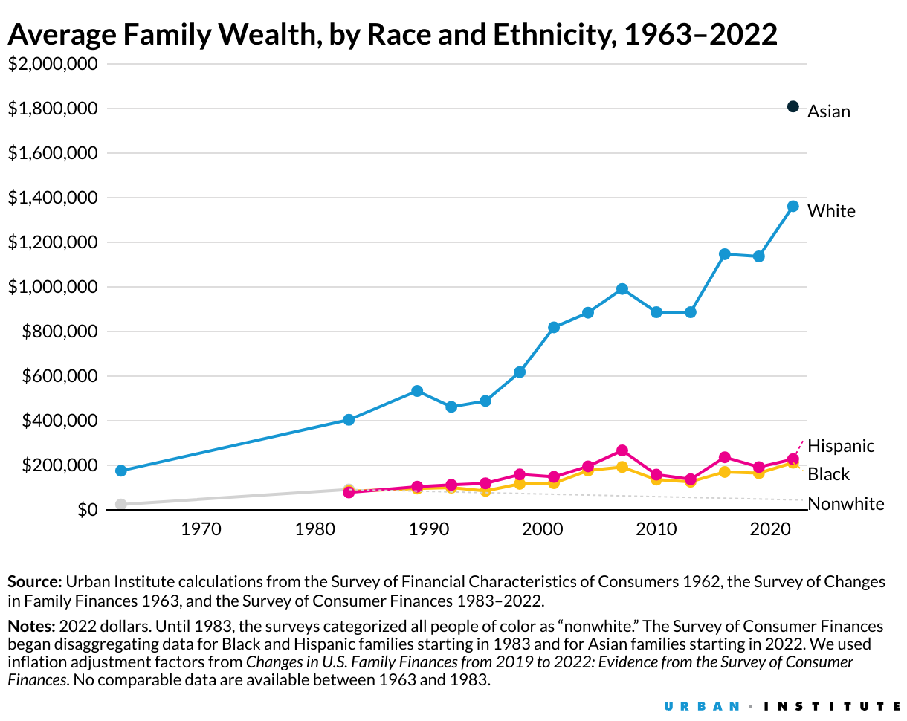

```{r setup, include=FALSE}
knitr::opts_chunk$set(echo = FALSE, warning = FALSE, message = FALSE)

knitr::opts_template$set(fullwidth_table = list(
  fig.width = 6, fig.height = 4,
  fig.retina = 2, out.width = '100%'
),
fullwidth_bar = list(
  fig.width = 6.5, fig.height = 5.5,
  fig.retina = 2
),
fullwidth_map = list(
  fig.width = 7, fig.height=8,
  fig.retina = 2, out.width = '100%'
))

# Load packages ----
library(tidyverse)
library(tidycensus)
library(scales)
library(ggspatial)
library(tigris)
options(tigris_use_cache = TRUE)
library(readxl)
library(stringr)
library(sf)
library(ggthemes)
library(rcartocolor)
library(patchwork)
library(gt)
library(ggpol)
library(ggrepel)

# Tract geometries ----
county_codes <- c("003", "540", "065", "079", "109", "125", "029")
tract_geo <- tracts(state = "VA", county = county_codes)

# Map palettes ----
pal_inc <- carto_pal(7, "Geyser")
# "#008080" "#70A494" "#B4C8A8" "#F6EDBD" "#EDBB8A" "#DE8A5A" "#CA562C"

pal_ssw <- carto_pal(7, "RedOr")
# "#F6D2A9" "#F5B78E" "#F19C7C" "#EA8171" "#DD686C" "#CA5268" "#B13F64"
# pal_ssw <- c("#F6D2A9", "#F5B78E", "#F19C7C", "#EA8171", "#DD686C")

# Palettes ----
pal_five <- c("#DE8A5A", "#EDBB8A", "#F6EDBD","#B4C8A8", "#70A494")
pal_six <- c("#CA562C", "#DE8A5A", "#EDBB8A", "#F6EDBD","#B4C8A8", "#70A494")
orange_dot <- "#CA562C"
green_dot <- "#B4C8A8"
grey_dot <-  "#b2b8be"
blue_dot <- "#3B8EA5"
  
# geography
geography_label <- "Thomas Jefferson Planning District"
# citations
acs_pums <- "Data Source: ACS Public Use Microdata Sample (PUMS), 2018-2022; U.S. Census Bureau."

# Pull in data ----
# County self sufficiency tables ----
selfsuff_county <- read_csv("../data/self_suff_county_2021.csv")

selfsuff_mean_monthly <- selfsuff_county %>% 
  select(county, ends_with("_mean")) %>% 
  select(-c(emergency_savings_mean, hourly_self_sufficiency_wage_mean, annual_self_sufficiency_wage_mean)) %>% 
  rename(self_sufficiency_wage_mean = monthly_self_sufficiency_wage_mean) %>% 
  pivot_longer(housing_costs_mean:self_sufficiency_wage_mean, values_to = "Monthly")

selfsuff_mean_annual <- selfsuff_county %>% 
  select(county, ends_with("_mean")) %>% 
  relocate(annual_self_sufficiency_wage_mean, .after = last_col()) %>% 
  select(-c(emergency_savings_mean, hourly_self_sufficiency_wage_mean, monthly_self_sufficiency_wage_mean)) %>%
  mutate(across(housing_costs_mean:child_tax_credit_mean, function(x) x*12)) %>% 
  rename(self_sufficiency_wage_mean = annual_self_sufficiency_wage_mean) %>% 
  pivot_longer(housing_costs_mean:self_sufficiency_wage_mean, values_to = "Annual")

# Join tables
selfsuff_table <- selfsuff_mean_monthly %>% 
  left_join(selfsuff_mean_annual) %>% 
  mutate(name = str_remove(name, "_mean")) %>% 
  mutate(name = str_to_title(str_replace_all(name, "_", " ")),
         county = str_to_title(county))

ssw_table_title <- "Average Expenses and Self-Sufficiency Wages for Families in "

# Families with income below 35k, between 35k-self sufficiency wage & above ssw ----
fam_ssw <- read_csv("../data/faminc_ssw_race_county_2022.csv")

fam_ssw_dat <- fam_ssw %>% 
  select(-c(estimate,moe)) %>% 
  pivot_wider(names_from = ssw_group, values_from = percent) %>% 
  pivot_longer(above_ssw:below_thirtyfive) %>% 
  mutate(total_group_round = round(total_families, -1),
         number_round = round(total_group_round*(value/100), -1),
         number = round(total_families*(value/100), 0),
         percent_round = round(number_round/total_group_round *100, 0),
         group = factor(group,
                       levels = c("Black", "Hispanic", "White, Not Hispanic", "All Families"),
                       labels = c("Black Families", "Hispanic Families", "White Families", "All Families")),
         name = factor(name,
                       levels = c("above_ssw", "below_ssw", "below_thirtyfive"),
                       labels = c("Income above Self-Sufficiency", "Income below Self-Sufficiency & above $35K", "Income below $35K")),
  text = case_when(percent_round >= 20 ~ paste0(round(percent_round, 0), "%\n(", prettyNum(number_round, big.mark=",", preserve.width="none"), ")"),
                   percent_round < 20 & percent_round >= 1 ~ paste0(round(percent_round, 0), "% (", prettyNum(number_round, big.mark=",", preserve.width="none"), ")"),
                   percent_round < 1 ~ ""),
  locality = str_to_title(str_remove(locality, ", Virginia")),
  locality_label = paste0(str_to_title(str_remove(locality, ", Virginia")), " (Annual Self-Sufficiency Standard: ", str_remove(self_suff_wage, "~"), ")"))

fam_ssw_dat <- fam_ssw_dat[order(fam_ssw_dat$name),]

fam_ssw_pal <- c("#B4C8A8", "#DE8A5A", "#CA562C")
fam_ssw_title <- "Families Earning Below and Above the Self-Sufficiency Standard"

# Total Families and Total Below SSW by county ----
fam_ssw_totals <- fam_ssw_dat %>% 
  filter(str_detect(name, "Income below")) %>% 
  group_by(locality, group) %>% 
  summarise(total_families = first(total_families),
            below_ssw_num = sum(number),
            below_ssw_per = sum(round(value))) %>% 
  ungroup() %>% 
  mutate(total_fam_round = round(total_families, -1),
         below_ssw_round = round(below_ssw_num, -1),
         below_per_round = round(below_ssw_round/total_fam_round *100, 0) )
  
  
# Income distribution by race/ethnicity by county ----
faminc_race <- read_csv("../data/faminc_race_county_2022.csv") 

faminc_race <- faminc_race %>% 
  filter(inc_band != "Total Families") %>% 
  mutate(inc_band_group = case_when(str_detect(variable, "_002|_003|_004|_005|_006|_007") ~ "Earning below $35K",
                               str_detect(variable, "_008|_009|_010|_011") ~ "Earning $35K-$59.9K",
                               str_detect(variable, "_012|_013") ~ "Earning $60K-$100K",
                               str_detect(variable, "_014|_015|_016|_017") ~ "Earning above $100K"),
         inc_rank = case_when(str_detect(variable, "_002|_003|_004|_005|_006|_007") ~ 1,
                               str_detect(variable, "_008|_009|_010|_011") ~ 2,
                               str_detect(variable, "_012|_013") ~ 3,
                               str_detect(variable, "_014|_015|_016|_017") ~ 4))

faminc_data <- faminc_race %>% 
  group_by(GEOID, locality, year, group, inc_band_group, inc_rank) %>% 
  summarise(estimate = sum(estimate),
            moe = moe_sum(moe = moe, estimate = estimate),
            total_families = first(total_families)) %>% 
  ungroup() %>% 
  mutate(percent = estimate/total_families *100,
         group = factor(group,
                         levels = c("Black", "Hispanic", "White, Not Hispanic", "All Families"),
                         labels = c("Black Families", "Hispanic Families", "White Families", "All Families")),
           inc_band_group = factor(inc_band_group,
                              levels = c("Earning above $100K",  "Earning $60K-$100K", "Earning $35K-$59.9K", "Earning below $35K")),
    text = case_when(percent >= 1 ~ paste0(round(percent, 0), "%\n(", prettyNum(estimate, big.mark=",", preserve.width="none"), ")"),
                     percent < 1 ~ ""),
  locality_label = str_to_title(str_remove(locality, ", Virginia")))

faminc_pal <- c("#E4EAF1", "#B4C8A8", "#DE8A5A", "#CA562C")
faminc_title <- "Distribution of Family Income"

# Median family income by county ----
med_faminc_county <- read_csv("../data/med_faminc_county_2022.csv") %>%
  mutate(GEOID = as.character(GEOID),
         estimate = round(estimate, 0),
         locality = str_to_title(str_remove(locality, ", Virginia")))

# Median family income by tract ----
med_faminc_tract <- read_csv("../data/med_faminc_tract_2022.csv") %>%
  mutate(GEOID = as.character(GEOID),
         estimate = round(estimate, -2),
         locality = str_to_title(locality))

med_faminc_tract <- med_faminc_tract %>%
  left_join(tract_geo, by = "GEOID") %>% 
  st_as_sf()

min_inc <- min(med_faminc_tract$estimate, na.rm = TRUE)
max_inc <- max(med_faminc_tract$estimate, na.rm = TRUE)

# Below Self Sufficiency Standard, by tract ----
ssw_tract <- read_csv("../data/faminc_ssw_tract_2022.csv") %>%
  filter(ssw_group == "below") %>%
  mutate(GEOID = as.character(GEOID),
         percent = round(percent,0),
         locality = str_to_title(locality))

ssw_tract <- ssw_tract %>%
  left_join(tract_geo, by = "GEOID") %>% 
  st_as_sf()

min_ssw <- min(ssw_tract$percent, na.rm = TRUE)
max_ssw <- max(ssw_tract$percent, na.rm = TRUE)

# Sources ----
source_acs <- "Data Source: U.S. Census Bureau, American Community Survey 5-year estimates, 2018-2022"
uw_sss_source <- "Data Source: The Self-Sufficiency Standard for Virginia, 2021; The Center for Women’s Welfare, University of Washington"

```

## Executive Summary

In the larger Charlottesville region, 14,990 families (22%) do not make enough money to meet their basic needs—housing, child care, food, transportation, health care, miscellaneous expenses (clothing, telephone, household items), and taxes. Rising costs and inflation along with stagnant wages and undervalued labor has made it increasingly difficult for families to be self-sufficient. 

To keep up with the rise in the cost of necessities, Orange Dot 6.0 has recalibrated how it determines the annual income required for families to meet their basic needs, using the Self-Sufficiency Standard. The Self-Sufficiency Standard is a project of the Center for Women’s Welfare at the University of Washington’s School of Social Work that defines the real cost of living for working families. 

The Self-Sufficiency Standard varies by locality and family size. For the City of Charlottesville, and Albemarle, Fluvanna, Greene, and Nelson counties, the Self-Sufficiency Standard for an average family is an annual income of around $60,000. For Louisa, the annual family income to meet basic needs is roughly $50,000, and for Buckingham, this value is around $45,000. A detailed breakdown of these costs and wages are provided in this report.

While families facing economic insecurity live throughout our region, the likelihood that a family is struggling varies by race and by place. The struggle is not equally shared.

47% of Black families and 35% of Hispanic families do not earn enough to meet their basic needs, compared to 18% of white families. This reflects a persistent gap resulting from past and ongoing policies that suppress investment, opportunity, and wealth creation in minoritized communities.

The percent of families struggling overall is highest in the City of Charlottesville at 27% and in Buckingham County, at 26%, and lowest in Albemarle County, at 18%.

Every locality in our region has areas where over a quarter (25%) of families have less than family-sufficient incomes. The areas with the highest percent of struggling families are in the City of Charlottesville, where the highest is 65%, and in Albemarle County, where despite having the lowest percent overall, has areas where nearly half the families struggle to meet their basic needs.
  
For a comparison with past reports, there are an estimated 7,330 families (11%) earning below $35,000 in the region. The Orange Dot Report 5.0, published in 2022, found 9,413 families (14%) in this same income range. As the population of the region has grown, the number of families earning under $35k has decreased. So we’ve made some progress as a community toward more economic mobility, but not nearly enough. The cost of living has steadily risen, making the $35,000 threshold less representative of the income required to meet the basic needs of working families.  

As noted, our community has seen progress since this work began in 2011, but there are still too many struggling families. For a region as prosperous as ours, we have the means to build programs and enact policy that helps more families become self-sufficient. 

## Preface

The first Orange Dot Report was released in 2011, and it served both to describe the local income deficit—the gap between what families earn as income and what they need to be self-sufficient—and to develop strategies for creating pathways to self-sufficiency for families in the region. This initial effort launched the innovative Network2Work framework pioneered at Piedmont Virginia Community College, a process that brings together a Job-Seeker Network, an Employer Network, and a Provider Network to match job-seekers to family-sustaining jobs and careers and to connect them to community resources using neighborhood-based volunteers.

As Network2Work has grown, the Orange Dot Report has evolved and expanded, serving as a central resource and important update on the progress of the community. Initially focused on Charlottesville and Albemarle County in Orange Dot Report 2.0 (2015), the report encompassed the entire region (Albemarle, Buckingham, Charlottesville, Fluvanna, Greene, Louisa, and Nelson) in Orange Dot Report 3.0 (2018), Orange Dot Report 4.0 (2021), and Orange Dot Report 5.0 (2022).^[To find previous versions of the Orange Dot report, go to https://www.pvcc.edu/community-business/network2work/history-network2workpvcc-program] Orange Dot Report 6.0 continues this evolution, incorporating new analysis and building on updated self-sufficiency standards. This report marks the second update completed in partnership between Network2Work@PVCC and The Equity Center at the University of Virginia. The collaboration and resulting analysis represent the continuation of our collective work toward a more equitable and fully thriving region. 

## Introduction

>“When someone works for less pay than she can live on — when, for example, she goes hungry so that you can eat more cheaply and conveniently — then she has made a great sacrifice for you, she has made you a gift of some part of her abilities, her health, and her life. The ‘working poor,’ as they are approvingly termed, are in fact the major philanthropists of our society.” -  Barbara Ehrenreich, “Nickel and Dimed: On (Not) Getting By in America” (2001)

Recent years have brought our country’s and our community’s ongoing struggles and inequities into stark relief. The housing affordability crisis, inflation and the rising costs of groceries, and the frequency and volatility of climate events have created challenges for all of us. But low-income individuals, especially individuals of color, are suffering disproportionately, both physically and financially.

Despite working hard, too many families struggle to make ends meet, in part because their labor is not valued, and we accept their sacrifice. Many people laboring in positions considered essential to our community do not earn enough to provide for their families. For example, the so-called “caring economy”—childcare workers, home health aides, teachers—provides enormous social value, but is not valued by the market. Changes in the labor market that have increased the number of underemployed part-time workers—those who want more hours or full-time work—add further strain.^[Lonnie Golden and Jaeseung Kim. 2020. The Involuntary Part-time Work and Underemployment Problem in the U.S. The Center for Law and Social Policy.]

We all seek security and stability: to provide for ourselves and our families, to see our children thrive, to create community with others, to live with dignity. For families experiencing economic insecurity, all of this is jeopardized. When faced daily with financial struggles—to pay for housing, to repair the car that carries you to work, to access needed healthcare, to find and afford a safe environment for your children—it is difficult to be the parent you want to be, the worker you know you could be, or the person you were meant to be. We all deserve a chance to succeed and flourish, but we are not all yet given equal access to that chance. Toward that end, we must seek to build an equitable economy, one intentionally constructed to fulfill America’s promise of opportunity for all.

Our whole community benefits when the families have access to jobs that pay sufficient incomes. The many collective advantages include:

**Children do better.** Graduating from college continues to be the fastest route to economic security, yet economic insecurity limits access to higher education. As Robert Putnam’s work shows, “a family’s socioeconomic status [has] become even more important than test scores in predicting which eighth graders would graduate from college. High-scoring poor kids are now slightly less likely (29%) to get a college degree than low-scoring rich kids (30%).”^[Putnam, R. (2015). Our Kids: The American Dream in Crisis. New York, NY: Simon & Schuster, 189-190.]

**Local businesses prosper.** Employees are also consumers, and increased income among a region’s workers means more spending power, which is better for the economy, especially the local economy.

**Taxpayers bear fewer costs.** Given the chance, families want to provide for themselves. When they are able to do so, they require less support from others.

**People live longer.** According to the Centers for Disease Control, the biggest contributor to poor health is low socio-economic status. The Health Inequality Project estimates that a woman in the Charlottesville area in the lowest income quartile has a life expectancy of seven years less than a woman from the highest income quartile; among men in our region, the life expectancy gap is nearly ten years.^[Chetty R., Stepner M., Abraham S., Lin S., Scuderi B., Turner N., Bergeron A., and Cutler D., (2016). The Association Between Income and Life Expectancy in the United States, 2001-2014. JAMA 315:1750–1766. doi:10.1001/jama.2016.4226. Data: https://healthinequality.org/data/]

**The community thrives.** A community thrives when its residents thrive. Residents thrive when their capacity as human beings is unleashed. And their capacity as human beings can only be unleashed when their basic needs are met.

Knowing that we can only solve issues we can understand, we provide a snapshot of the families in our community who are struggling. What we have learned since this work began in 2011 is that there are too many struggling families in our community, but not too many to help.


## Defining Self-Sufficiency

The goal of the Orange Dot Report is to provide an overview of the families in our region that struggle to afford the basic necessities. To determine what annual income is required for a family in our region to be considered self-sufficient, this year’s report uses the Self-Sufficiency Standard, a project of the Center for Women’s Welfare at the University of Washington’s School of Social Work.^[For more on the Self-Sufficiency Standard project: https://selfsufficiencystandard.org/]

The Self-Sufficiency Standard defines the income working families need to meet their basic necessities without public or private assistance. Basic minimum needs include: housing, child care, food, transportation, health care, miscellaneous expenses (clothing, telephone, household items), as well as the cost of taxes and the impact of tax credits. These expenses are calculated for each US county, taking into account family composition, ages of children, and geographic differences in costs. The values used in this report are specific to the cost of living in our region.^[Virginia data used in this report is available here: https://selfsufficiencystandard.org/Virginia/]

The Standard has been used across the country by government entities, advocates, and service providers. Using this resource in the Orange Dot Report provides a reliable and well-researched measure for determining which families in our community struggle to meet their basic needs. The methods used by the Self-Sufficiency Standard are comparable to methods used in past Orange Dot Reports but include additional categories.^[Methodology for the Self-Sufficiency Standard: https://selfsufficiencystandard.org/the-standard/methodology/]

The Self-Sufficiency Standard provides a breakdown of the real cost of all basic needs for over 700 different family compositions for each locality. Family compositions are described by the number of adults, infants, preschoolers, school age children, and teenagers in a family. For each locality in the greater Charlottesville area, we have provided a detailed table of the average costs, and the annual wage required to meet self-sufficiency based on the most common family compositions in this region. For tables of expenses and self-sufficient wages for specific family compositions (i.e. one adult, one infant and one school age child), please see the Appendix of this report. 

```{r region_summary}
# All families in region 
all_fam_region <- fam_ssw_totals %>%
  filter(group == "All Families") %>% 
  group_by(group) %>% 
  summarise(total_families = sum(total_families),
            below_ssw_num = sum(below_ssw_num),
            total_fam_round = sum(total_fam_round),
            below_ssw_round = sum(below_ssw_round)) %>% 
  ungroup() %>% 
  mutate(below_ssw_per = round(below_ssw_num/total_families *100, 0),
         below_per_round = round(below_ssw_round/total_fam_round *100, 0),
         locality = "Total for Region") %>% 
  select(locality, group, total_families, below_ssw_num, below_ssw_per, total_fam_round, below_ssw_round, below_per_round)

below_ssw_all_region <- prettyNum(all_fam_region$below_ssw_round, big.mark=",", preserve.width="none")
below_ssw_per_all_region <- all_fam_region$below_per_round
total_fam_all_region <- prettyNum(all_fam_region$total_fam_round, big.mark=",", preserve.width="none")

# Black families in region
black_fam_region <- fam_ssw_totals %>%
  filter(group == "Black Families") %>% 
  group_by(group) %>% 
  summarise(total_fam_round = sum(total_fam_round),
            below_ssw_round = sum(below_ssw_round)) %>% 
  ungroup() %>% 
  mutate(below_per_round = round(below_ssw_round/total_fam_round *100, 0) )

below_ssw_black_region <- prettyNum(black_fam_region$below_ssw_round, big.mark=",", preserve.width="none")
below_ssw_per_black_region <- black_fam_region$below_per_round

# Hispanic families in region
his_fam_region <- fam_ssw_totals %>%
  filter(group == "Hispanic Families") %>% 
  group_by(group) %>% 
  summarise(total_fam_round = sum(total_fam_round),
            below_ssw_round = sum(below_ssw_round)) %>% 
  ungroup() %>% 
  mutate(below_per_round = round(below_ssw_round/total_fam_round *100, 0) )

below_ssw_his_region <- prettyNum(his_fam_region$below_ssw_round, big.mark=",", preserve.width="none")
below_ssw_per_his_region <- his_fam_region$below_per_round

# White families in region
white_fam_region <- fam_ssw_totals %>%
  filter(group == "White Families") %>% 
  group_by(group) %>% 
  summarise(total_fam_round = sum(total_fam_round),
            below_ssw_round = sum(below_ssw_round)) %>% 
  ungroup() %>% 
  mutate(below_per_round = round(below_ssw_round/total_fam_round *100, 0) )

below_ssw_white_region <- prettyNum(white_fam_region$below_ssw_round, big.mark=",", preserve.width="none")
below_ssw_per_white_region <- white_fam_region$below_per_round

# Summary table for counties
all_fam_region_table <- fam_ssw_totals %>%
  filter(group == "All Families")

all_fam_region_table <- rbind(all_fam_region_table, all_fam_region)

# Creating comparison values from previous Orange Dot reports
faminc_below35k <- faminc_race %>% 
  filter(inc_band_group == "Earning below $35K")

# All families under 35K
faminc_below35k_all <- faminc_below35k %>% 
  filter(group == "All Families") %>% 
  group_by(locality) %>% 
  summarise(total_families = first(total_families),
            estimate = sum(estimate)) %>% 
  ungroup() %>% 
  summarise(total_families = sum(total_families),
            estimate = sum(estimate)) %>% 
  mutate(total_fam_round = round(total_families, -1),
         estimate_round = round(estimate, -1),
         estimate_per = round(estimate/total_families *100, 0),
         estimate_per_round = round(estimate_round/total_fam_round *100, 0),
         locality = "Total for Region",
         inc_band_group = "Earning below $35K")

```

## Families Struggling in Our Region

There are `r total_fam_all_region` families living in the Charlottesville region, defined in this report as the City of Charlottesville and the surrounding counties of Albemarle, Buckingham, Fluvanna, Greene, Louisa, and Nelson.^[Family is defined as two or more people related by birth, marriage, or adoption and living in the same household.] Of these, `r below_ssw_all_region` families (`r paste0(below_ssw_per_all_region,"%")`) do not earn enough to provide for their family's basic needs.

The table below shows the estimated number of struggling families in each locality and the corresponding percent. The percent of families struggling overall is highest in the City of Charlottesville at 27% and in Buckingham County, at 26%, and lowest in Albemarle County, at 18%. Localities in our region vary in population, so that even though Albemarle has the lowest percent, it has the highest number of families struggling to meet their basic minimum needs, at over 5,000.


```{r region_table}
# Region self sufficiency totals table ----

all_fam_region_table %>% 
  mutate(below_per_round = below_per_round/100) %>% 
  ungroup() %>% 
  select(-c(group, total_families, below_ssw_num, below_ssw_per, total_fam_round)) %>%
  gt(rowname_col = "locality") %>% 
  cols_label(
    below_ssw_round = "Number of Struggling Families",
    below_per_round = "Percent of Struggling Families"
  ) %>% 
  fmt_number(columns = below_ssw_round, 
             decimals = 0, 
             sep_mark = ",") %>%
  fmt_percent(
    columns = below_per_round,
    decimals = 0
  ) %>% 
  tab_style(
    style = list(
      cell_fill(color = "#F6D2A9"),
      cell_text(weight = "bold")
    ),
    locations = list(cells_body(rows = 8), cells_stub(rows = 8))
  ) %>% 
  tab_style(
    style = cell_text(align = "center", v_align = "middle"),
    locations = list(cells_column_labels(), cells_body())
  ) %>% 
  tab_style(
    style = cell_text(weight = "bold"),
    locations = list(cells_column_labels())
  ) %>% 
  tab_header(
    title = "Summary of Struggling Families in the Region"
  ) %>% 
  tab_source_note(
    source_note = "Note: Values are approximate based on the U.S. Census Bureau, American Community Survey 5-year estimates (2018-2022)"
  )
  
```

Working families in our community need to earn an annual income that meets the Self-Sufficiency Standard to meet the real cost of living in our region. The Self-Sufficiency Standard varies by locality. Housing is less expensive in Buckingham and Louisa. Childcare is more expensive in Albemarle and Charlottesville. 

The above table shows the estimated number of struggling families that do not make an annual income that meets self-sufficiency as defined by the Self-Sufficiency Standard for each specific locality. For the City of Charlottesville, and Albemarle, Fluvanna, Greene, and Nelson counties, this is an annual income of around $60,000 for an average family. For Louisa, the annual family income to meet basic needs is roughly $50,000, and for Buckingham, this value is around $45,000. A detailed breakdown of these costs and wages are provided in the Locality Profiles in this report.

### Undervalued Labor

A majority (62%) of workers in struggling families are working at least 40 hours per week—the equivalent of a full-time job, as shown in the figure below. This deeper understanding about people in the workforce who are in families earning below the Self-Sufficiency Standard is drawn from the ACS Public Use Microdata Sample provided by the U.S. Census Bureau for the Thomas Jefferson Planning District.^[The Thomas Jefferson Planning District includes City of Charlottesville, and Albemarle, Fluvanna, Greene, Louisa, and Nelson counties. Buckingham County is not included in the microdata sample.]

Those working fewer than full-time weekly hours can be a sign that workers are in jobs with lower wages, few to no health or retirement benefits, and less scheduling stability—and want less vulnerable, full-time jobs. Race and gender can define who has a higher chance of having an unstable job, with black women bearing the weight of vulnerable work.^[See: https://www.urban.org/data-tools/black-women-precarious-gig-work?&utm_source=urban_ea&utm_campaign=unstable_work_black_women&utm_id=workforce&utm_content=general&engaged&utm_term=workforce ; https://www.urban.org/sites/default/files/2023-09/Job-quality-and-race-and-gender-equity.pdf]

```{r workers_by_hours, fig.width = 9.5, fig.height = 6, fig.retina = 2}
workers_by_hours <- read_csv("../microdata/data/workers_by_hours.csv") %>% 
  mutate(
    hours_bin = factor(hours_bin, levels = c("Unemployed", "Less than 20", "20 to 29", "30 to 34", "35 to 39", "40 or more"), labels = c("Unemployed", "Less than 20 hours", "20 to 29 hours", "30 to 34 hours", "35 to 39 hours", "40 or more hours")),
         label_text = case_when(
           below_ess_finc == "Yes" ~ paste0(prettyNum(count, big.mark=",", preserve.width="none"), " (", round(percent, 0), "%)"),
           below_ess_finc == "No" ~ paste0(prettyNum(count, big.mark=",", preserve.width="none"), " (", round(percent, 0), "%)")),
         below_ess_finc = factor(below_ess_finc, levels = c("Yes", "No"),
                                 labels = c("Income Below Self-Sufficiency Standard", "Income Above Self-Sufficiency Standard")))

workers_by_hours %>% 
  filter(below_ess_finc == "Income Below Self-Sufficiency Standard") %>% 
  ggplot(aes(x = count, y = hours_bin)) +
  geom_bar(stat = "identity", fill = blue_dot) +
  geom_text(aes(label = label_text),
            vjust = 0.5,
            hjust = -0.1,
            size = 5) +
  scale_y_discrete(name = "") +
  scale_x_continuous(name = "Number of Workers",
                     breaks = seq(0, 12000, by = 2500),
                     label=comma,
                     expand = expansion(mult = c(0, .2))) +
  labs(title = "Weekly Hours Worked for Workers Earning Below the Self-Sufficiency Standard",
       subtitle = geography_label,
       caption = acs_pums) +
  theme_minimal() +
  theme(legend.title=element_blank(),
        legend.position = "top",
        legend.text = element_text(size = 12),
        # legend.location = "plot",
        legend.justification="center",
          # panel.grid.major.y = element_blank(),
          axis.ticks = element_blank(),
          panel.grid.minor = element_blank(),
          plot.title.position= "plot",
          plot.caption.position = "plot",
        axis.text.y = element_text(color = "black", size = 14),
        text = element_text(size = 14),
        axis.text.x = element_text(size=14),
        plot.title = element_text(size = 18),
        plot.caption = element_text(size = 12))

```


We can also identify different categories of struggling families—those who are closer to self-sufficiency and who can more readily earn more with the right opportunities, and those whose earning potential is more limited—and different strategies are required to improve the lives of families within each.


```{r family_income, fig.width = 10, fig.height = 6, fig.retina = 2}

family_income <- read_csv("../microdata/data/families_below_ess_by_incomes.csv")

family_income %>%
  ggplot(aes(x = count, y = income_bins, fill = income_bins)) +
  geom_bar(stat = "identity") +
  geom_text(aes(label = paste0(prettyNum(count, big.mark=",", preserve.width="none"), " (", round(percent, 0), "%)")),
            vjust = 0.5,
            hjust = -0.1,
            size = 5) +
  scale_y_discrete(name = "") +
  scale_x_continuous(name = "Number of Families",
                     breaks = seq(0, 4000, by = 1000),
                     label=comma,
                     expand = expansion(mult = c(0, .19))
                     ) +
  scale_fill_manual(values = c("#EDBB8A", "#EDBB8A","#DE8A5A", "#DE8A5A", "#DE8A5A", "#B4C8A8"))+
  labs(title = "Annual Incomes for Families Earning Below the Self-Sufficiency Standard",
       subtitle = geography_label,
       caption = acs_pums) +
  theme_minimal() +
  theme(legend.title=element_blank(),
        legend.position = "none",
        # legend.location = "plot",
        legend.justification="center",
        legend.text = element_text(size = 12),
          # panel.grid.major.y = element_blank(),
          axis.ticks = element_blank(),
          panel.grid.minor = element_blank(),
          plot.title.position= "plot",
          plot.caption.position = "plot",
        axis.text.y = element_text(color = "black", size = 14),
        text = element_text(size = 14),
        axis.text.x = element_text(size=14),
        plot.title = element_text(size = 18),
        plot.caption = element_text(size = 12))
```

Families in our region generally need to earn between $50,000 and $60,000 annually to meet their basic needs. While some of the struggling families in our community appear to have limited earning capacity (those with incomes under $20,000), most are working and earning income ($20,000-$49,999), just not enough to support their families. These are the families who are closer to self-sufficiency and who can more readily earn more with the right opportunities.

Some families are on fixed incomes or have otherwise reached a more constrained earning potential due to illness, disability, caregiving responsibilities, and other circumstances. These families are unlikely to see their incomes increase appreciably and require sustained subsidy to meet their basic needs. Their survival depends on the strength of the social safety net. But the vast majority of families, however, have the capacity to earn a family-sufficient income. 

For most families, low-incomeness is not a constant, not an immutable condition that must be worked around, but a variable that must be changed. For a family experiencing economic struggle, the first question should be: What do they need to increase their income?

Most workers in struggling families are in low-waged employment. The figure below sorts occupations into those groups based on the median wages typically earned in the Charlottesville metro region based on the Bureau of Labor Statistics Occupational Employment and Wage statistics.^[U.S. Bureau of Labor Statistics, Occupational Employment and Wage Statistics; May 2023; https://www.bls.gov/oes/tables.htm] A large portion (42%) of workers in struggling families are in the lowest paid occupations, those typically earning between $25,610 and $37,760 a year – making it difficult to impossible to meet the Self-Sufficiency Standard for single or two-parent households. 


```{r workers_by_medianwages, fig.width = 10, fig.height = 6, fig.retina = 2}
workers_by_medianwages <- read_csv("../microdata/data/workers_by_medianwages.csv") %>% 
   mutate(
    median_wage_bin_label = factor(median_wage_bin_label, levels = c("25610-37760", "37860-48320", "48340-60600", "60640-86950", "88050-238990"), labels = c("$25,610 - $37,760", "$37,860 - $48,320", "$48,340 - $60,600", "$60,640 - $86,950", "$88,050 - $238,990")),
         label_text = case_when(
           below_ess_finc == "Yes" ~ paste0(prettyNum(count, big.mark=",", preserve.width="none"), " (", round(percent, 0), "%)"),
           below_ess_finc == "No" ~ paste0(prettyNum(count, big.mark=",", preserve.width="none"), " (", round(percent, 0), "%)")),
         below_ess_finc = factor(below_ess_finc, levels = c("Yes", "No"),
                                 labels = c("Income Below Self-Sufficiency Standard", "Income Above Self-Sufficiency Standard")))

workers_by_medianwages %>% 
  filter(below_ess_finc == "Income Below Self-Sufficiency Standard") %>% 
  ggplot(aes(x = count, y = median_wage_bin_label, fill = median_wage_bin_label)) +
  geom_bar(stat = "identity") +
  geom_text(aes(label = label_text),
            vjust = 0.5,
            hjust = -0.1,
            size = 5) +
  scale_y_discrete(name = "") +
  scale_x_continuous(name = "Number of Workers",
                     breaks = seq(0, 12000, by = 1500),
                     label=comma,
                     expand = expansion(mult = c(0, .19))) +
  scale_fill_manual(values = c("#DE8A5A", "#EDBB8A", "#F6EDBD","#B4C8A8", "#70A494"))+
  labs(title = "Annual Median Wage for Workers Earning Below the Self-Sufficiency Standard",
       subtitle = geography_label,
       caption = "Bureau of Labor Statistics, U.S. Department of Labor. Occupational Employment and Wage Statistics, 2023.") +
  theme_minimal() +
  theme(legend.title=element_blank(),
        legend.position = "none",
        # legend.location = "plot",
        legend.justification="center",
        legend.text = element_text(size = 12),
          # panel.grid.major.y = element_blank(),
          axis.ticks = element_blank(),
          panel.grid.minor = element_blank(),
          plot.title.position= "plot",
          plot.caption.position = "plot",
        axis.text.y = element_text(color = "black", size = 14),
        text = element_text(size = 14),
        axis.text.x = element_text(size=14),
        plot.title = element_text(size = 18),
        plot.caption = element_text(size = 12))

```

The myth of American meritocracy promotes the idea that those who work hard and play by the rules will get ahead. The flipside of that myth—if you haven’t gotten ahead, it must be because you don’t work hard enough or play by the rules—leads to negative beliefs about the poor in our society and, subsequently, to reduced support for resources and programs meant to reduce the burdens of poverty. Working hard, however, does not guarantee that individuals will get ahead. Take the formulas below:

**Hard Work × High Wages = High Income**
**Hard Work × Low Wages = Low Income**
 
The difference between these outcomes is not the hard work individuals put in, but the wages paid out. A full-time worker making Virginia’s minimum wage will have a gross income of $24,000 per year.^[Based on the 2024 minimum wage of $12/hour. In 2025, the Virginia minimum wage will increase to $12.41.] To reduce the number of struggling families, therefore, requires an increase in their wages. We need a system that identifies low-income families who are working for a living but who are not valued and help them increase their value in the eyes of their employers.

To get ahead, those workers will need jobs and careers that pay enough to support their families. They need job that do not require them to sacrifice for our benefit by working for less pay than they can live on. 

The table below provides information on the types of jobs and the corresponding wages that fall into different earning bands:


```{r occupations_by_wagebin, fig.width = 6, fig.height = 10,  fig.retina = 2}
occupations_by_wagebin <- read_csv("../microdata/data/occupations_by_wagebin.csv")

occupations_filtered <- occupations_by_wagebin %>% 
  filter(occupation %in% c("Fast Food and Counter Workers", "Cashiers", "Home Health and Personal Care Aides", "Childcare Workers",
                           "Customer Service Representatives", "Construction Laborers", "Maintenance and Repair Workers, General", 
                           "Emergency Medical Technicians", "Nursing Assistants", 
                           "Healthcare Support Workers, All Other", "Medical Assistants",
                           "Bus Drivers, Transit and Intercity", "Dental Assistants", "Bus Drivers, School",
                           "Automotive Service Technicians and Mechanics", "Heavy and Tractor-Trailer Truck Drivers",
                           "Carpenters", "Production, Planning, and Expediting Clerks",
                           "Graphic Designers", "Plumbers, Pipefitters, and Steamfitters",
                           "Electricians", "Medical Records Specialists", "Police and Sheriff's Patrol Officers",
                           "Clinical Laboratory Technologists and Technicians", "Elementary School Teachers, Except Special Education",
                           "Secondary School Teachers, Except Special and Career/Technical Education",
                           "Office and Administrative Support Workers, All Other", "Registered Nurses", 
                           "Radiologic Technologists and Technicians", "Computer User Support Specialists", 
                           "Accountants and Auditors", "Nurse Practitioners",
                           "General and Operations Managers", "Construction Managers", "Dental Hygienists", 
                           "Heating, Air Conditioning, and Refrigeration Mechanics and Installers", 
                           "Electrical and Electronic Engineering Technologists and Technicians", 
                           "Licensed Practical and Licensed Vocational Nurses", "Surgical Technologists")) %>% 
  mutate(median_wage_bin_label = factor(median_wage_bin_label, levels = c("25610-37760", "37860-48320", "48340-60600", "60640-86950", "88050-238990"), labels = c("$25,610 - $37,760", "$37,860 - $48,320", "$48,340 - $60,600", "$60,640 - $86,950", "$88,050 - $238,990")),
         job_group = case_when(soc_group_num == "11" ~ "Management",
soc_group_num == "13" ~ "Business and Financial Operations",
soc_group_num == "15" ~ "Computer and Mathematical",
soc_group_num == "17" ~ "Architecture and Engineering",
soc_group_num == "19" ~ "Life, Physical, and Social Science",
soc_group_num == "21" ~ "Community and Social Service",
soc_group_num == "23" ~ "Legal",
soc_group_num == "25" ~ "Educational Instruction and Library",
soc_group_num == "27" ~ "Arts, Design, Entertainment, Sports, and Media",
soc_group_num == "29" ~ "Healthcare Practitioners and Technical",
soc_group_num == "31" ~ "Healthcare Support",
soc_group_num == "33" ~ "Protective Service",
soc_group_num == "35" ~ "Food Preparation and Serving Related",
soc_group_num == "37" ~ "Building and Grounds Cleaning and Maintenance",
soc_group_num == "39" ~ "Personal Care and Service",
soc_group_num == "41" ~ "Sales and Related",
soc_group_num == "43" ~ "Office and Administrative Support",
soc_group_num == "45" ~ "Farming, Fishing, and Forestry",
soc_group_num == "47" ~ "Construction and Extraction",
soc_group_num == "49" ~ "Installation, Maintenance, and Repair",
soc_group_num == "51" ~ "Production",
soc_group_num == "53" ~ "Transportation and Material Moving"
))

occupations_filtered %>%
  mutate(employment_per_1_000_jobs = round(employment_per_1_000_jobs,1),
         color = "") %>% 
  select(c(occupation, annual_median_wage_2, color, employment_per_1_000_jobs, job_group, median_wage_bin)) %>%
  gt() %>% 
  data_color(
    columns = median_wage_bin,
    target_columns = color,
    direction = "column",
    palette = c("#DE8A5A", "#EDBB8A", "#F6EDBD","#B4C8A8", "#70A494"),
  ) %>% 
  fmt_currency(
    columns = 2,
    currency = currency(
      html = "&#36;",
      default = "$"
    ),
    decimals = 2
  ) %>% 
  cols_hide(columns = c(median_wage_bin)) %>% 
  cols_label(
    occupation = "Occupation",
    annual_median_wage_2 = "Annual Median Wage",
        color = "",
    employment_per_1_000_jobs = "Employment Rate (per 1,000 jobs)",
    median_wage_bin = "",
    job_group = "Occupation Group"
  ) %>% 
  tab_style(
    style = cell_text(align = "center", v_align = "middle"),
    locations = list(cells_column_labels(2:4), cells_body(2:4))
  ) %>% 
  tab_footnote(
    footnote = "A full list of occupations and wages is available here: https://github.com/virginiaequitycenter/orange-dot/blob/main/OrangeDot6_files/microdata/data/occupation_wages.csv",
    locations = cells_title(groups = "title")
  ) %>% 
  tab_footnote(
    footnote = "The annual median wage is the boundary between the highest and lowest paid workers in a given occupation. Half of the workers in a given occupation earn more than the median wage, and half the workers earn less than the median wage.",
    locations = cells_column_labels(columns = annual_median_wage_2)
  ) %>% 
  tab_footnote(
    footnote = "Employment rate is the number of jobs (employment) in the given occupation per 1,000 jobs in the Charlottesville Metro Area",
    locations = cells_column_labels(columns = employment_per_1_000_jobs)
  ) %>% 
  tab_footnote(
    footnote = "Major occupation groups defined by the Standard Occupational Classification (SOC) system, used by Federal statistical agencies to classify workers and jobs into occupational categories for the purpose of collecting, calculating, analyzing, or disseminating data.",
    locations = cells_column_labels(columns = job_group)
  ) %>% 
  tab_header(
    title = "Selection of Occupations by Annual Median Wage Earned in the Charlottesville Metro Area"
  ) %>% 
  tab_source_note(
    source_note = "Data Source: U.S. Bureau of Labor Statistics, Occupational Employment and Wage Statistics; May 2023; https://www.bls.gov/oes/tables.htm"
  )
```

### The Intersection with Race and Ethnicity

Too many families are struggling in our region, but these burdens are not equally shared. Wealth inequality is higher in the United States than in almost any other developed country.^[OECD (2021), "Inequalities in household wealth and financial insecurity of households", OECD Policy Insights on Well-being, Inclusion and Equal Opportunity, No. 2, OECD Publishing, Paris, https://doi.org/10.1787/b60226a0-en.]

Racial wealth inequities reflect the long-standing effects of structural racism, not individual or group traits. Structural racism is defined by current and historic policies, programs, and institutional practices that make it easier for white families to accrue wealth compared to families of color, who face more barriers to wealth building.

This has generated a significant racial and ethnic wealth gap in our country. The graph below, provided by the Urban Institute, shows that this differences in family wealth by race and ethnicity are large and have grown larger over the past four decades.

```{r}

```

From the Urban Institute:

In 1983, the average wealth of white families was about $320,000 higher than the average wealth of Black families and Hispanic families. By 2022, white families’ average wealth ($1.4 million) was more than $1 million higher than that of Black families ($211,596) and Hispanic families ($227,544). Put another way, white families had six times the average wealth of Black families and Hispanic families.^[Urban Institute, "Nine Charts about Wealth Inequality in America." April 25, 2024. https://apps.urban.org/features/wealth-inequality-charts/]

This racial and ethnic wealth gap is clearly visible in our region. In the Thomas Jefferson Planning District, 47% of Black families and 35% of Hispanic families earn below the Self-Sufficiency Standard, compared to 18% of white families. This is a difference of 29% and 17%, respectively. This means there are nearly three times as many Black families and two times as many Hispanic families not earning a real living wage compared to white families.

The figure below provides another way to look at this gap in earnings in our community. It shows that among families not earning enough to be self-sufficient, nearly a quarter (23%) are Black. Compare this to families making above the Self-Sufficiency Standard, where only 6% are Black families.

```{r race_by_percent, fig.width = 9.5, fig.height = 6, fig.retina = 2}
fam_by_race <- read_csv("../microdata/data/families_by_race.csv") 

fam_by_ess_totals <- fam_by_race %>% 
  group_by(below_ess_finc) %>% 
  summarise(sss_group_total = sum(count)) %>% 
  ungroup()

fam_by_race_rounded<- fam_by_race %>%
  left_join(fam_by_ess_totals) %>% 
  mutate(count_rounded = round(count, -2),
         sss_group_tot_rounded = round(sss_group_total, -2),
         percent_rounded = round(count_rounded/sss_group_tot_rounded *100, 0),
    race_ethn = case_when(hhldr_race_ethn %in% c("Hispanic", "Black", "White") ~ hhldr_race_ethn,
                          .default = "All Other Groups"),
    race_ethn = factor(race_ethn, levels = c("White", "Black", "Hispanic", "All Other Groups"), labels = c("White\nFamilies", "Black\nFamilies", "Hispanic\nFamilies", "All Other Groups")),
         label_text = paste0(scales::percent(percent_rounded / 100, accuracy = 1), "\n(",
                        scales::comma(count_rounded), " families)"),
         below_ess_finc = factor(below_ess_finc, levels = c("Yes", "No"),
                                 labels = c("Income Below Self-Sufficiency Standard", "Income Above Self-Sufficiency Standard"))
    )

fam_by_race_rounded %>% 
  filter(hhldr_race_ethn %in% c("White", "Black", "Hispanic")) %>% 
  ggplot(aes(x = percent, y = race_ethn, group = race_ethn, fill = below_ess_finc)) +
  geom_bar(stat = "identity") +
  geom_text(aes(label = label_text),
            vjust = -0.35,
            hjust = 0.5,
            size = 4.5) +
  scale_y_discrete(name = "") +
  scale_x_continuous(name = "",
                     limits = c(0,100),
                     breaks = seq(0, 100, by = 25),
                     label= label_percent(scale = 1)) +
  scale_fill_manual(values = c(orange_dot, green_dot)) +
  coord_flip() +
  facet_wrap(~ below_ess_finc, scales = "free") +
  labs(title = "Race/Ethnicity of Families Earning Below and Above the Self-Sufficiency Standard",
       subtitle = geography_label,
       caption = paste0("Note: Not all groups are included here.\n", acs_pums)) +
  theme_minimal() +
  theme(legend.title=element_blank(),
        legend.position = "none",
        # legend.location = "plot",
        # legend.justification="center",
        # legend.text = element_text(size = 13),
          panel.grid.major.x = element_blank(),
          axis.ticks = element_blank(),
          panel.grid.minor = element_blank(),
          plot.title.position= "plot",
          plot.caption.position = "plot",
        strip.text = element_text(size = rel(1.15),
                                  # face = "bold",
                                  color = "black"),
        # axis.text.y = element_text(color = "black", size = 14),
        text = element_text(size = 14),
        axis.text.x = element_text(size=14),
        plot.title = element_text(size = 18),
        plot.caption = element_text(size = 12))
```

We need to be intentional about helping all families in our community who are struggling to achieve self-sufficient income but must be especially attentive to families of color who are struggling in our economy. We must consider new programs and policies through an equitable lens to ensure that solutions will benefit the families that need it most.

### Additional Regional Measures

In addition to differences in race and ethnicity, there are other characteristics of families in our community who have a higher risk of experiencing economic hardship.

#### Age

The detailed ACS Public Use Microdata for our region show disparities related to age for families earning below and above the Self-Sufficiency Standard. The figure below shows that a majority of the families who do not earn enough income to meet their basic needs are younger families, whose heads of household are ages 25 to 44 years, and older families, ages 65 years and older. Of the families earning below the Self-Sufficiency Standard, nearly a quarter (24%) are between the ages of 35 and 44 years.

```{r age_butterfly_percent, fig.width = 10.5, fig.height=6, fig.retina = 2}
fam_by_age <- read_csv("../microdata/data/families_by_age.csv") %>% 
  left_join(fam_by_ess_totals) %>% 
  mutate(count_rounded = round(count, -2),
         sss_group_tot_rounded = round(sss_group_total, -2),
         percent_rounded = round(count_rounded/sss_group_tot_rounded *100, 0)) %>% 
  mutate(hhldrage_bin = factor(hhldrage_bin, levels = c("65 and over", "55 to 64", "45 to 54", "35 to 44", "25 to 34", "Under 25")),
         below_ess_finc = factor(below_ess_finc, levels = c("Yes", "No"),
                                 labels = c("Income Below Self-Sufficiency Standard", "Income Above Self-Sufficiency Standard")))

dummy_age_per = tibble(y = c(-50, 0, 0, 50),
                    below_ess_finc = c("Income Above Self-Sufficiency Standard", "Income Above Self-Sufficiency Standard",
                                       "Income Below Self-Sufficiency Standard", "Income Below Self-Sufficiency Standard"))
    
dat_ess_per <- fam_by_age %>% 
    group_by(percent_rounded, below_ess_finc) %>%
    mutate(y = ifelse(below_ess_finc == "Income Above Self-Sufficiency Standard", -percent, percent),
           label_text = case_when(
           below_ess_finc == "Income Below Self-Sufficiency Standard" ~ paste0(percent_rounded, "%\n(", prettyNum(count_rounded, big.mark=",", preserve.width="none"), " families)"),
           below_ess_finc == "Income Above Self-Sufficiency Standard" ~ paste0(percent_rounded, "%\n(", prettyNum(count_rounded, big.mark=",", preserve.width="none"), " families)"))) %>%
    ungroup()

ggplot() +
  geom_bar(data = dat_ess_per,
           mapping = aes(y = y,
                         x = hhldrage_bin,
                         fill = below_ess_finc),
           stat = "identity",
           width = 0.8) +
  geom_blank(data = dummy_age_per,
             mapping = aes(y = y)) +
  geom_text(data = dat_ess_per,
            mapping = aes(x = hhldrage_bin,
                          y = case_when(below_ess_finc == "Income Above Self-Sufficiency Standard" ~  y-1.2,
                                        below_ess_finc == "Income Below Self-Sufficiency Standard" ~  y+1.2),
                          hjust = case_when(below_ess_finc == "Income Above Self-Sufficiency Standard" ~  1,
                                        below_ess_finc == "Income Below Self-Sufficiency Standard" ~  0),
                          label = label_text),
            size = 4.5
            ) +
  scale_x_discrete(name = "") +
  scale_y_continuous(expand = expansion(mult = c(0, 0)),
                     name = "Percent of Families") +
  scale_fill_manual(values = c(orange_dot, green_dot)) +  
  facet_share(~ below_ess_finc,
              dir = "h",
              scales = "free",
              reverse_num = TRUE) +
  coord_flip(clip = "off") +
  theme_light() +
  labs(title = "Age of Householder for Families Earning Below and Above the Self-Sufficiency Standard",
       subtitle = geography_label,
       caption = acs_pums) +
  theme(legend.position = "none",
        panel.grid.minor.x = element_blank(),
        panel.border = element_blank(),
        strip.text = element_text(size = rel(1.15),
                                  # face = "bold",
                                  color = "black"),
    strip.background = element_rect(fill = "white", colour = "black", size = 0),
    plot.title.position= "plot",
          plot.caption.position = "plot",
        axis.text.y = element_text(hjust = 0.5, color = "black", size = 14),
        text = element_text(size = 14),
        axis.title.x = element_text(size=13),
        plot.title = element_text(size = 18),
        plot.caption = element_text(size = 12))

```

#### Housing

Of course, earning a living wage has a broad impact on the choices families make for their lives. Housing is a significant expense, and in our housing affordability crisis there can be limited options for those families who are not meeting self-sufficiency. 

Below, we show the difference in homeowners and renters for families with incomes below and above the Self-Sufficiency Standard: 41% of families who do not earn enough to meet their basic needs rent their home, compared to 16% of those earning above. Earning an income that goes beyond meeting basic needs opens up more opportunities for stability—a large majority (84%) of families earning above the Self-Sufficiency Standard are homeowners.

```{r tenure-stacked, fig.width=9.5, fig.height=5, fig.retina = 2}
fam_by_tenure <- read_csv("../microdata/data/families_by_tenure.csv") %>% 
  mutate(label_text = case_when(
    below_ess_finc == "No" ~ paste0(prettyNum(count, big.mark=",", preserve.width="none"), " (", round(percent, 0), "% of families above SSS)"),
    below_ess_finc == "Yes" ~ paste0(prettyNum(count, big.mark=",", preserve.width="none"), " (", round(percent, 0), "% of families below SSS)")),
         below_ess_finc = factor(below_ess_finc, levels = c("No", "Yes"),
                                 labels = c("Income Above\nSelf-Sufficiency Standard", "Income Below\nSelf-Sufficiency Standard")),
    own_rent = factor(own_rent, levels = c("Own", "Rent"), labels = c("Homeowners", "Renters")))

fam_by_tenure %>% 
  ggplot(aes(x = percent, y = below_ess_finc, group=below_ess_finc, fill = own_rent)) +
  geom_bar(stat = "identity") +
  geom_label_repel(aes(label = case_when(
           own_rent == "Homeowners" ~ paste0(round(percent, 0), "% are Homeowners\n(", prettyNum(count, big.mark=",", preserve.width="none"), " families)"),
           own_rent == "Renters" ~ paste0(round(percent, 0), "% are Renters\n(", prettyNum(count, big.mark=",", preserve.width="none"), " families)"))),
                  size = 4.5, fontface = "bold", show.legend = FALSE,
                  min.segment.length = Inf,
                  position = position_stack(vjust = 0.35),
           vjust = 0.5,
           hjust = -0.025,
                  box.padding = 0.01,
                  # force_pull = 100,
                  # direction = "x",
                  color = "white") +
  scale_x_continuous(limits = c(0, 100),
                     labels = label_percent(scale = 1), 
                     name = "Percent of Families",
                     sec.axis = dup_axis()) + 
  scale_y_discrete(name = "") +
  scale_fill_manual(values = c(grey_dot, blue_dot)) +
  labs(title = "Housing Status for Families Earning Below and Above the Self-Sufficiency Standard",
       subtitle = geography_label,
       caption = acs_pums) +
  theme_minimal() +
  theme(legend.title=element_blank(),
        legend.position = "top",
        # legend.location = "plot",
        legend.justification="center",
        legend.text = element_text(size = 13),
          panel.grid.major.y = element_blank(),
          axis.ticks = element_blank(),
          panel.grid.minor = element_blank(),
          plot.title.position= "plot",
          plot.caption.position = "plot",
        axis.text.y = element_text(hjust = 0.5, color = "black", size = 14),
        text = element_text(size = 14),
        axis.title.x = element_text(size=12),
        plot.title = element_text(size = 18),
        plot.caption = element_text(size = 12))
```

However, both homeownership and renting come with expenses that need to be matched by an income to comfortably support them. Housing burden describes the percentage of a household’s income that goes towards housing expenses. A family is considered burdened if 30% or more of their income goes towards these expenses, and severely burdened if housing expenses are over 50%. 

The figure below shows that over half (56%) of families earning less than the Self-Sufficiency Standard are housing burdened, with 32% of those families being severely burdened. On the other side, 93% of self-sufficient families are not housing burdened, making an income that adequately meets these needs.

```{r burden, fig.width=9.5, fig.height=5, fig.retina = 2}
fam_by_burden <- read_csv("../microdata/data/families_by_burden.csv") %>% 
  mutate(label_text = case_when(
    below_ess_finc == "No" ~ paste0(prettyNum(count, big.mark=",", preserve.width="none"), " (", round(percent, 0), "% of families above SSS)"),
    below_ess_finc == "Yes" ~ paste0(prettyNum(count, big.mark=",", preserve.width="none"), " (", round(percent, 0), "% of families below SSS)")),
         below_ess_finc = factor(below_ess_finc, levels = c("No", "Yes"),
                                 labels = c("Income Above\nSelf-Sufficiency Standard", "Income Below\nSelf-Sufficiency Standard")))

fam_by_burden %>% 
  ggplot(aes(x = percent, y = below_ess_finc, group=below_ess_finc, fill = factor(shelter_burden, levels = c("Not Burdened", "Burdened", "Severely Burdened"), labels = c("Not Burdened\nLess than 30% household income", "Burdened\n30% to 49% household income", "Severely Burdened\nOver 50% household income")))) +
  geom_bar(stat = "identity") +
  # geom_text(aes(label = case_when(
  #          shelter_burden == "Not Burdened" ~ paste0(round(percent, 0), "% are Not Burdened\n(", prettyNum(count, big.mark=",", preserve.width="none"), " families)"),
  #          shelter_burden == "Burdened" ~ paste0(round(percent, 0), "% are Burdened\n(", prettyNum(count, big.mark=",", preserve.width="none"), " families)"),
  #          shelter_burden == "Severely Burdened" ~ paste0(round(percent, 0), "% are Severely Burdened\n(", prettyNum(count, big.mark=",", preserve.width="none"), " families)"))),
  #           position = position_stack(vjust = 0.5),
  #           vjust = 0.5,
  #           # hjust = -0.025,
  #           size = 3) +
  geom_label_repel(aes(label = case_when(
           shelter_burden == "Not Burdened" ~ paste0(round(percent, 0), "% Not Burdened\n(", prettyNum(count, big.mark=",", preserve.width="none"), " families)"),
           shelter_burden == "Burdened" ~ paste0(round(percent, 0), "% Burdened\n(", prettyNum(count, big.mark=",", preserve.width="none"), " families)"),
           shelter_burden == "Severely Burdened" ~ paste0(round(percent, 0), "% Severely Burdened\n(", prettyNum(count, big.mark=",", preserve.width="none"), " families)"))),
                  size = 4, fontface = "bold", show.legend = FALSE,
                  min.segment.length = Inf,
                  position = position_stack(vjust = 0.25),
           # vjust = 0.5,
           hjust = -0.025,
                  box.padding = 0.01,
                  # force_pull = 100,
                  # direction = "x",
                  color = "white",
                   seed = 123) +
  scale_x_continuous(limits = c(0, 100),
                     labels = label_percent(scale = 1), 
                     name = "Percent of Families",
                     sec.axis = dup_axis(),
                     expand = expansion(mult = c(0, .35))) + 
  scale_y_discrete(name = "") +
  scale_fill_manual(values = c("#B4C8A8", "#DE8A5A", "#CA562C")) +
  labs(title = "Housing Burden for Families Earning Below and Above the Self-Sufficiency Standard",
       subtitle = geography_label,
       caption = acs_pums) +
  theme_minimal() +
  theme(legend.title=element_blank(),
        legend.position = "top",
        legend.location = "plot",
        legend.justification="center",
        legend.text = element_text(size = 13),
          panel.grid.major.y = element_blank(),
          axis.ticks = element_blank(),
          panel.grid.minor = element_blank(),
          plot.title.position= "plot",
          plot.caption.position = "plot",
        axis.text.y = element_text(hjust = 0.5, color = "black", size = 14),
        text = element_text(size = 14),
        axis.title.x = element_text(size=12),
        plot.title = element_text(size = 18),
        plot.caption = element_text(size = 12))

```


## Locality Profiles

The following sections explore each locality separately, detailing the family income required to be self-sufficient in each of the localities that comprise the region. The expenses for basic needs and corresponding wages are provided by the Self-Sufficiency Standard, a project of the Center for Women’s Welfare at the University of Washington. Basic minimum needs include: housing, child care, food, transportation, health care, miscellaneous expenses (clothing, telephone, household items), and taxes (minus federal and state tax credits).^[Because the Self-Sufficiency Standard is calculated for specific family compositions, we provide averages for each locality for expenses and self-sufficient wages based on the most common family types (one or two adults and one or two children). Detailed tables are provided in the appendix for specific family compositions.]

For each locality, we show how families are faring by race, and where populations are high enough, by ethnicity. These figures include measures of families earning above and below the locality’s self-sufficiency wage, as well as those earning less than $35,000, for comparison with previous versions of the Orange Dot Report.

The locality profiles also include maps, showing each locality in more detail using census tracts. Census tracts are areas determined by the U.S. Census Bureau to approximate neighborhoods; they are roughly equal in population and are bounded by major roads, rivers and railroad tracks. 

The geographic variation in our region is evident across these census tracts. The City of Charlottesville is roughly 10 square miles and is relatively densely populated, compared to much of the surrounding counties. In comparison, Albemarle is 726 square miles, with both dense neighborhoods and sprawling rural ones. While there is variation across the communities that define the greater Charlottesville region, there is one constant: throughout the region there are hundreds of families who struggle every day to put a roof over their heads, food in their bellies, clothes on their backs and heat in their homes.

### Albemarle County
```{r}
# Set name
local_name <- "Albemarle County"

<<locality_summary>>

```

```{r locality_summary, echo=FALSE}
# Calculate summary values ----
# Total Families and Total Below SSW
total_fam <- fam_ssw_totals %>%
  filter(group == "All Families" & locality == local_name)

total <- prettyNum(total_fam$total_fam_round, big.mark=",", preserve.width="none")
locality_name <- total_fam$locality
below_ssw <- prettyNum(total_fam$below_ssw_round, big.mark=",", preserve.width="none")
below_ssw_per <- percent(total_fam$below_per_round, scale = 1, accuracy = 1)

# Black families
black_fam <- fam_ssw_totals %>%
  filter(group == "Black Families" & locality == local_name)
below_ssw_black <- prettyNum(black_fam$below_ssw_round, big.mark=",", preserve.width="none")
below_ssw_per_black <- black_fam$below_per_round

# Hispanic families
his_fam <- fam_ssw_totals %>%
  filter(group == "Hispanic Families" & locality == local_name)
below_ssw_his <- prettyNum(his_fam$below_ssw_round, big.mark=",", preserve.width="none")
below_ssw_per_his <- his_fam$below_per_round

# White families
white_fam <- fam_ssw_totals %>%
  filter(group == "White Families" & locality == local_name)
below_ssw_white <- prettyNum(white_fam$below_ssw_round, big.mark=",", preserve.width="none")
below_ssw_per_white <- white_fam$below_per_round

# SSW table
selfsuff_table_data <- selfsuff_table %>% 
  filter(county == local_name)

ssw_annual<- selfsuff_table_data %>% 
  filter(name == "Self Sufficiency Wage")
ssw_annual<- paste0("$", prettyNum(ssw_annual$Annual, big.mark=",", preserve.width="none"))

# Median Family income
med_faminc <- med_faminc_county %>% 
  filter(locality == local_name)
med_faminc<-paste0("$", prettyNum(med_faminc$estimate, big.mark=",", preserve.width="none"))

med_faminc_low <- med_faminc_tract %>% 
  filter(locality == local_name) %>% 
  filter(estimate == min(estimate, na.rm = TRUE))
med_faminc_low_est <- paste0("$", prettyNum(med_faminc_low$estimate, big.mark=",", preserve.width="none"))
med_faminc_low_name <- med_faminc_low$tractnames

med_faminc_high <- med_faminc_tract %>% 
  filter(locality == local_name) %>% 
  filter(estimate == max(estimate, na.rm = TRUE))
med_faminc_high_est <- paste0("$", prettyNum(med_faminc_high$estimate, big.mark=",", preserve.width="none"))
med_faminc_high_name <- med_faminc_high$tractnames

# SSW by tract
ssw_tract_high <- ssw_tract %>% 
  filter(locality == local_name) %>% 
  filter(percent == max(percent, na.rm = TRUE))
ssw_tract_high_per <- unique(ssw_tract_high$percent)
ssw_tract_high_name <- paste(ssw_tract_high$tractnames, collapse = " and ")

ssw_tract_low <- ssw_tract %>% 
  filter(locality == local_name) %>% 
  filter(percent == min(percent, na.rm = TRUE))
ssw_tract_low_per <- unique(ssw_tract_low$percent)
ssw_tract_low_name <- paste(ssw_tract_low$tractnames, collapse = " and ")

# Section summary texts ----

section_summary_w_hisp <- paste0("
<p>There are ", total, " families living in ", locality_name, ". Of these families, ", below_ssw," (", below_ssw_per,") do not earn enough to provide for their family’s basic needs.</p>
<p>", locality_name, " at a glance:</p>
<ul>
<li><p>The Self-Sufficiency Standard for an average family in ", locality_name, " is an annual income of ", ssw_annual, ". This is the income working families need to meet their basic necessities. These include: housing, child care, food, transportation, health care, miscellaneous expenses (clothing, telephone, household items), and taxes (minus federal and state tax credits).</p></li>

<li><p>Approximately ", below_ssw, " families, or ", below_ssw_per, " of families, in ", locality_name, " earn below the Self-Sufficiency Standard.</p></li>

<li><p>The percent of Black families earning below the Self-Sufficiency Standard is ", percent(below_ssw_per_black, scale = 1, accuracy = 1), ". The percent of Hispanic families earning below the Self-Sufficiency Standard is ", percent(below_ssw_per_his, scale = 1, accuracy = 1), ". These are ", percent(below_ssw_per_black-below_ssw_per_white, scale = 1, accuracy = 1), " and ", percent(below_ssw_per_his-below_ssw_per_white, scale = 1, accuracy = 1), " higher than the percent of white families earning below the Self-Sufficiency Standard (", percent(below_ssw_per_white, scale = 1, accuracy = 1), ").</p></li>

<li><p>The median family income for ", locality_name, " is ", med_faminc, ". The tract with the lowest median family income is ", med_faminc_low_name, " at ", med_faminc_low_est, ". The tract with the highest median family income is ", med_faminc_high_name, " at ", med_faminc_high_est, ".</p></li>

<li><p>The tract with the highest percent of families with income below the Self-Sufficiency Standard is ", ssw_tract_high_name, " with ", percent(ssw_tract_high_per, scale = 1, accuracy = 1), " of families. The tract with the lowest percent of families earning below the Self-Sufficiency Standard is ", ssw_tract_low_name, " with ", percent(ssw_tract_low_per, scale = 1, accuracy = 1), " of families. That is a difference of ", percent(ssw_tract_high_per-ssw_tract_low_per, scale = 1, accuracy = 1), ".</p></li>
</ul>
")

section_summary <- paste0("
<p>There are ", total, " families living in ", locality_name, ". Of these families, ", below_ssw," (", below_ssw_per,") do not earn enough to provide for their family’s basic needs.</p>
<p>", locality_name, " at a glance:</p>
<ul>
<li><p>The Self-Sufficiency Standard for an average family in ", locality_name, " is an annual income of ", ssw_annual, ". This is the income working families need to meet their basic necessities. These include: housing, child care, food, transportation, health care, miscellaneous expenses (clothing, telephone, household items), and taxes (minus federal and state tax credits).</p></li>

<li><p>Approximately ", below_ssw, " families, or ", below_ssw_per, " of families, in ", locality_name, " earn below the Self-Sufficiency Standard.</p></li>

<li><p>The percent of Black families earning below the Self-Sufficiency Standard is ", percent(below_ssw_per_black, scale = 1, accuracy = 1), ". This is ", percent(below_ssw_per_black-below_ssw_per_white, scale = 1, accuracy = 1), " higher than the percent of white families earning below the Self-Sufficiency Standard (", percent(below_ssw_per_white, scale = 1, accuracy = 1), ").</p></li>

<li><p>The median family income for ", locality_name, " is ", med_faminc, ". The tract with the lowest median family income is ", med_faminc_low_name, " at ", med_faminc_low_est, ". The tract with the highest median family income is ", med_faminc_high_name, " at ", med_faminc_high_est, ".</p></li>

<li><p>The tract with the highest percent of families with income below the Self-Sufficiency Standard is ", ssw_tract_high_name, " with ", percent(ssw_tract_high_per, scale = 1, accuracy = 1), " of families. The tract with the lowest percent of families earning below the Self-Sufficiency Standard is ", ssw_tract_low_name, " with ", percent(ssw_tract_low_per, scale = 1, accuracy = 1), " of families. That is a difference of ", percent(ssw_tract_high_per-ssw_tract_low_per, scale = 1, accuracy = 1), ".</p></li>
</ul>
")


```


`r section_summary_w_hisp`


```{r ssw_table, opts.label='fullwidth_table'}
# County self sufficiency table ----
selfsuff_table_print <- selfsuff_table %>% 
  filter(county == local_name)

selfsuff_table_print %>% 
  select(-c(county)) %>%
  gt(rowname_col = "name") %>% 
  fmt_currency(
    columns = 2:3,
    currency = currency(
      html = "&#36;",
      default = "$"
    ),
    decimals = 2
  ) %>% 
  tab_style(
    style = list(
      cell_fill(color = "#F6D2A9"),
      cell_text(weight = "bold")
    ),
    locations = list(cells_body(rows = 11), cells_stub(rows = 11))
  ) %>% 
  tab_style(
    style = cell_text(align = "center", v_align = "middle"),
    locations = list(cells_column_labels(), cells_body())
  ) %>% 
  tab_style(
    style = cell_text(weight = "bold"),
    locations = list(cells_column_labels())
  ) %>% 
  tab_header(
    title = paste0(ssw_table_title, unique(selfsuff_table_print$county))
  ) %>% 
  tab_source_note(
    source_note = uw_sss_source
  )
  
```


```{r ssw_bar_w_hisp, opts.label='fullwidth_bar'}
# Families with income below 35k, between 35k-self sufficiency wage & above ssw ----
fam_ssw_bar <- fam_ssw_dat %>% 
  filter(locality == local_name)

fam_ssw_bar %>% 
  arrange(desc(name)) %>% 
  ggplot(aes(x = group, y = percent_round, group = group, fill = name, 
             label = text)) +
  geom_bar(stat = "identity", color = "white") + 
  geom_text(size = 3.5, position = position_stack(vjust = 0.5), lineheight = 1) +
  scale_fill_manual(values = fam_ssw_pal) +
  scale_x_discrete(name = "") +
  scale_y_continuous(labels = label_percent(scale = 1),
                     name = "") +
  guides(fill = guide_legend(reverse = TRUE)) +
  labs(title = fam_ssw_title, 
       subtitle = unique(fam_ssw_bar$locality_label),
       caption = source_acs) +
  theme_minimal() +
  theme(legend.title=element_blank(),
        legend.position = "top",
        legend.location = "plot",
        legend.text = element_text(size = 9),
        panel.grid.major.x = element_blank(),
        axis.ticks = element_blank(),
        panel.grid.minor = element_blank(),
        plot.title.position= "plot",
        plot.caption.position = "plot",
        axis.text.x = element_text(color = "black", size = 11))
```


```{r, fig.width=9, fig.height=11, out.width = '100%'}
# Geospatial visualization: Albemarle ----
income_map <- med_faminc_tract %>%
  filter(locality == local_name) %>%
  mutate(estimate = round(estimate, -3),
         text = paste0("$", prettyNum((estimate/1000), big.mark=",", preserve.width="none"), "K")) %>%
  ggplot() +
  annotation_map_tile(zoomin = 1, progress = "none", cachedir = "../data/tempdata/") +
  geom_sf(aes(fill = estimate), color = "white") +
  geom_sf_text(aes(label = text), size = 3, color = "black") +
  scale_fill_stepsn(colors = rev(pal_inc),
                    labels = scales::label_currency(scale = 1),
                    trans = "log",
                    n.breaks = 7,
                    limits = c(min_inc, max_inc),
                    na.value = "grey70",
                    guide = guide_colourbar(title = "Median Family Income",
                                            title.position = "top",
                                            direction = "horizontal",
                                            title.hjust = 0.5,
                                            theme = theme(legend.key.height  = unit(0.5, "lines"),
                                                          legend.key.width = unit(26, "lines"),
                                                          text = element_text(size = 10))
                                            )
                    )+
  labs(title = "Median Family Income by Tract",
      subtitle = local_name,
      caption = source_acs) +
  theme_map() +
  theme(legend.position="top",
        legend.position.inside=c(1, 1.06),
        legend.justification="center",
        plot.title = element_text(size = 16),
        plot.subtitle = element_text(size = 14),
        plot.caption = element_text(size = 9))

income_map

```

```{r, fig.width=9, fig.height=11, out.width = '100%'}
# Geospatial visualization: Albemarle ----
below_ss_map <- ssw_tract %>%
  filter(locality == local_name) %>%
  filter(ssw_group == "below") %>%
  mutate(text = paste0(round(percent,0), "%")) %>%
  ggplot() +
  annotation_map_tile(zoomin = 1, progress = "none", cachedir = "../data/tempdata/") +
  geom_sf(aes(fill = percent), color = "white") +
  geom_sf_text(aes(label = text), size = 3.5, color = "black") +
  scale_fill_stepsn(colors = pal_ssw,
                    labels = scales::label_percent(scale = 1),
                    breaks = c(5,7,15,20,40,60),
                    trans = "log",
                    limits = c(min_ssw, max_ssw),
                    na.value = "grey70",
                    guide = guide_colourbar(title = "Percent Below Self-Sufficient Wages",
                                            title.position = "top",
                                            direction = "horizontal",
                                            title.hjust = 0.5,
                                            theme = theme(legend.key.height  = unit(0.5, "lines"),
                                                          legend.key.width = unit(18, "lines"),
                                                          text = element_text(size = 10)) 
                                            )
                    )+
  labs(title = "Families with Income below Self-Sufficiency",
      subtitle = local_name,
      caption = source_acs) +
  theme_map()+
  theme(legend.position="top",
        legend.position.inside=c(1, 1.06),
        legend.justification="center",
        plot.title = element_text(size = 16),
        plot.subtitle = element_text(size = 14),
        plot.caption = element_text(size = 9))

below_ss_map
```

### Buckingham County
```{r, echo=FALSE}
# Set name
local_name <- "Buckingham County"

<<locality_summary>>

```

`r section_summary`


```{r ssw_table_buc}
<<ssw_table>>
```

```{r ssw_bar, opts.label='fullwidth_bar'}
# Families with income below 35k, between 35k-self sufficiency wage & above ssw ----
fam_ssw_bar <- fam_ssw_dat %>% 
  filter(locality == local_name & group != "Hispanic Families")

fam_ssw_bar %>% 
  arrange(desc(name)) %>% 
  ggplot(aes(x = group, y = value, group = group, fill = name, 
             label = text)) +
  geom_bar(stat = "identity", color = "white") + 
  geom_text(size = 3.5, position = position_stack(vjust = 0.5), lineheight = 1) +
  scale_fill_manual(values = fam_ssw_pal) +
  scale_x_discrete(name = "") +
  scale_y_continuous(labels = label_percent(scale = 1),
                     name = "") +
  guides(fill = guide_legend(reverse = TRUE)) +
  labs(title = fam_ssw_title, 
       subtitle = unique(fam_ssw_bar$locality_label),
       caption = source_acs) +
  theme_minimal() +
  theme(legend.title=element_blank(),
        legend.position = "top",
        legend.location = "plot",
        legend.text = element_text(size = 9),
        panel.grid.major.x = element_blank(),
        axis.ticks = element_blank(),
        panel.grid.minor = element_blank(),
        plot.title.position= "plot",
        plot.caption.position = "plot",
        axis.text.x = element_text(color = "black", size = 11))
```


```{r geo_income, fig.width = 7, fig.height=8, out.width = '100%'}

income_map <- med_faminc_tract %>%
  filter(locality == local_name) %>%
  mutate(text = case_when(is.na(estimate) ~ "",
                          .default = paste0("$", prettyNum(estimate, big.mark=",", preserve.width="none")))) %>%
  ggplot() +
  annotation_map_tile(zoomin = 1, progress = "none", cachedir = "../data/tempdata/") +
  geom_sf(aes(fill = estimate), color = "white") +
  geom_sf_text(aes(label = text), size = 4, color = "black") +
  scale_fill_stepsn(colors = rev(pal_inc),
                    labels = scales::label_currency(scale = 1),
                    trans = "log",
                    n.breaks = 7,
                    limits = c(min_inc, max_inc),
                    na.value = "grey70",
                    guide = guide_colourbar(title = "Median Family Income",
                                            title.position = "top",
                                            direction = "horizontal",
                                            title.hjust = 0.5,
                                            theme = theme(legend.key.height  = unit(0.5, "lines"),
                                                          legend.key.width = unit(26, "lines"),
                                                          text = element_text(size = 10))
                                            )
                    )+
  labs(title = "Median Family Income by Tract",
      subtitle = local_name,
      caption = source_acs) +
  theme_map() +
  theme(legend.position="top",
        legend.position.inside=c(1, 1.06),
        legend.justification="center",
        plot.title = element_text(size = 16),
        plot.subtitle = element_text(size = 14),
        plot.caption = element_text(size = 9))

income_map


```

```{r geo_below_ss, fig.width = 7, fig.height=8, out.width = '100%'}

below_ss_map <- ssw_tract %>%
  filter(locality == local_name) %>%
  filter(ssw_group == "below") %>%
  mutate(text = paste0(round(percent,0), "%")) %>%
  ggplot() +
  annotation_map_tile(zoomin = 1, progress = "none", cachedir = "../data/tempdata/") +
  geom_sf(aes(fill = percent), color = "white") +
  geom_sf_text(aes(label = text), size = 4, color = "black") +
  scale_fill_stepsn(colors = pal_ssw,
                    labels = scales::label_percent(scale = 1),
                    breaks = c(5,7,15,20,40,60),
                    trans = "log",
                    limits = c(min_ssw, max_ssw),
                    na.value = "grey70",
                    guide = guide_colourbar(title = "Percent Below Self-Sufficient Wages",
                                            title.position = "top",
                                            direction = "horizontal",
                                            title.hjust = 0.5,
                                            theme = theme(legend.key.height  = unit(0.5, "lines"),
                                                          legend.key.width = unit(18, "lines"),
                                                          text = element_text(size = 10)) 
                                            )
                    )+
  labs(title = "Families with Income below Self-Sufficiency",
      subtitle = local_name,
      caption = source_acs) +
  theme_map()+
  theme(legend.position="top",
        legend.position.inside=c(1, 1.06),
        legend.justification="center",
        plot.title = element_text(size = 16),
        plot.subtitle = element_text(size = 14),
        plot.caption = element_text(size = 9))

below_ss_map

```

### City of Charlottesville
```{r, echo=FALSE}
# Set name
local_name <- "Charlottesville City"

<<locality_summary>>

```

`r section_summary_w_hisp`

```{r ssw_table_cville}
<<ssw_table>>
```

```{r ssw_bar_cville, opts.label='fullwidth_bar'}
<<ssw_bar_w_hisp>>
```

```{r geo_income_cville, fig.width = 7, fig.height=8, out.width = '100%'}
<<geo_income>>
```

```{r geo_below_ss_cville, fig.width = 7, fig.height=8, out.width = '100%'}
<<geo_below_ss>>
```

### Fluvanna County
```{r, echo=FALSE}
# Set name
local_name <- "Fluvanna County"

<<locality_summary>>

```

`r section_summary`

```{r ssw_table_flu}
<<ssw_table>>
```

```{r ssw_bar_flu, opts.label='fullwidth_bar'}
<<ssw_bar>>
```


```{r geo_income_flu, fig.width = 7, fig.height=8, out.width = '100%'}
<<geo_income>>
```

```{r geo_below_ss_flu, fig.width = 7, fig.height=8, out.width = '100%'}
<<geo_below_ss>>
```

### Greene County
```{r, echo=FALSE}
# Set name
local_name <- "Greene County"

<<locality_summary>>

```

`r section_summary`

```{r ssw_table_grn}
<<ssw_table>>
```

```{r ssw_bar_grn, opts.label='fullwidth_bar'}
<<ssw_bar>>
```


```{r geo_income_grn, fig.width = 7, fig.height=8, out.width = '100%'}
<<geo_income>>
```

```{r geo_below_ss_grn, fig.width = 7, fig.height=8, out.width = '100%'}
<<geo_below_ss>>
```

### Louisa County
```{r, echo=FALSE}
# Set name
local_name <- "Louisa County"

<<locality_summary>>

```

`r section_summary`

```{r ssw_table_lou}
<<ssw_table>>
```

```{r ssw_bar_lou, opts.label='fullwidth_bar'}
<<ssw_bar>>
```


```{r geo_income_lou, fig.width = 7, fig.height=8, out.width = '100%'}
<<geo_income>>
```

```{r geo_below_ss_lou, fig.width = 7, fig.height=8, out.width = '100%'}
<<geo_below_ss>>
```

### Nelson County
```{r, echo=FALSE}
# Set name
local_name <- "Nelson County"

<<locality_summary>>

```

`r section_summary`

```{r ssw_table_nel}
<<ssw_table>>
```

```{r ssw_bar_nel, opts.label='fullwidth_bar'}
<<ssw_bar>>
```


```{r geo_income_nel, fig.width = 7, fig.height=8, out.width = '100%'}
<<geo_income>>
```

```{r geo_below_ss_nel, fig.width = 7, fig.height=8, out.width = '100%'}
<<geo_below_ss>>
```

## Credits

This report was done in partnership between Network2Work@PVCC and the UVA Equity Center. 

The authors of this report are: 

Elizabeth Mitchell, Senior Research Specialist, The Equity Center, University of Virginia.

Michele Claibourn, Director of Equitable Analysis, The Equity Center, University of Virginia and Assistant Professor, Batten School of Leadership and Public Policy, University of Virginia. 

Ridge Schuyler, Dean, Student Support & Community Partnerships, Piedmont Virginia Community College, originated the Orange Dot Report in 2011 and authored three prior updates (2015, 2018, 2021). 

**Project Repository**
The work supporting the Orange Dot Report 6.0, including our data collection documentation and the corresponding data, is publicly available on Github at https://github.com/virginiaequitycenter/orange-dot/tree/main

This work is licensed under a Creative Commons Attribution 4.0 International License.


## Appendix
